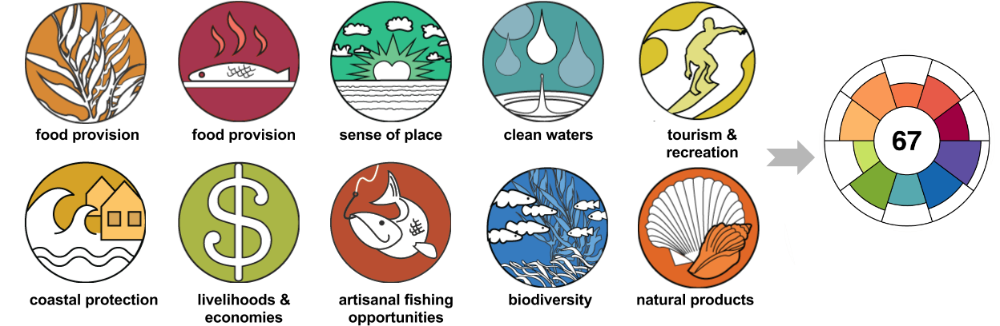
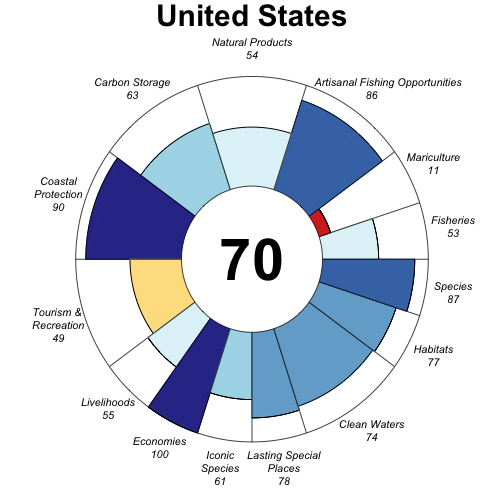
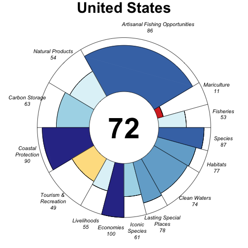
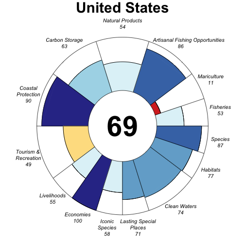

# Introduction

The Ocean Health Index (OHI) framework measures the health of coupled human-ocean ecosystems in different contexts by accommodating differences in local environmental characteristics, cultural priorities, and information availability and quality. The OHI framework assesses a suite of benefits the ocean provides humans - called 'goals' - using the best information available. It distills complex socio-ecological relationships and context-specific targets into scores that can be repeated so that management can track and respond through time. 

Assessments using the OHI framework results in scores for each goal as well as in a single score for overall ocean health, which is a weighted-average of each goal's score. Each goal's score is calculated compared to a target called a **reference point**, and thus the score represents how close the goal is to meeting that target, on a scale from 0-100. Scores can be represented on a flower plot, where the center value is the overall OHI score. Each petal of the flower plot represents a goal; the length is the score of that particular goal and the width is its **weight**: contribution to the overall score.




# Your assignment

In this assignment you will explore how Ocean Health Index (OHI) scores respond when you chante two things: 

1. how goals are weighted 
2. the reference point of a goal

You will turn in a Word document with figures visualizing the changes you've made for a country of your choice. You will be using the OHI Toolbox software to do this, and follow the instructions in this document. Walk through line-by-line and execute the code in R. Then, once you have finished, press the 'Knit Word' at the top of this pane; this is what you'll turn in as homework. It will take a few minutes to Knit. 

The example presented is for the USA, so please choose another country for your assignment. 


```{r setup, include=FALSE}
knitr::opts_chunk$set(echo = TRUE, root.dir = 'ESM_270')
```

## Get the ohi-global repo

We'll be playing with inputs for the global OHI assessments; we calculate scores each year for 221 coastal nations and territories. Let's get it on your computer.

1. Go to [github.com/OHI-Science/ohi-global](https://github.com/OHI-Science/ohi-global). This is the `ohi-global` repository 'repo'. 
2. Click on the <span style="color:green">green</span> 'clone or download' button. 
3. Clone or download somewhere you can find on your computer. If you are familiar with GitHub clone this repository. Otherwise click 'Download ZIP' from this site.
4. Navigate to where you saved the `ohi-global` repo on your computer and double-click the `ohi-global.Rproj` file. This will open [RStudio](https://www.rstudio.com/) (which is how you should always interface with R). 
5. Within the RStudio file directory pane (bottom right), navigate to the `ESM_270` folder. Inside is a mix of `.R` scripts and `.csv` files. The figure below shows more information than you need about each file's role in the calculation workflow (green). 


## Setup

Since we're in RStudio with a `.Rproj` file, our current working directory is `wherever/you/saved/it/ohi-global`. All of our work for the assignment happens in the `ESM_270` folder. Let's change the working directory to the ESM_270 folder, and install the packages we need to get going. 

If you have any problems, check that R and RStudio are up-to-date. The most recent version of R is 3.3 and RStudio is 0.99. If needed, update R [here](Find the latest version at http://cran.r-project.org) and RStudio [here](http://www.rstudio.com/products/rstudio/download). 


1. Run the following code to install the OHI package `ohicore`. 
```{r setwd, eval=FALSE}

## set working directory with setwd()
## our working directory is ohi-global; set it to ohi-global/ESM_270. 
setwd('ESM_270')


## Install the OHI package `ohicore`

## remove old packages
for (p in c('ohicore', 'rCharts')){
  if (p %in% rownames(installed.packages())){
    lib = subset(as.data.frame(installed.packages()), Package==p, LibPath, drop=T)
    remove.packages(p, lib)
  }
}

## install dependencies
for (p in c('devtools', 'dplyr', 'tidyr', 'readr', 'zoo', 'psych')){
  if (!require(p, character.only=T)){
    install.packages(p)
    require(p, character.only=T)
  }
}

## install packages
devtools::install_github('ohi-science/rCharts')
devtools::install_github('ohi-science/ohicore')

# for (p in c('ohicore')){
#   if (p %in% rownames(installed.packages())){
#     lib = subset(as.data.frame(installed.packages()), Package==p, LibPath, drop=T)
#     remove.packages(p, lib)
#   }
# }
# 
# ## install dependencies
# for (p in c('devtools')){
#   if (!require(p, character.only=T)){
#     install.packages(p)
#     require(p, character.only=T)
#   }
# }
# 
# ## install ohicore -- don't worry about the warnings
# devtools::install_github('ohi-science/ohicore@dev')
library(ohicore)

## source the function to make flower plots
source('PlotFlowerMulti.r')

```


## Calculate scores

We can calculate OHI scores by sourcing `calculate_scores.r` (below). This uses the following files, which are all in our current working directory, `ohi-global/ESM_270`: 

- data layers in the `layers` folder
- goal models and reference points in `conf/functions.r`
- goal weighs in `conf/goals.csv`

Resulting scores for all goals and all 221 regions are saved in `scores.csv`. 


```{r calculate scores, eval=FALSE}

source('calculate_scores.r')

```

## Visualize OHI scores for your region

We just calculated scores for all 221 regions. But you'll just be inspecting one region, which do you choose? Each region has a unique numeric identifier. View the full list of regions and choose one to inspect. Run the following code, then use the search icon in the top right of the View pane for your country and assign the `rgn_id` to `my_rgn`. 

```{r assign rgn_id, eval=FALSE}

View(read.csv('layers/rgn_global.csv'))

## assign your rgn_id
my_rgn = 163 # United States; change this to your region of choice

```

## Flower plot for your region

Now, let's visualize your region's scores in a flower plot. Run the following as-is: 

```{r plot original, eval=FALSE}

## parameters for the flower plot
scores_orig <- read.csv('scores.csv')
conf_orig <- read.csv('conf/goals.csv')
name_fig_orig <- 'reports/figures/flower_orig'   # my_rng is appended to name_fig

## function call for the flower plot
PlotFlowerMulti(scores       = scores_orig, 
                rgns_to_plot = my_rgn, 
                conf         = conf_orig, 
                name_fig     = name_fig_orig)

```

## Change goal weighting

Now you will change the goal weighting for one of the goals. Refer to the [Introduction](#Introduction) above to see the list of goals. All goals have a weight of 1; if a goal has sub-goals, those are weighted each as 0.5. Below, look at the weights of each goal and sub-goal, and change one of the weights. The example below shows changing the weight of the Artisanal Fishing Opportunity goal (AO) from 1 to 3. Note that all of these weights are relative; you don't need to have them add up as they do now. 

```{r, eval=FALSE}

## inspect the weights for each goal
View(conf_orig %>% dplyr::select(goal, name, weight))

## save original conf file
readr::write_csv(conf_orig, 'conf/goals_orig.csv')

## change the weight of a goal, eg AO to 3 and save file
conf_new_wt <- conf_orig
conf_new_wt$weight[conf_new_wt$goal == 'CP'] = 10
readr::write_csv(conf_new_wt, 'conf/goals.csv')

## ensure your new weight is reflected
View(conf_new_wt %>% dplyr::select(goal, name, weight))

## re-calculate scores
source('calculate_scores.r')
scores_new_wt <- read_csv('scores.csv')

## parameter for the flower plot
name_fig_weights <- 'reports/figures/flower_weights_new'

## function call for the flower plot
PlotFlowerMulti(scores       = scores_new_wt, 
                rgns_to_plot = my_rgn, 
                conf         = conf_new_wt, 
                name_fig     = name_fig_weights)

```

Compare: don't forget to change these with your region names!

 

## What are your reactions?

(write plain text here)

## Now change LSP reference point. 

The Lasting Special Places sub-goal represents geographic locations that hold particular value for aesthetic, spiritual, cultural, recreational or existence reasons, and assesses how well they are protected. In global assessments, we model this with the proportion of the offshore area that is a marine protected area (MPAs), with the reference point set to 30%. 

You can see this by navigating to `conf/functions.r`, and looking at line 1578: you can also search for `LSP = `. Right now it's set to 30% of waters should be in MPAs. What if we altered that? Go ahead and change it and let's compare. 

```{r, eval=FALSE}

## set a new reference point
ref_pct_new <- 50

## run this this to insert your new reference point into functions.r
readLines('conf/functions.r') %>%
  str_replace("LSP = .*", sprintf("LSP = function(layers, ref_pct_cmpa=%s, ref_pct_cp=%s, status_year){", ref_pct_new, ref_pct_new)) %>%
  writeLines('conf/functions.r')


## recalculate scores with new reference point
source('calculate_scores.r')

scores_new_ref <- read.csv('scores.csv')
name_fig_ref <- 'reports/figures/flower_ref_new'

PlotFlowerMulti(scores       = scores_new_ref, 
                rgns_to_plot = my_rgn, 
                conf         = conf_orig, 
                name_fig     = name_fig_ref)

# Warning message:
# In inner_join_impl(x, y, by$x, by$y) :
#   joining character vector and factor, coercing into character vector


```

 



## Write up something about these differences
