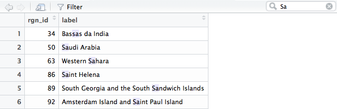
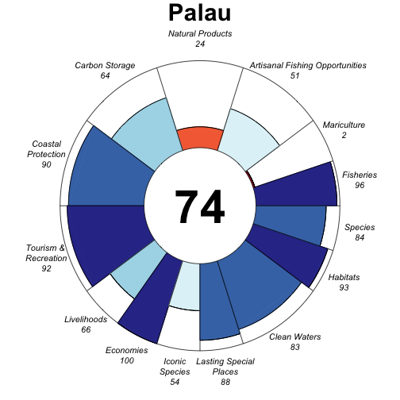

# Introduction

The Ocean Health Index (OHI) framework measures health of coupled human-ocean ecosystems in different contexts by accommodating differences in local environmental characteristics, cultural priorities, and information availability and quality. The OHI framework assesses a suite of benefits the ocean provides humans using the best available information. It distills complex socio-ecological relationships and context-specific targets into scores that can be repeated so that management can track and respond through time. 

In this assignment you will explore how Ocean Health Index (OHI) scores would respond to 1) changing how goals are weighted, and 2) changing the reference point of a goal. You will be using the OHI Toolbox software

TODO: add 2 figs: Lowndes et al Fig 1, and this: 
https://docs.google.com/drawings/d/1zHe1Gp2L7xN04w3NO_uQvOrl47Ug_oogyj2E338J90U/edit, consider switching positions of pre_scores.r and config.R

The example will be with Palau. Don't use that in your writeup. 

# Your assignment


```{r setup, include=FALSE}
knitr::opts_chunk$set(echo = TRUE, root.dir = 'ESM_270')
```

# Download/Clone the ohi-global repo 

url, 
save on your computer. 
Navigate to where you saved the `ohi-global` repo and double-click the `ohi-global.Rproj` file. This will open RStudio. 
Within the RStudio file directory pane, navigate to the `ESM_270 folder`. 
TODO

# Explore `ohi-global/ESM_270`. 

TODO: here's a quick intro to what's inside. 

Since we're in RStudio with a `.Rproj` file, our current working directory is `ohi-global`, no matter where you saved it on your computer. So to set the working directory to the ESM_270 folder, we can simply type: 

Run the following code to install the OHI package `ohicore`. 

If you have any problems, check that R and RStudio are up-to-date. The most recent version of R is 3.3 and RStudio is 0.99. If needed, update R [here](Find the latest version at http://cran.r-project.org) and RStudio [here](http://www.rstudio.com/products/rstudio/download). 

# Setup ohicore

```{r setwd, eval=FALSE}

## Install the OHI package `ohicore`

## remove old packages
for (p in c('ohicore', 'rCharts')){
  if (p %in% rownames(installed.packages())){
    lib = subset(as.data.frame(installed.packages()), Package==p, LibPath, drop=T)
    remove.packages(p, lib)
  }
}

## install dependencies
for (p in c('devtools', 'dplyr', 'tidyr', 'readr', 'zoo', 'psych')){
  if (!require(p, character.only=T)){
    install.packages(p)
    require(p, character.only=T)
  }
}

## install packages
install_github('ohi-science/rCharts')
install_github('ohi-science/ohicore')

## set working directory with setwd()
## our working directory is ohi-global; set it to ohi-global/ESM_270. 
setwd('ESM_270')

```

# Change goal weightings

TODO


# Calculate scores

TODO:
This will calculate scores using models in the conf folder, data layers in the layers folder, and goal weightings in the conf folder.
This will recalculate OHI scores, saving the scores for all goals and regions in `scores.csv`. 

Fig Goal Icons 

```{r calculate scores, eval=FALSE}

library(ohicore)
source('calculate_scores.r')

# you'll get a few warning messages but don't worry...
# TODO: get rid of these warning messages

```

# Choose your region to inspect

But you'll just be working with one region, so let's figure out which one you want. 

```{r View regions, eval=FALSE}

View(read.csv('layers/rgn_global.csv'))

```

Find the `rgn_id` identifier for the Region of your choice. You can search using the search icon in the top right of the View pane: 




```{r assign rgn_id, eval=FALSE}

## assign your region
my_rgn = 8 

```

# Flower plot for your region

```{r plot original, eval=FALSE}
# Choose a region to plot TODO

scores_orig <- read.csv('scores.csv')
conf_orig <- read.csv('conf/goals.csv')
name_fig_orig <- 'reports/figures/flower_orig'   # your region will be appended to name_fig

source('PlotFlowerMulti.r')
PlotFlowerMulti(scores       = scores_orig, 
                rgns_to_plot = my_rgn, 
                conf         = conf_orig, 
                name_fig     = name_fig_orig)

```

# Change goal weighting

TODO: instructions. It's relative weights. 

```{r, eval=FALSE}

# have a look at the weights for each goal
View(conf_orig %>% dplyr::select(goal, name, weight))

conf_new_wt <- conf_orig
conf_new_wt$weight[conf_new_wt$goal == 'AO'] = 3

View(conf_new_wt %>% dplyr::select(goal, name, weight))

name_fig_weights <- 'reports/figures/flower_weights_new'

# plot
PlotFlowerMulti(scores       = scores_orig, 
                rgns_to_plot = my_rgn, 
                conf         = conf_new_wt, 
                name_fig     = name_fig_name_fig_weights)
dev.off()

```

[](reports/figures/flower_orig_Palau.png) [](reports/figures/flower_weights_new_Palau.png)


# Now change LSP reference point. 

TODO: background of LSP ref point

open up `functions.r`, navigate to LSP = (line 1578)

```{r, eval=FALSE}

## Right now it's set to 30% of waters should be in MPAs. What if we altered that? Do it now. 

ref_pct_new <- 50

readLines('conf/functions.r') %>%
  str_replace("LSP = .*", sprintf("LSP = function(layers, ref_pct_cmpa=%s, ref_pct_cp=%s, status_year){", ref_pct_new, ref_pct_new)) %>%
  writeLines('conf/functions.r')


## recalculate scores with new reference point

source('calculate_scores.r')

scores_new_ref <- read.csv('scores.csv')
name_fig_ref <- 'reports/figures/flower_ref_new'

PlotFlowerMulti(scores       = scores_new_ref, 
                rgns_to_plot = my_rgn, 
                conf         = conf_orig, 
                name_fig     = name_fig_ref)

# Warning message:
# In inner_join_impl(x, y, by$x, by$y) :
#   joining character vector and factor, coercing into character vector


```

[](reports/figures/flower_orig_Palau.png) 



# Write up something about these differences
