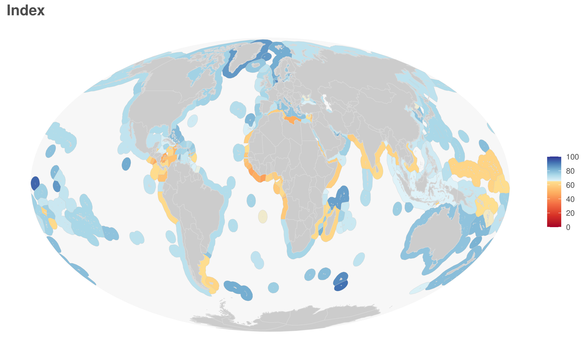

Compiled on `r date()`.


```{r, echo=FALSE, warning=FALSE, error=FALSE, message=FALSE}

## Running:
 # 1. Make sure that all the necessary files have been updated (OHI.bib, goal_descriptions, layers_info)
 # 2. Make sure that all the files in metadata_documentation have been updated (e.g., layers_eez_base, layers_eez_targets, layers_eez_methods, layers_eez_datasources)
 # 3. Run CombineLayers.R to create the relevant Rmd file for data layers (if any changes to these files), creates layers_all.R
 # 4. Save a new OHI.bib file from Zotero if changes to references (Export BibLaTeX)
 # 5. Run BIBcorrect.R to fix a few weird things in the OHI.bib file
  # 6. Review document to fix year references (i.e., title at top, assessmentYear variable in this code chunk, update figure 3.1)
 # 7. Knit this file and review html output. 


# tables in Rmd: https://rpubs.com/benmarwick/tables-rmarkdown

library(knitr)
library(xtable)
library(pander)
library(dplyr)
library(tidyr)
library(ggplot2)
library(here)
library(kableExtra)

options(knitr.kable.NA = '')

# If there are changes to the references, run BIBcorrect.R!!!

# exclude when knitting
# setwd("documents/methods")

assessmentYear <- 2020

# sections to run:
ten_goals <- TRUE
index_scores <- TRUE
table_regions <- TRUE
goal_model <- TRUE
trend <- TRUE
pressure <- TRUE
resilience <- TRUE

```

# Introduction to the global Ocean Health Index (OHI) assessment

The global Ocean Health Index assesses ocean health for 220 coastal countries and territories and has been conducted every year starting in 2012.  The Index describes how well we are sustainably managing 10 goals for ocean ecosystems which represent the full suite of benefits that people want and need from the ocean.  These goals include: artisanal fishing opportunity, biodiversity, carbon storage, clean waters, coastal livelihoods and economies, coastal protection, food provision, natural products, sense of place, and tourism and recreation.  Each goal is given a score ranging from 0 to 100, and the full suite of goal scores are then averaged to obtain an overall index score for each region.

For more information about the philosophy of the Ocean Health Index and model development see Halpern et al. (2012, 2015) and http://ohi-science.org/ohi-global/, which includes information about downloading global ocean health data.


# The Theory of OHI

## A comprehensive framework to assess ocean health
The Ocean Health Index assesses ocean health which we define as how well we are sustainably managing the resources that we want and need from the ocean (e.g., tourism and recreation, food provisioning).

The OHI is considered a *composite indicator* because it combines many indicators into a comprehensive framework describing ocean health.  This is in contrast to focusing on individual indicators, such as phosphate levels, sedimentation, biodiversity, etc.  Individual indicators are important, but they provide limited information when it comes to evaluating how well an overall ecosystem is functioning.  Another shortcoming of individual indicators is that they do not directly describe what we actually care about, and consequently, focusing on them can hinder communication.  For example, most people do not directly care about nutrient pollution, however, we do care about its effects on the ocean’s ability to provide recreation and food.  

Without an overall framework to evaluate indicators, certain indicators may be overemphasized relative to their true importance due to researcher bias (most researchers believe their area of study is the most important), trends in research (what is currently considered a hot topic and is funded), and availability of data (e.g., some data is easier to collect).  A model that combines multiple indicators will inevitably have flaws, but at least we know which variables are included and how they are weighted.

## The role of humans
One of the primary contributions of the OHI is that it recognizes people are an important part of the marine system.  Both conservation and extractive use of ocean resources are valued, and consequently, scores are highest when we maximize the benefits we receive while maintaining sustainability so we can continue to receive benefits now and into the future.  One temptation of indicator development is to focus only on the pressures that humans apply to systems.  This makes sense because we want to be sure we are adequately protecting resources.  However, eliminating all pressures on the ocean would require eliminating all contact between humans and the ocean. Beyond being unrealistic, this is undesirable because we would stop receiving all the benefits that we rely on from the ocean. The OHI is unique because it tracks both the pressures we put on oceans as well as the benefits we receive.

## Yearly assessments
The global Ocean Health Index has been assessed every year since 2012. The primary goal of each yearly assessment is to calculate a new year of scores using the most recent data. Often, in addition to incorporating an additional year of data, we make improvements to models or decide to use different data sources. To ensure that scores for all years are comparable, we recalculate scores for previous scenario years for each assessment using new methods and data sources. For the current assessment, for example, in addition to calculating the current year’s scores, we recalculate scores for every year since 2012. Consequently, comparisons among years should always be performed using data from the same assessment year so trends in scores reflect changes to ocean health rather than changes to methods.

Not all data layers are reported through the most current assessment year, and consequently, the OHI scores are calculated using the most recent year of available data. Details on which years are used for each data layer are provided in Table 7.2.


## Brief anatomy of OHI scores
We define ocean health as the sustainable delivery of ten widely-held public goals for ocean ecosystems (Table 2.1).  These goals represent the full suite of benefits that people want and need from the ocean, including the traditional ‘goods and services’ people often consider (e.g., fish to eat, coastal protection from nearshore habitats) as well as benefits less commonly accounted for, such as cultural values and biodiversity.  Within each region, scores, ranging from 0 to 100, are calculated for the 10 goals (section 4.2).  Four of the goals are calculated from 2 subgoals.  The subgoals are calculated independently (i.e., they are treated as if they are goals) and then combined into the goal status score (Table 2.2). 

<br/>

**Table 2.1. The 10 goals of the Ocean Health Index** 
```{r ten_goals, eval = ten_goals, echo=FALSE}

goals <- read.csv(here("metadata_documentation/ohi_model/tables/ten_goals.csv")) %>%
  select(Goal, Abbreviation, Description) %>%
  arrange(Goal)

kable(goals) %>%
  kableExtra::kable_styling(full_width = T)
```
 
<br/>

**Table 2.2. Subgoals used to calculate 4 of the Ocean Health Index goals** 
```{r subgoals, eval = ten_goals, echo=FALSE}

subgoals <- read.csv(here("metadata_documentation/ohi_model/tables/Subgoal_Descriptions.csv")) %>%
  select(Subgoal, Goal, Abbreviation, Description) %>%
  arrange(Goal)

kable(subgoals) %>%
  kableExtra::kable_styling(full_width = F)
```

Goal (and subgoal scores) are calculated using several variables (referred to as “dimensions”, Table 2.3).  Goal scores (Section 4.2) are calculated as the average of current status (Section 5) and likely future status.  Likely future status (Section 4.3) is the current status modified by variables (resilience, pressures, and trend) expected to influence future status. 

<br/>

**Table 2.3. Dimension used to calculate an OHI goal score**
Goal scores are the average of current and likely future status.  Likely future status adjusts current status scores based on pressures and resilience variables acting on the goal as well as recent trends in status.

Dimension        | Subdimension   | Description                  | More information     | Calculating
---------------- | ----------- | ---------------------------- | -------------------- | ----------------------
Current status   |  -          | Current state of the goal relative to the desired "reference point".  Values range from 0-100. | *Section 5. Goal models and data* | Calculated using functions in ohi-global repo: https://github.com/OHI-Science/ohi-global/blob/draft/eez/conf/functions.R and the *scenario_data_years.csv* file (in same folder)
Predicted future status | Resilience | Variables such as good governance and ecological factors that provide resilience to pressures, and thus, are likely to improve future status.  Values range from 0-100  | *Section 4.3 Likely future status dimensions* | Calculated using functions in ohicore package.And, files: *resilience_categories.csv* and *resilience_matrix.csv* located here: https://github.com/OHI-Science/ohi-global/tree/draft/eez/conf
Predicted future status | Pressure  | Pressures stress the system and threaten future delivery of benefits, and thus, are likely to reduce future status. Values range from 0-100  | *Section 4.3 Likely future status dimensions* | Calculated using function in ohicore package.  And, files: *pressure_categories.csv* and *pressures_matrix.csv*, located here: https://github.com/OHI-Science/ohi-global/tree/draft/eez/conf
Predicted future status | Trend  | Average yearly change in status (typically estimated using most recent 5 years of data) multiplied by 5 to esimate five years into the future.  Units are proportional change (absolute change/year is divided by the value of the earliest year) and range from -1 to 1  | *Section 4.3 Likely future status dimensions* | Calculated using functions from ohi-global repo: https://github.com/OHI-Science/ohi-global/blob/draft/eez/conf/functions.R and the scenario_data_years.csv file (in same folder)

**Figure 1.1. Relationship between OHI dimensions and scores**
This figure describes how the dimensions come together to calculate a goal score.  This figure represents equations 4.3 and 4.5. 


Finally, an overall Index score for each region is calculated by averaging the goal scores (Figure 1.2).

**Figure 1.2. Example flowerplot of goal scores for a region**
Goal and subgoal scores for Canada.  The middle value is the regional Index score, and is calculated by averaging the goal scores.


# Data inclusion and data gaps

Ideally, regional and local assessments should use the best available data, but this decision limits the ability to compare across scales. For direct comparisons among locations to be valid, they must use consistent data.  For this reason, we focused on using global datasets so differences in Index scores across regions are driven by differences in ocean health rather than variation in the data. Although, in reality, many global datasets are compilations of local or regional datasets and their quality varies spatially. In some cases, data for a particular component or dimension of a goal were available for most, but not all, countries. Gaps in these data were known to not be true zero values. Rather than exclude these data layers, we employed several different methods to fill these data gaps [@frazier_mapping_2016].  

These guidelines both motivated and constrained our methods. The development of the model frameworks for each goal (including reference points) was heavily dictated by the availability of global datasets. And, ultimately, several key elements related to ocean health could not be included due to lack of existing or appropriate global datasets. As new and better data become available in the future, details of how goals or dimensions are modeled will likely change, although the framework we have developed can accommodate these changes. 

For Index scores to be comparable, every region must have a value for each data layer included in the analysis, unless it is known to not be relevant to a region. In other words, missing data are not acceptable [@burgass_navigating_2017]. Adhering to this criterion is critical to avoid influencing the Index score simply because of inclusion (or absence) of a particular data layer for any reporting region.  

Gaps in data are common; many developing countries lack the resources to gather detailed datasets, and even developed, data-rich countries have inevitable data gaps.  We use a variety of methods to estimate missing data, including: averages of closely related groups (e.g., regions sharing ecological, spatial, political attributes; taxonomic groups; etc.), spatial or temporal interpolation (e.g., raster or time-series data), and predictive models (e.g., regression analysis, machine learning, etc.). Gapfilling is a major source of uncertainty, especially for certain goals and regions. Given how common gaps in data are, clear documentation of gapfilling is a critical step of index development because it provides a measure of the reliability of index scores.  

One of the ongoing goals of the Ocean Health Index (OHI) has been to improve our approach to dealing with missing data, by quantifying the potential influence of gapfilled data on index scores, and developing effective methods of tracking, quantifying, and communicating this information [@frazier_mapping_2016].

# Regions
One of the first steps of conducting an OHI assessment is defining regions of interest.  These can be based on political and/or ecological boundaries.  The definition of a “region” varies depending on the goals and scale of the OHI assessment.  For the global OHI, each region is defined as the EEZ area (300 nm offshore) for all coastal countries and territories (e.g., US Virgin Islands).  

There are 220 global coastal countries and territorial regions (Table 4.1).  Regions are based on Exclusive Economic Zone boundaries [EEZ, @claus_marine_2012].  However, we aggregate some EEZ regions to the level of country (e.g., Hawaii is estimated as part of the larger U.S.).  We have also modified some boundaries [@halpern_index_2012; @halpern_patterns_2015].  We do not estimate OHI values for disputed or unclaimed areas.

**Figure 3.1. Global regions**
Map of the OHI regions (with color corresponding to 2020 regional index scores). Mollweide coordinate reference system is used because it accurately represents area.  



**Table 4.1. Global regions**

```{r table_regions, eval = table_regions, echo=FALSE, message=FALSE, error=FALSE, warning=FALSE}

regions <- read.csv("https://raw.githubusercontent.com/OHI-Science/ohiprep/master/src/LookupTables/eez_rgn_2013master.csv", stringsAsFactors = FALSE) %>%
  filter(rgn_typ == "eez") %>%
  filter(rgn_id_2013 <= 250) %>%
  filter(rgn_id_2013 != 213) %>%
  select(region_id = rgn_id_2013, region_name = rgn_nam_2013, iso_id = eez_iso3, administrative_country=sov_nam) %>%
  unique() %>%
  arrange(region_id) %>%
  mutate(status = ifelse(region_name == administrative_country, "country", "territory")) %>%
  mutate(administrative_country = ifelse(region_name == administrative_country, "", administrative_country)) %>%
  select("region"=region_name, "region ID"=region_id, "ISO code"=iso_id, type=status, "administrative country" =administrative_country) %>%
  arrange(region)

kable(regions) %>%
  kableExtra::kable_styling(full_width = F)
```

# Models

## Regional and global Index scores
```{r child = '../../metadata_documentation/ohi_model/index_scores.Rmd', eval=index_scores}

```

## Goal scores
```{r child = '../../metadata_documentation/ohi_model/goal_model.Rmd', eval=goal_model}

```

## Likely future status dimensions
Three dimensions are used to calculate likely future status: trends, pressure, and resilience.  This section describes the calculations underlying these three dimensions.

```{r child = '../../metadata_documentation/ohi_model/trend.Rmd', eval=trend}

```

```{r child = '../../metadata_documentation/ohi_model/pressure.Rmd', eval=pressure}

```

```{r child = '../../metadata_documentation/ohi_model/resilience.Rmd', eval=resilience}

```


# Goal models and data
In this section we describe how the current status and trend of each goal was calculated. We also indicate which data layers were used to calculate current status, trend (if different from current status), pressure, and resilience.  

The R code used to calculate the goal model is located [here](https://github.com/OHI-Science/ohi-global/blob/draft/eez/conf/functions.R) (scroll to the appropriate goal function). To learn more about the data layers used in the model calculations see Section 7: Description of data layers.  Table 7.1 includes links to the code and data used to create the data layers (current calculations are in the folder with the most recent year).  Table 7.2 describes the data sources used to create the data layers.  


```{r goal functions, echo=FALSE, warning=FALSE, error=FALSE, results="asis"}

## data and functions used to list data layers in each goal

# data with information
layers <- read.csv(here("metadata_documentation/layers_eez_base.csv"))
targets <- read.csv(here("metadata_documentation/layers_eez_targets.csv"))
layers_web <- "http://ohi-science.org/ohi-global/layers.html"

# function
data_layers <- function(dimension, goal){ # goal = "ICO"; dimension=c("status", "trend")
  
  st <- targets[targets$goal == goal, ]
  st <- st[st$dimension %in% dimension, ]
  
st <- st %>%
  select(layer) %>%
  unique()

st_layers <- filter(layers, layer %in% st$layer) %>%
  mutate(web_name = gsub(" ", "_", name)) %>%
  mutate(web_name = tolower(web_name)) %>%
  mutate(web_name = gsub("/", "", web_name)) %>%
  mutate(info = sprintf("[%s](%s#%s) (%s): %s", name, layers_web, web_name, layer, description))

cat(paste(st_layers$info, collapse="\n\n"))
}

```


```{r child = '../../metadata_documentation/ohi_model/goal_descriptions/AO_long.Rmd'}

```

```{r child = '../../metadata_documentation/ohi_model/goal_descriptions/BD_long.Rmd'}

```

```{r child = '../../metadata_documentation/ohi_model/goal_descriptions/HAB_long.Rmd'}

```

```{r child = '../../metadata_documentation/ohi_model/goal_descriptions/SPP_long.Rmd'}

```

```{r child = '../../metadata_documentation/ohi_model/goal_descriptions/CP_long.Rmd'}

```

```{r child = '../../metadata_documentation/ohi_model/goal_descriptions/CS_long.Rmd'}

```

```{r child = '../../metadata_documentation/ohi_model/goal_descriptions/CW_long.Rmd'}

```

```{r child = '../../metadata_documentation/ohi_model/goal_descriptions/FP_long.Rmd'}

```

```{r child = '../../metadata_documentation/ohi_model/goal_descriptions/FIS_long.Rmd'}

```

```{r child = '../../metadata_documentation/ohi_model/goal_descriptions/MAR_long.Rmd'}

```

```{r child = '../../metadata_documentation/ohi_model/goal_descriptions/LE_long.Rmd'}

```

```{r child = '../../metadata_documentation/ohi_model/goal_descriptions/ECO_long.Rmd'}

```

```{r child = '../../metadata_documentation/ohi_model/goal_descriptions/LIV_long.Rmd'}

```

```{r child = '../../metadata_documentation/ohi_model/goal_descriptions/NP_long.Rmd'}

```

```{r child = '../../metadata_documentation/ohi_model/goal_descriptions/SP_long.Rmd'}

```

```{r child = '../../metadata_documentation/ohi_model/goal_descriptions/ICO_long.Rmd'}

```

```{r child = '../../metadata_documentation/ohi_model/goal_descriptions/LSP_long.Rmd'}

```

```{r child = '../../metadata_documentation/ohi_model/goal_descriptions/TR_long.Rmd'}

```

# Description of data layers

### Tables describing data layers (Table 7.1) and sources (Table 7.2)

**Table 7.1. Data layers of `r assessmentYear` global OHI assessment**
A brief overview of all the data layers used to calculate the global OHI.  The "Data layer" variable provides links to a full description of the data layer.  The "Description" variable provides link/s to the data preparation scripts (when available).   See Table 7.2 for a description of the data sources used to create these data layers.

```{r DataLayer Table, echo=FALSE, warning=FALSE, error=FALSE, messages=FALSE}
options(dplyr.summarise.inform=F)
## Get list of layers, name, description:
base <- read.csv(here("metadata_documentation/layers_eez_base.csv")) %>%
  mutate(Name = paste0("[", name, "](", "http://ohi-science.org/ohi-global/layers#", layer, ")")) %>%
  select(layer, Name, Description = description)

## Get dimension/targets
target <- read.csv(here("metadata_documentation/layers_eez_targets.csv"), stringsAsFactors = FALSE) %>%
  mutate(goal = ifelse(dimension %in% c("pressure", "resilience", "spatial", "weighting"), dimension, goal)) %>%
  select(layer, goal) %>%
    unique() %>%
  group_by(layer) %>%
  summarize(Dimension = paste(goal, collapse = ", "))

# setdiff(base$layer, target$layer) # the sp_alien_species ends up not being used
# setdiff(target$layer, base$layer)

data <- left_join(target, base, by="layer")

## Get data prep url (will be a link in description)
url <- read.csv(here("metadata_documentation/layers_eez_dataprep.csv")) %>%
  group_by(layer) %>%
  mutate(N = 1) %>%
  mutate(method_count = cumsum(N)) %>%
  mutate(total_methods = sum(N)) %>%
  mutate(count = sum(N)) %>%
  mutate(url_link = ifelse(count==1,  sprintf("[data prep](http://ohi-science.org/ohiprep_v%s/%s)", assessmentYear, dataprep_url), 
                sprintf("[data prep %s](http://ohi-science.org/ohiprep_v%s/%s)", method_count, assessmentYear, dataprep_url))) %>%
  summarize(url_link = paste(url_link, collapse = ", ")) %>%
  select(layer, url_link) %>%
  ungroup()

data <- left_join(data, url, by="layer") %>%
  mutate(Description = sprintf("%s (%s)", Description, url_link)) %>%
  select(layer, Name, Description, Dimension)

## get references:
refs <- read.csv(here("metadata_documentation/layers_eez_reference.csv")) %>%
  select(layer, reference) %>%
  unique() %>%
  mutate(ref = paste0("@", reference)) %>%
  group_by(layer) %>%
  summarize(reference = paste(ref, collapse = "; ")) %>%
  ungroup() %>%
  #mutate(reference = paste0("[", reference, "]")) %>%
  select(layer, References=reference)
  
# setdiff(data$layer, refs$layer) # these are reasonable layers to not have references

data <- data %>%
  left_join(refs, by="layer")

### Get method updates
updates <- read.csv(here("metadata_documentation/layers_eez_updates.csv")) %>%
  select(layer, Updates=updates) %>%
  unique()

data <- data %>%
  left_join(updates, by="layer") %>%
  select(-layer) %>%
  select(Layer=Name, Description, Dimension, References, Updates) %>%
  arrange(Dimension)

kable(data) %>%
  kableExtra::kable_styling(full_width = F)

```

<br/> 

**Table 7.2. Data sources used to create data layers for `r assessmentYear` global OHI assessment**
A brief overview of the data sources used to calculate the global OHI.

```{r DataSources Table, echo=FALSE, warning=FALSE, error=FALSE, messages=FALSE}

### Get datasource primary data


## get source data
ds_source <- read.csv(here("metadata_documentation/layers_eez_data_sources.csv")) %>%
  mutate(ds_reference = paste0("@", ds_reference)) %>%
  select(Reference = ds_reference, "Description" = ds_description, Years=ds_years, Resolution = ds_native_resolution, Updated = sprintf("ds_updated_%s", assessmentYear))
kable(ds_source) %>%
  kableExtra::kable_styling(full_width = F)

```


```{r child = 'layers_all.Rmd'}
## Need to run CombineLayers.R to create the relevant Rmd file

```

# References