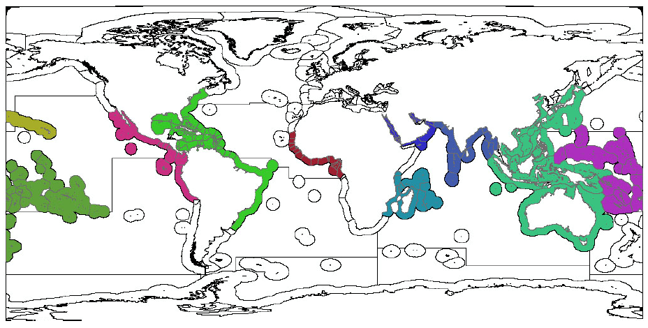

See hab_extent layer for more information.

#### Coral 
Condition was calculated using current condition data divided by reference condition.  We use condition data from percent live coral cover from 12,634 surveys from 1975-2006 (Bruno and Selig 2007, Schutte et al. 2010). When multiple data points are available for the same site and year, we average these data, and also average the site data to calculate a per country per year average. However, data were missing for several countries and some countries did not have data for the reference or current year time periods or had only 1-2 surveys. Because coral cover can be highly temporally and spatially dynamic, having only a few surveys that may have been motivated by different reasons (i.e., documenting a pristine or an impacted habitat) can bias results. To calculate condition we used fitted values from a linear trend of all data per country, which was more robust to data poor situations and allowed us to take advantage of period of intense sampling that did not always include both current and reference years. Then, we create a fitted linear model of all these data points in 1975-2010, provided that 2 or more points are in 1980-1995 and 2 or more points are in 2000-2010. We defined the ‘current’ condition (health) as the mean of the predicted values for 2008-2010, and the reference condition as the mean of the predicted values for 1985-1987. Where country data were not available, we used an average from adjacent EEZs weighted by habitat area, or a georegional average weighted by habitat area, based on countries within the same ocean basin (Figure).

#### Mangroves 
Condition was the current cover divided by reference cover.  FAO mangrove area data was provided on a country basis for 1980, 1990, 2000, and 2005.  Current condition is based on 2005 cover, and reference condition is based on the 1980 cover.  

#### Salt marsh 
Condition was assigned based on trend, for regions where both a current and reference data year available.  An increasing or stable trend was assigned condition = 1.0, and decreasing trend was assigned condition = 0.5. Data was from multiple sources (Bridgham et al. 2006, Dahl 2000, Ministry for the Environment 2007, JNCC 2004, EEA 2008). 

#### Sea ice 
Sea ice condition was calculated using sea ice concentrations from the USA National Snow and Ice Data Center (Cavalieri et al. 2014; https://nsidc.org/cryosphere/quickfacts/seaice.html) as the current percent cover of sea ice (average of 3 years of data) divided by the average historical percent cover, defined as the start of the data (1979) until the year 2000 as recommended by the National Snow & Ice Data Center (Cavalieri et al. 2014; https://nsidc.org/cryosphere/quickfacts/seaice.html) for each of the sea ice habitats. 

#### Seagrass 
Seagrass condition was calculated on a per-site basis from Waycott et al. (2009), which provides seagrass habitat extent data for several sites around the world over several years. Reference condition was calculated as the mean of the three oldest years between 1975-1985, or the two earliest years if needed. If data responding to these conditions was not available, we fitted a linear model to all data points, and then used the mean of the predicted values for 1979-1981 as the reference condition. For the current condition we used the mean of the three most recent years after 2000 or the two most recent years. If condition data satisfying these constraints were still not available, we fitted a linear model to all data points, provided that there were at least three data points and then used the mean of the predicted values for 2008-2010 as the current condition and the mean of the predicted values for 1979-1981 as the reference condition. Otherwise, we used neighboring (adjacent) regional averages, weighted by habitat area, or averages weighted by habitat area using seagrass geographical regions as defined by Hemminga and Duarte (2000). We did not project beyond a 15-year timeframe.

#### Soft-bottom subtidal 
To estimate status of this habitat, we used intensity of trawl fishing relative to soft-bottom subtidal habitat as a proxy. Spatialized catch data (0.5 degree raster) are available from the global catch database of the Sea Around Us project, which uses data from FAO global fisheries catch statistics, data from international and national fisheries agencies, and reconstructed catch datasets (Zeller and Pauly 2007). The proportion of catch by fishing gear type was estimated at 0.5 degree resolution based on global taxon-gear associations (Watson et al. 2006a,b, Halpern 2008). These data were used to calculate catch (tonnes per year) from trawling for each year. Trawling gears were defined as dredges, hand dredges, bottom trawls, and shrimp trawls (mid-water trawls were excluded). These catches were assumed to be uniform within each half degree cell.  We aggregated by summing the trawled catch data by reporting region for each year, and converted to catch density by dividing annual catch by the trawlable (soft-bottom) habitat. ‘Trawlable habitat’ within a region was defined as shallow subtidal (0-60m) and outer shelf (60-200m) soft bottom habitat. Because these data were extremely skewed, we ln(X+1) transformed them and then rescaled to the 95th quantile value from all year-country possibilities. Condition was then calculated as one minus the rescaled catch density in the most recent year. The condition value was then rescaled to the median intensity density value across all years, and any value greater than the median was set = 1.0. 
 
