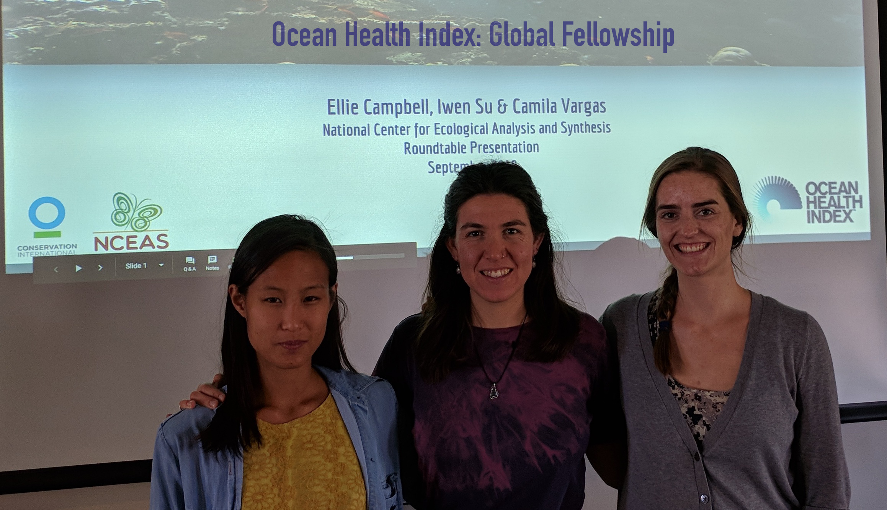

----

The OHI Fellows Program is our new approach to calculating global scores annually. The OHI team trains Fellows in cutting-edge open data science tools that they then apply while conducting the annual global assessment.

----

In 2018 the inaugural cohort of OHI Fellows were trained to lead the annual global assessment.

 

The OHI Fellows Program not only produces annual global OHI scores, these highly trained graduate students become valuable members to the global OHI community. We have run the program in 2018 and 2019 with a fantastic group of students and will continue that tradition with the third cohort in 2020.

Communication was a big part of the Fellowship experience: 

- The Fellows created and maintain the [globalfellows website](http://ohi-science.org/globalfellows) and [blogged](http://ohi-science.org/globalfellows/blog.html) as they learned
- They also gave an excellent [presentation about their work](https://docs.google.com/presentation/d/1OHsnnspXKT5f1szxinzB5rh2grejNBSoxxrE0dOwino/edit?usp=sharing) at the NCEAS Roundtable
- Ellie made a website for our [`ohicore` R package](http://ohi-science.org/ohicore)
- Iwen made an [interactive data explorer](https://iwensu.shinyapps.io/global-dashboard/) for the Mariculture goal
- Camila created country score cards and produced our [training videos](https://www.youtube.com/watch?v=xpe7jmt0-J4&list=PLX7J3qtjcll_4s2oaKHuWdRdBMJz7tBAU)

Additionally, we [blogged](http://ohi-science.org/news) about the experience:

- [Training the next generation of ocean data scientists](http://ohi-science.org/news/training-the-next-generation-of-ocean-data-scientists) by Erin O'Reilly, March 2018
- [Fellowship Feature: Expanding mariculture](http://ohi-science.org/news/fellowship-expanding-mariculture): by Iwen Su, October 2018
- [What does scientific reproducibility look like?](http://ohi-science.org/news/scientific-reproducibility-with-fellows) by Erin O'Reilly and Jenny Seifert, October 2018
- [Building community for OHI and beyond](http://ohi-science.org/news/building-community) by Julie Lowndes, October 2018
- [Fellowship Feature: Demystifying pressures and ohicore](http://ohi-science.org/news/fellowship-demystifying-pressures-ohicore) by Ellie Campbell, October 2018
- [Fellowship Feature: Applying data science principles](http://ohi-science.org/news/fellowship-feature-applying-data-science-principles) by Camila Vargas, November 2018
- [Fellowship Feature: Teaching reflections](http://ohi-science.org/news/fellowship-feature-teaching-reflections) by Melanie Frazier and Julie Lowndes, November 2018
- [Marine Research, Open Science, and the 2019 Ocean Health Index Fellows](https://ohi-science.org/news/fellows-2019) by Julie Lowndes, March 2019

> "These skills will be invaluable in my future work as an environmental data scientist”  
> - Ellie Campbell, 2018 OHI Global Fellow

 

  
[ohi-science.org home](http://ohi-science.org)

