This document describes results from the OHI 2016 global assessment.

Scores are broken down as follows: 

1. Description of reference datasets and figures
2. The global picture
3. A closer look at regions 
4. Change over time: five year trends in scores
5. Comparison of assessment years (what's changed do due to changes to models and/or data sources)
6. A closer look at goals 
7. Additional checks

```{r data set up, include=FALSE}

#load libraries
library(dplyr)
library(tidyr)
library(ggplot2)
library(hwriter)
library(RColorBrewer)
library(knitr)
library(googleVis)
library(ohicore)
library(sp)
library(rgdal)
library(DT)

# Set working directory when not knitting:
# setwd("global2016/Reporting")

goals <- c('Index', 'AO', 'SPP', 'BD', 'HAB', 'CP', 'CS', 'CW', 'ECO', 'LE', 'LIV', 'FIS', 'FP', 'MAR', 'ICO', 'SP', 'LSP', 'NP', 'TR')
goal_names <- data.frame(goal=goals, long_goal=c("Index", 
                                                  "Artisanal opportunities",
                                                  "Species condition (subgoal)",
                                                  "Biodiversity",
                                                  "Habitat (subgoal)",
                                                  "Coastal protection",
                                                  "Carbon storage",
                                                  "Clean water",
                                                  "Economies",
                                                  "Livelihoods & economies",
                                                  "Livelihoods",
                                                  "Fisheries (subgoal)",
                                                  "Food provisioning",
                                                  "Mariculture (subgoal)",
                                                  "Iconic species (subgoal)",
                                                  "Sense of place",
                                                  "Lasting special places (subgoal)",
                                                  "Natural products",
                                                  "Tourism & recreation"))

## General settings to control
scenario <- "2016" #identify scenario of focus (this can be changed to obtain data for other years)
radicalFile = '2016-11-08' #date extension on the radical data files that are used for all tables/figures
benchmark = 2015  # year that is used for old vs. new OHI analyses
oldCommit = '1d4dcb1abb82dc1d20817acca33c7e7d2ef1b52f' # '4da6b4a1d69d694264ea68456359a939b0c03f9c' = commit for 2014 analysis
colorScheme <- 'new'  # color scheme to use on flower plots ("new" = color reflects size score and is not the original rainbow)
saveFile <- 'global2016' #location where files that are created are to be saved

## General files to load
rgn_names <- read.csv(sprintf('../../eez%s/layers/rgn_global.csv', scenario)) %>%
  dplyr::select(region_id = rgn_id, country = label) %>%
  dplyr::mutate(country = as.character(country))

rgn_names$country[rgn_names$region_id == 212] <- "Gilbert Islands (Kiribati)"
rgn_names$country[rgn_names$region_id == 148] <- "Line Islands (Kiribati)"
rgn_names$country[rgn_names$region_id == 157] <- "Phoenix Islands (Kiribati)"


# if the ohi-global data is updated these should be changed to TRUE
# (note: these files are then read in for all subsequent tables/figures)
radical1 <- FALSE
radical2 <- FALSE

### code to run (change these if data is updated, otherwise takes a while to run):
map_create=TRUE
goal_hists=TRUE
flower_plots=TRUE

```

# Description of reference datasets and figures
The following datasets and figures include the complete data for the OHI 2016 assessment.

### Datasets (compiled for website)
Data files to generate content for the Ocean Health Index [website](http://www.oceanhealthindex.org/).

Output files: 

* [radical_*date*.csv](`r sprintf('https://raw.githubusercontent.com/OHI-Science/ohi-global/draft/%s/radical_%s.csv', saveFile, radicalFile)`). This file is also used to generate the tables and figures in this document.
    + File includes the EEZ (updated in 2012-2016), Antarctica (most recently calculated in 2015), and High Seas (most recently calculated in 2014) data.  However, years 2012 and 2013 do not have Antarctica or High Seas data.  And, the same High Seas and Antarctica data are used for years 2014, 2015, and 2016.
    + Region 0 is the global average scores, which are calculated using an area-weighted average of the scores (status, likely future state, and score dimensions) for EEZ, Antarctica, and High Seas regions.
    + Region 300 is the eez average scores, which are calculated using an area-weighted average of the scores (status, likely future state, and score dimensions) for the EEZ regions. 
* [`r sprintf('DataExplorer_eez%s_*date*.csv', scenario)`](`r sprintf('https://raw.githubusercontent.com/OHI-Science/ohi-global/draft/%s/DataExplorer_eez2016_%s.csv', saveFile, radicalFile)`). This file includes only the 2016 data, and is used in the Data Explorer.


```{r websites data, include=FALSE}

## These are run and saved if radical1 and radical2 arguments are TRUE
# NOTE: radical_scores.R, compiles all scenarios using the following combinations:
# 2012 = eez2012
# 2013 = eez2013
# 2014 = eez2014 and antarctica2015 and highseas2014
# 2015 = eez2015 and antarctica2015 and highseas2014
# 2016 = eez2015 and antarctica2015 and highseas2014
# this function needs to be updated when these scenarios are updated
source('../radical_scores.R')

## This calls a file called layers_2015.csv that includes information about
## the metadata for each layer file.  This will need to be updated if any of the 
## layers change in future analyses.
source('../Radical_scores_v2.R')

```

### Figures that provide an overview of scores
This carpet plot figure ([download as high resolution png](https://github.com/OHI-Science/ohi-global/raw/draft/global2016/Reporting/figures/carpetPlot_2016.png)) provides a full overview of the scores from the 2016 assessment.  Each row represents a region, the main groupings represent goals, and within each goal there are 5 years of data.  Black regions indicate no data.

*Don't try too hard to interpret the results for specific countries/goals/years!!*

This plot is good for providing a quick overview of things like:

* What is the range of scores?
* Which goals tend to have high scores across most regions (species, habitat)
* Which goals have a lot of variation across regions (tourism & recreation, lasting special places)
* Which goals are volatile across years (natural products, tourism & recreation)


```{r carpet plot, message=FALSE, warning=FALSE, error=FALSE, echo=FALSE, fig.width=14, fig.height=23}

data <- read.csv(sprintf('../radical_%s.csv', radicalFile)) 

data <- data %>%
  filter(dimension == "score") %>%   # focus only on score data
  filter(region_id != 0) %>%         # this weighted mean includes high seas and Antarctica
  mutate(region_id = ifelse(region_id==300, 0, region_id)) %>%   #convert the 300 (i.e., only eez's averaged to zero)
  filter(region_id <= 250) %>%       # get rid of high seas regions
  filter(region_id != 213)  %>%
  mutate(value = round(value, 0)) %>%
  left_join(rgn_names, by=c('region_id')) %>%
  mutate(country = ifelse(is.na(country), "eez_weighted_avg", as.character(country))) %>%
  group_by(region_id) %>% 
  mutate(meanIndex=mean(value[goal=="Index"])) %>%
  ungroup() %>%
  data.frame()
  
data$goal <- factor(data$goal, levels = goals)

myPalette <- colorRampPalette(brewer.pal(10, "RdYlBu"))
ggplot(data, aes(y=factor(country, levels=(country)[order(meanIndex)]), x=scenario, fill=value)) + 
  geom_tile(aes(order=meanIndex)) +
  facet_grid(~goal) + 
  scale_fill_gradientn(colours=myPalette(100), na.value="black") +
  theme(axis.text.x  = element_text(angle=90, vjust=0.5)) +
  ylab("") + 
  xlab("")
ggsave(sprintf("figures/carpetPlot_%s.png", scenario), width=20, height=25, units="in")


```

Another resource that can be useful for examining scores is this [interactive plot](https://rawgit.com/OHI-Science/ohi-global/draft/global2016/Reporting/figures/GoogleVisScores.html).  This can be used to (some example screen shots): 

*explore the distribution of scores*
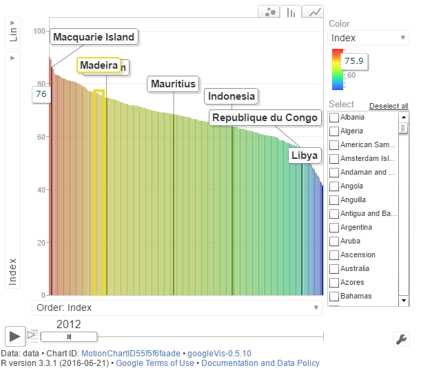 

*compare different goal scores* 
 

*observe change over time*

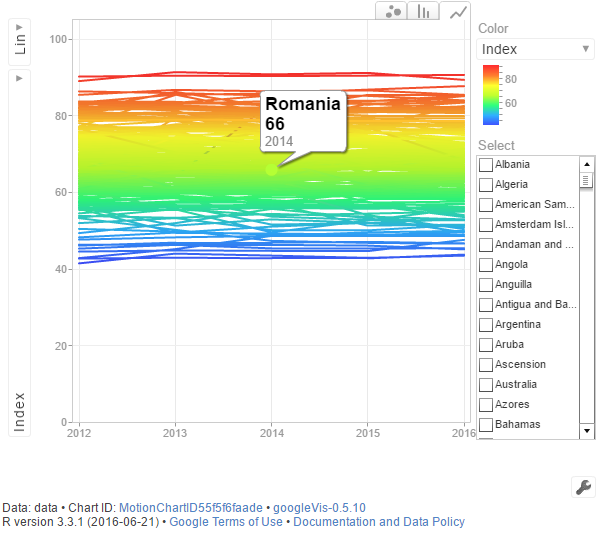 

```{r GoogleVis, message=FALSE, warning=FALSE, error=FALSE, echo=FALSE}

## creates a GoogleVis file that can be viewed:

data <- read.csv(sprintf('../radical_%s.csv', radicalFile)) 

data <- data %>%
  filter(dimension == "score") %>%   # focus only on score data
  filter(region_id != 0) %>%         # this weighted mean includes high seas and Antarctica
  mutate(region_id = ifelse(region_id==300, 0, region_id)) %>%   #convert the 300 (i.e., only eez's averaged to zero)
  filter(region_id <= 250) %>%       # get rid of high seas regions
  filter(region_id != 213)  %>%
  mutate(value = round(value, 2)) %>%
  left_join(rgn_names, by=c('region_id')) %>%
  mutate(country = ifelse(is.na(country), "eez_weighted_avg", as.character(country))) %>%
  select(year=scenario, goal, country, score=value)

data <- spread(data, goal, score)

#https://cran.r-project.org/web/packages/googleVis/vignettes/googleVis.pdf
# can't change color of bubbles in motion charts!

myStateSettings <- '
{"iconKeySettings":[],
  "duration":{"timeUnit":"Y","multiplier":1},
  "iconType":"BUBBLE","playDuration":15000,"xLambda":1,
  "yZoomedDataMin":41.49,
  "xZoomedDataMin":1325376000000,
  "yZoomedDataMax":91.36,
  "time":"2012",
  "dimensions":{"iconDimensions":["dim0"]},
  "showTrails":true,
  "yAxisOption":"12",
  "yLambda":1,
  "nonSelectedAlpha":0.4,
  "orderedByY":false,
  "xZoomedIn":false,
  "colorOption":"12",
  "yZoomedIn":false,
  "xZoomedDataMax":1451606400000,
  "sizeOption":"_UNISIZE",
  "orderedByX":false,
  "uniColorForNonSelected":false,
  "xAxisOption":"_TIME"}
'

# Motion=gvisMotionChart(data, 
#                        idvar="country", 
#                        timevar="year",
#                        options=list(state=myStateSettings))

Motion=gvisMotionChart(data, 
                       idvar="country", 
                       timevar="year")

#plot(Motion)

print(Motion, file=sprintf('figures/GoogleVisScores2.html', saveFile))

```
### More figure resources

* The location of maps describing goal and index scores can be downloaded from [here](https://github.com/OHI-Science/ohi-global/tree/draft/global2016/Reporting/figures/maps_by_goal_mol)
* Flower plots for each region can be downloaded from [here](https://github.com/OHI-Science/ohi-global/tree/draft/global2016/Reporting/figures/FlowerPlots)


# The global picture 
This section describes global patterns in index and goal scores. If you are more interested in what is happening at the region scale, skip to the next section.

### Average global goal and index scores across years

(NOTE: Livelihood and economy goals are not included here)

Overall, there weren't dramatic changes across years.

The Index score for 2016 (eez area weighted average of region scores) was: 71.  This value was essentially constant from 2012 to 2016.

I haven't done a formal analysis, but it looks like over time:

* Clean water scores may be slightly decreasing
* Lasting special places may be slightly increasing
* Natural products decreases rather dramatically

```{r overview, echo=FALSE}

data <- read.csv(sprintf('../radical_%s.csv', radicalFile)) 

data_filter <- data %>%
  filter(region_id != 0) %>%         # this weighted mean includes high seas and Antarctica
  mutate(region_id = ifelse(region_id==300, 0, region_id)) %>%   #convert the 300 (i.e., only eez's averaged to zero)
  filter(region_id <= 250) %>%       # get rid of high seas regions
  filter(region_id != 213)  %>%         # Antarctica (calculated in a very different way)
  left_join(rgn_names, by=c('region_id')) %>%
  mutate(country = ifelse(is.na(country), "eez_weighted_avg", as.character(country))) %>%
  mutate(value = round(value, 1))

data_index <- data_filter %>%
  filter(region_id == 0) %>%
  filter(dimension == "score") %>%
  left_join(goal_names, by="goal") %>%
  select(scenario, goal, long_goal, value)

data_index$goal <- factor(data_index$goal, levels = goals)

data_spread <- spread(data_index, scenario, value) %>%
  arrange(goal) %>%
  filter(!goal %in% c("ECO", "LE", "LIV")) %>%
  select(-goal) %>%
  rename(goal = long_goal)

kable(data_spread)
```


# A closer look at the regions
This section explores goal and index scores at the region level.  I mostly focus on the 2016 scores.

### Regional goal and index scores for 2016

This interactive table describes the index and goal scores for the regions in 2016 (and here's a [link](https://rawgit.com/OHI-Science/ohi-global/draft/global2016/Reporting/data/scores_eez2016.html) to a color coded table, and a csv file can also be [downloaded](https://raw.githubusercontent.com/OHI-Science/ohi-global/draft/global2016/Reporting/data/scores_eez2016.csv)). 

```{r score table, echo=FALSE}

## create a score dataframe 

for(year in 2012:scenario){ # year = 2016

data <- read.csv(sprintf('../radical_%s.csv', radicalFile)) 

data <- data[data$scenario == year, ]

data <- data %>%
  filter(dimension == "score") %>%   # focus only on score data
  filter(region_id != 0) %>%         # this weighted mean includes high seas and Antarctica
  mutate(region_id = ifelse(region_id==300, 0, region_id)) %>%   #convert the 300 (i.e., only eez's averaged to zero)
  filter(region_id <= 250) %>%       # get rid of high seas regions
  filter(region_id != 213)  %>%         # Antarctica (calculated in a very different way)
  left_join(rgn_names, by=c('region_id')) %>%
  mutate(country = ifelse(is.na(country), "eez_weighted_avg", as.character(country))) %>%
  mutate(value = round(value, 0))

data <- spread(data, goal, value)

index <- data %>%
  filter(country == 'eez_weighted_avg')

data <- data %>%
  arrange(-Index) %>%
  filter(country != 'eez_weighted_avg')

data_final <- rbind(index, data) %>%
    select(country, region_id, Index, AO, SPP, BD, HAB, CP, CS, CW, ECO, LE, LIV, FIS, FP, MAR, ICO, SP, LSP, NP, TR)

write.csv(data_final, sprintf("data/scores_eez%s.csv", year), row.names = FALSE, na='')

}

data_final <- read.csv(sprintf("data/scores_eez%s.csv", scenario))
  
data_final_inlay <- data_final %>%
  select(-region_id)

datatable(data_final_inlay,
          caption = '2016 OHI scores')


## make an html file that is color coded:
pal = brewer.pal(10, 'RdYlBu')

cols <- data.frame(country=data_final$country)
for(goal in goals){ #goal="Index"
  tmp <- data_final[, goal]
  tmp <- assign(goal, cut(tmp, breaks=c(0,10,20,30,40,50,60,70,80,90,100), include.lowest = TRUE, labels=pal))
  tmp <- data.frame(goal=tmp)
  names(tmp) <- goal
  cols <- cbind(cols, tmp)
}


hwrite(data_final, sprintf('data/scores_eez%s.html', scenario), br=TRUE, center=TRUE, border=0, 
       row.style=list(goal='text-align:center'), table.style='padding: 10px; margin:20px;', 
       col.bgcolor=list(scenario='#fff',dimension='#fff',country='#fff', region_id='#fff', Index = cols$Index, 
                        AO = cols$AO, SPP = cols$SPP, BD = cols$BD, HAB = cols$HAB, CP = cols$CP, CS = cols$CS, CW = cols$CW, 
                        ECO = cols$ECO, LE = cols$LE, LIV = cols$LIV, FIS = cols$FIS, FP = cols$FP, MAR = cols$MAR, ICO = cols$ICO, 
                        SP = cols$SP, LSP = cols$LSP, NP = cols$NP, TR = cols$TR))

```


### Distribution of scores
The median index score was `r median(data_final$Index)`. The highest score was 91 for Howland Island and Baker Island, and the lowest score was 44 for Sierra Leone.  

The following histogram describes the distribution of overall index scores:

```{r histogram, echo=FALSE, warning=FALSE, error=FALSE, message=FALSE}

hist_data <- data_final %>%
select(country, Index)

g <- ggplot(hist_data, aes(x=Index)) +
geom_histogram(color = "gray", fill="gray") +
labs(y="Number of regions", x="Index scores") + 
theme_bw()

plot(g)
```

The regions with index scores of 80 or greater are:

```{r top performers, echo=FALSE, warning=FALSE, error=FALSE, message=FALSE}

top <- hist_data %>%
  filter(Index >= 80)

kable(top)
```

The regions with index scores of 50 or less are:

```{r low performers, echo=FALSE, warning=FALSE, error=FALSE, message=FALSE}

low <- hist_data %>%
  filter(Index <= 50)

kable(low)
```

### Map of index scores

Map png files can be downloaded [here](https://github.com/OHI-Science/ohi-global/tree/draft/global2016/Reporting/figures/maps_by_goal_mol).

(Maps of goal scores are described below)

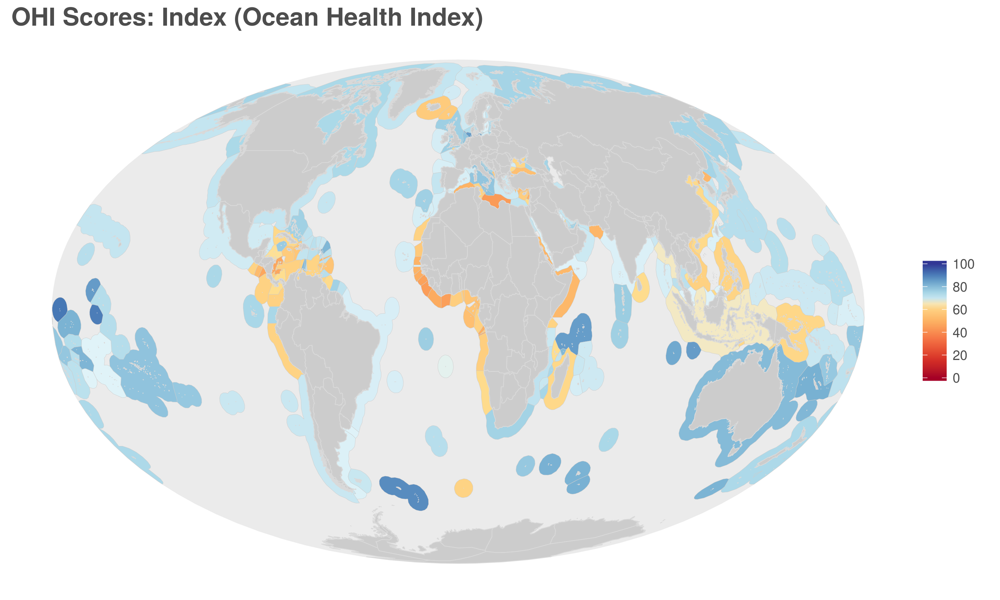 


``` {r Maps, message=FALSE, warning=FALSE, error=FALSE, echo=FALSE, eval=map_create}

## Making the maps of goal scores that will be reported, these figures are not reported here, but will be called in 
## different parts of the text.

source('map_fxns.R')

### set scenario and desired map projection
prj      <- 'mol'    ### note: 'gcs' is way faster.

### get OHI data and rename column headings

for(year in 2012:scenario){ #year=2012
scores_df <- read.csv(sprintf('data/scores_eez%s.csv', year), stringsAsFactors = FALSE) %>%
  rename(rgn_name = country, rgn_id = region_id)

### load region data frame, so doesn't need to reload every time through the loop.  Also
### load the land data frame, if plotting in Mollweide projection.
rgn_df <- get_rgn_df(prj = prj)
if(prj == 'mol' & !exists('land_poly')) {
  land_poly  <- get_land_df()
  ocean_poly <- get_ocean_df() ### assume if land_poly doesn't exist, ocean_poly doesn't either...
}


### establish list of fields for mapping
mapFlds   <- names(scores_df %>% select(-rgn_name, -rgn_id))

### Loop over each field, plotting each map in turn and saving to file.
for (fld in mapFlds) { # fld <- mapFlds[1]

  if(year==scenario){
   fig_save = sprintf('figures/maps_by_goal_%s/global_map_%s_%s_%s.png', prj, fld, year, prj)
} else{ 
    fig_save = sprintf('figures/maps_by_goal_%s/year_%s/global_map_%s_%s_%s.png', prj, year, fld, year, prj)
    }
  
   ohiplot <- plot_scores_easy(scores_df, fld, rgn_df, title = title, prj = prj, fig_save = fig_save)
   
   #print(ohiplot)
}
}

```


# Change over time: five year trends in scores

A color-coded table of 5 year trends is available [here](https://rawgit.com/OHI-Science/ohi-global/draft/global2016/Reporting/data/trends_2016.html) (and a [csv file](https://raw.githubusercontent.com/OHI-Science/ohi-global/draft/global2016/Reporting/data/trends_2016.csv)).  

These values are calculated using a linear model of scores for each region/goal over the past 5 years.  Positive values indicate potentially increasing scores during the past 5 years and negative values indicate potentially decreasing scores.

NOTE: Currently, these data include the livelihoods and economies goal but this trends should probably be calculated without this goal.

```{r trends, message=FALSE, warning=FALSE, error=FALSE, echo=FALSE}

data <- read.csv(sprintf('../radical_%s.csv', radicalFile)) 

data <- data %>%
  filter(dimension == "score") %>%   # focus only on score data
  filter(region_id != 0) %>%         # this weighted mean includes high seas and Antarctica
  mutate(region_id = ifelse(region_id==300, 0, region_id)) %>%   #convert the 300 (i.e., only eez's averaged to zero)
  filter(region_id <= 250) %>%       # get rid of high seas regions
  filter(region_id != 213)  

trends <- data %>%
  filter(!is.na(value)) %>%
  mutate(goal = as.character(goal)) %>%
  group_by(goal, region_id) %>%
  do(mdl = lm(value ~ scenario, data = .)) %>%
  summarize(goal = goal, region_id = region_id,
            trend = coef(mdl)['scenario']) %>%
  ungroup()

trends <- trends %>%  
  left_join(rgn_names, by=c('region_id')) %>%
  mutate(country = ifelse(is.na(country), "eez_weighted_avg", as.character(country))) %>%
  mutate(trend = round(trend, 2)) %>%
  select(goal, country, region_id, trend) %>%
  data.frame()

trends_spread <- spread(trends, goal, trend)

index <- trends_spread %>%
  filter(country == 'eez_weighted_avg')

trends_spread <- trends_spread %>%
  arrange(-Index) %>%
  filter(country != 'eez_weighted_avg')

trends_spread <- rbind(index, trends_spread) %>%
    select(country, region_id, Index, AO, SPP, BD, HAB, CP, CS, CW, ECO, LE, LIV, FIS, FP, MAR, ICO, SP, LSP, NP, TR)

write.csv(trends_spread, sprintf("data/trends_%s.csv", scenario), row.names = FALSE, na='')

## make an html file that is color coded:
pal = brewer.pal(10, 'RdYlBu')

cols <- data.frame(country=trends_spread$country)
for(goal in goals){ #goal="CW"
  tmp <- trends_spread[, goal]
  tmp <- assign(goal, cut(tmp, breaks=c(-1000, -10, -5, -2, -1, 0, 1, 2, 5, 10, 1000), include.lowest = TRUE, labels=pal))
  tmp <- data.frame(goal=tmp)
  names(tmp) <- goal
  cols <- cbind(cols, tmp)
}


hwrite(trends_spread, sprintf('data/trends_%s.html', scenario), br=TRUE, center=TRUE, border=0, 
       row.style=list(goal='text-align:center'), table.style='padding: 10px; margin:20px;', 
       col.bgcolor=list(country='#fff', region_id='#fff', Index = cols$Index, 
                        AO = cols$AO, SPP = cols$SPP, BD = cols$BD, HAB = cols$HAB, CP = cols$CP, CS = cols$CS, CW = cols$CW, 
                        ECO = cols$ECO, LE = cols$LE, LIV = cols$LIV, FIS = cols$FIS, FP = cols$FP, MAR = cols$MAR, ICO = cols$ICO, 
                        SP = cols$SP, LSP = cols$LSP, NP = cols$NP, TR = cols$TR))

```

### Trends of regional index scores
The global average suggests a slight (but, probably negligible) decrease in index scores during the past five years (-0.11), but there was a good deal of variation among regions.  The following histogram describes the distribution of trends in index scores:

```{r trend histogram, message=FALSE, warning=FALSE, error=FALSE, echo=FALSE}
trends_hist <- trends %>%
  filter(goal=="Index") %>%
  filter(region_id != 0)

g <- ggplot(trends_hist, aes(x=trend)) +
geom_histogram(color = "gray", fill="gray") +
labs(y="Number of regions", x="Index scores: 5 year trend") + 
geom_vline(xintercept=0, color="red") +  
theme_bw()

plot(g)

```

The 10 regions with the largest increases in index scores are:

```{r trend best, message=FALSE, warning=FALSE, error=FALSE, echo=FALSE}

trends_order <- trends %>%
  filter(goal=="Index") %>%
  filter(region_id != 0) %>%
  select(country, trend) %>%
  arrange(-trend)

kable(trends_order[1:10, ])

```

The 10 regions with the largest decreases in index scores are: 

```{r trend worst, message=FALSE, warning=FALSE, error=FALSE, echo=FALSE}
bottom <- dim(trends_order)[1]

kable(trends_order[(bottom-9):bottom, ])

```

### Trends of goal scores
Here is a summary of the mean and standard deviation of the trends for different goals:

```{r trend goals, message=FALSE, warning=FALSE, error=FALSE, echo=FALSE}

trends_goals <- trends %>%
  filter(region_id != 0) %>%
  group_by(goal) %>%
  summarize(mean_trend = mean(trend, na.rm=TRUE),
            sd_trend = sd(trend, na.rm=TRUE)) %>%
  mutate(goal = factor(goal, levels = goals)) %>%
  arrange(goal) %>%
  left_join(goal_names) %>%
  select(goal=long_goal, "mean trend" = mean_trend, "sd trend" = sd_trend)

kable(trends_goals)

```

These scores require a closer look, but possible patterns include:

* Scores for the artisanal opportunities goal appear to have increased by relatively small amounts for the majority of regions
* Scores for the fisheries goal appear to be increasing for the majority of regions
* Scores for the natural products appear to be overall decreasing, but there is a lot of variation, and some regions have had large increases
* Tourism trends vary strongly from region to region
* Lasting special places trends are fairly variable due to large increases in scores for a few regions


# Comparing assessment years

The following is a comparison of the global status scores generated for 2015 by this year's assessment vs. last year's assessment. 

If the models and source data remains the same, these scores should be exactly the same.  Differences indicate changes in methods or source data ([described in this downloadable document](https://github.com/OHI-Science/ohi-global/raw/draft/global2016/Reporting/OHI%202016%20summary_v1.docx)).  

These changes do not reflect changes in actual system health!   


### Global averages
The following goals had the largest changes:

* Artisanal opportunity (biggest change: +11 points): Reference point of need data adjusted to avoid scores being driven by outliers
* Species condition/biodiversity (+8 points): Addition of bird species tended to increase status scores
* Mariculture (+6 points): Changes to source data
* Fisheries (-4 points): Decrease is due primarily to increase in number of stocks classified as "unidentified" in source data (plus, a lot of other changes)

The rest of the goals/subgoals changed by less than 3 points (on average, although regions might be highly variable).

```{r compare assessments, echo=FALSE}

data <- read.csv(sprintf('../radical_%s.csv', radicalFile)) %>%
  rename("assess2016"=value)

data_old <- read.csv('../../global2015/radical_2015-09-11.csv') %>%
  rename("assess2015"=value) %>%
  left_join(data, by = c("scenario", "goal", "dimension", "region_id")) %>%
  filter(region_id != 0) %>%         # this weighted mean includes high seas and Antarctica
  mutate(region_id = ifelse(region_id==300, 0, region_id)) %>%   #convert the 300 (i.e., only eez's averaged to zero)
  filter(region_id <= 250) %>%       # get rid of high seas regions
  filter(region_id != 213)  %>%         # Antarctica (calculated in a very different way)
  left_join(rgn_names, by=c('region_id')) %>%
  mutate(country = ifelse(is.na(country), "eez_weighted_avg", as.character(country))) 

data_old <- data_old %>%
  filter(region_id == 0) %>%
  filter(dimension == "status") %>%
  left_join(goal_names, by="goal") %>%
  filter(scenario==2015)

data_old$goal <- factor(data_old$goal, levels = goals)

data_old <- data_old %>%
  arrange(goal) %>%
  select(goal = long_goal, assess2015, assess2016) %>%
  mutate(change = assess2016 - assess2015)

kable(data_old)

```

### Regional data

This color-coded [table](https://rawgit.com/OHI-Science/ohi-global/draft/global2016/Reporting/data/change_in_scores_benchmark2015_eez2016.html) compares the 2015 index scores generated for each region/goal between this year's and last year's assessment.  

Because these are index scores, changes reflect updates to pressure and resilience scores as well as status.  

The following interactive plot provides an overview of how the 2015 scores changed between the 2015 and 2016 assessment for all goals and dimensions.

```{r compare plot, echo=FALSE}

data <- read.csv(sprintf('../radical_%s.csv', radicalFile)) %>%
  rename("assess2016"=value)

data_old <- read.csv('../../global2015/radical_2015-09-11.csv') %>%
  rename("assess2015"=value) %>%
  left_join(data, by = c("scenario", "goal", "dimension", "region_id")) %>%
  filter(region_id != 0) %>%         # this weighted mean includes high seas and Antarctica
  mutate(region_id = ifelse(region_id==300, 0, region_id)) %>%   #convert the 300 (i.e., only eez's averaged to zero)
  filter(region_id <= 250) %>%       # get rid of high seas regions
  filter(region_id != 213)  %>%         # Antarctica (calculated in a very different way)
  left_join(rgn_names, by=c('region_id')) %>%
  mutate(country = ifelse(is.na(country), "eez_weighted_avg", as.character(country))) 

data_old <- data_old %>%
  filter(scenario==2015) %>%
  mutate(change = assess2016 - assess2015)


  p <- ggplot2::ggplot(data_old, aes(x=goal, y=change, color=dimension)) +
    #geom_point(shape=19, size=1) +
    theme_bw() + 
    labs(title="2015 OHI scores", y="Change in score", x="") +
    scale_x_discrete(limits = c("Index", "AO", "SPP", "BD", "HAB", "CP", "CS", "CW", "FIS", "FP", 
                                "MAR", "ECO", "LE", "LIV", "NP", "LSP", "SP", "ICO", "TR")) +
    scale_colour_brewer(palette="Dark2") +
    geom_jitter(aes(text=paste0("rgn = ", country)), position = position_jitter(width=0.2, height=0), shape=19, size=1)
  
  plotly_fig <- plotly::ggplotly(p)
  plotly_fig
  
```


```{r difference table, message=FALSE, warning=FALSE, error=FALSE, echo=FALSE}

data <- read.csv(sprintf('../radical_%s.csv', radicalFile)) 

data <- data[data$scenario == benchmark, ]

data <- data %>%
  filter(dimension == "score") %>%   # focus only on score data
  filter(region_id != 0) %>%         # this weighted mean includes high seas and Antarctica
  mutate(region_id = ifelse(region_id==300, 0, region_id)) %>%   #convert the 300 (i.e., only eez's averaged to zero)
  filter(region_id <= 250) %>%       # get rid of high seas regions
  filter(region_id != 213)  

# get the older data
oldDataAddress <- paste0('https://raw.githubusercontent.com/',
                         'OHI-Science/ohi-global/', oldCommit,
                        sprintf('/eez%s/scores.csv', benchmark))

oldData <- repmis::source_data(oldDataAddress) %>%
  filter(dimension == "score") %>%
  filter(region_id != 213) %>%
  select(goal, dimension, region_id, old_value=score)

oldData$scenario <- benchmark

compare <- data %>%
  left_join(oldData) %>%
  left_join(rgn_names, by=c('region_id')) %>%
  mutate(country = ifelse(is.na(country), "eez_weighted_avg", as.character(country))) %>%
  mutate(change_in_score = round((value - old_value), 2))

compare_table <- compare %>%
  group_by(goal) %>%
  summarize(standard_deviation = round(sd(change_in_score, na.rm=TRUE), 2)) %>%
  mutate(goal = factor(goal, levels = goals)) %>%
  arrange(goal)

# Decided this table was more confusing than helpful:
# kable(compare_table)

compare_wide <- compare %>%
  select(scenario, goal, dimension, country, region_id, change_in_score) %>%
  spread(goal, change_in_score)

index <- compare_wide %>%
  filter(country == 'eez_weighted_avg')

compare_wide <- compare_wide %>%
  arrange(-Index) %>%
  filter(country != 'eez_weighted_avg')

compare_wide <- rbind(index, compare_wide) %>%
    select(scenario, dimension, country, region_id, Index, AO, SPP, BD, HAB, CP, CS, CW, ECO, LE, LIV, FIS, FP, MAR, ICO, SP, LSP, NP, TR)

write.csv(compare_wide, sprintf("data/change_in_scores_benchmark%s_eez%s.csv", benchmark, scenario), row.names = FALSE, na='')

## make an html file that is color coded:
pal = brewer.pal(10, 'RdYlBu')

cols <- data.frame(country=compare_wide$country)
for(goal in goals){ #goal="CW"
  tmp <- compare_wide[, goal]
   tmp <- assign(goal, cut(tmp, breaks=c(-100, -50, -30, -20, -10, 0, 10, 20, 30, 50, 100), include.lowest = TRUE, labels=pal))
  tmp <- data.frame(goal=tmp)
  names(tmp) <- goal
  cols <- cbind(cols, tmp)
}


hwrite(compare_wide, sprintf('data/change_in_scores_benchmark%s_eez%s.html', benchmark, scenario), br=TRUE, center=TRUE, border=0, 
       row.style=list(goal='text-align:center'), table.style='padding: 10px; margin:20px;', 
       col.bgcolor=list(scenario='#fff',dimension='#fff',country='#fff', region_id='#fff', Index = cols$Index, 
                        AO = cols$AO, SPP = cols$SPP, BD = cols$BD, HAB = cols$HAB, CP = cols$CP, CS = cols$CS, CW = cols$CW, 
                        ECO = cols$ECO, LE = cols$LE, LIV = cols$LIV, FIS = cols$FIS, FP = cols$FP, MAR = cols$MAR, ICO = cols$ICO, 
                        SP = cols$SP, LSP = cols$LSP, NP = cols$NP, TR = cols$TR))


```

Some general pattern in these data:

* Fisheries/Food provisioning: Lots of changes all over the place due to changes in source data and other changes to methods
* Artisanal opportunity: consistently increased for most regions due to change in reference point

# A closer look at goals

This section takes a closer look at each goal/subgoal.  I do not include goals that are comprised of multiple subgoals, although the subgoals are described.

```{r goal histograms, message=FALSE, warning=FALSE, error=FALSE, echo=FALSE, eval=goal_hists}

data <- read.csv('data/scores_eez2016.csv') %>%
  filter(region_id != 0) %>%
  select(AO, SPP, HAB, CP, CS, CW, FIS, MAR, ICO, LSP, NP, TR)

for(goal in names(data)){ # goal = "AO"
  
  data_goal <- data[, goal]
  
g <- ggplot(data, aes(x=data_goal)) +
geom_histogram(color = "gray", fill="gray") +
labs(y="Number of regions", x= paste(goal, "region scores", sep=" ")) +
xlim(0,100) +
theme_bw()

ggsave(g, filename=sprintf("figures/goal_histograms/%s_scores.png", goal))
}

```

## Artisanal opportunities

### Scores
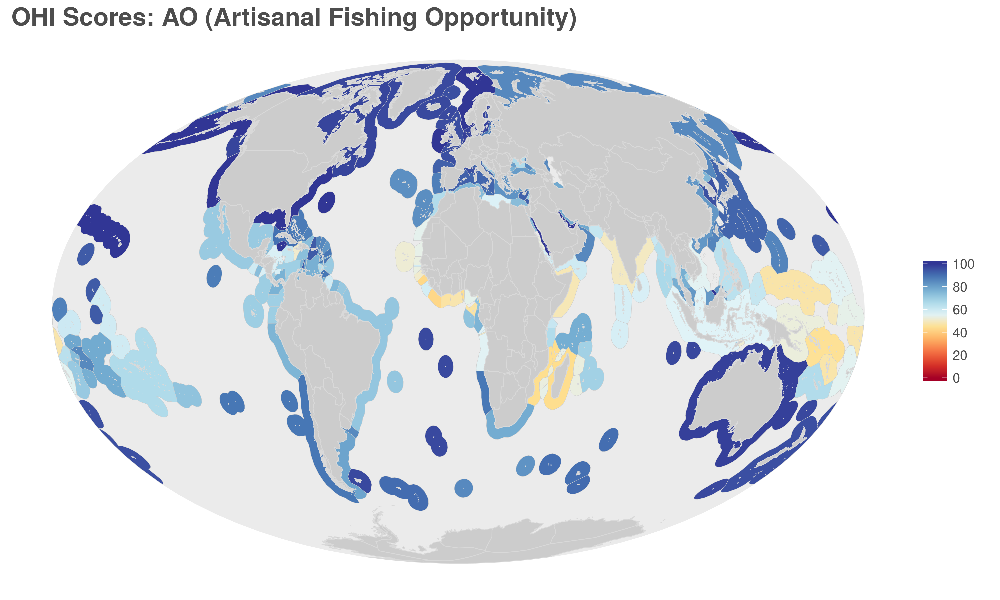
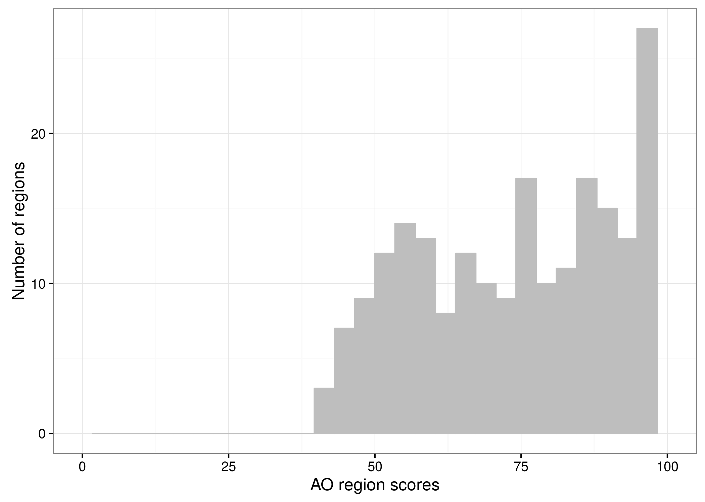

### Top 10 performers
```{r top AO, message=FALSE, warning=FALSE, error=FALSE, echo=FALSE}

data <- read.csv('data/scores_eez2016.csv') %>%
  filter(region_id != 0) %>%
  select(country, score=AO) %>%
  arrange(-score) %>%
  filter(!is.na(score))

top <- data[1:10, ]
kable(top)

```

### Bottom 10 performers
```{r bottom AO, message=FALSE, warning=FALSE, error=FALSE, echo=FALSE}

max <- dim(data)[1]
bottom <- data[(max-9):max, ]
kable(bottom)

```


## Species condition

### Scores
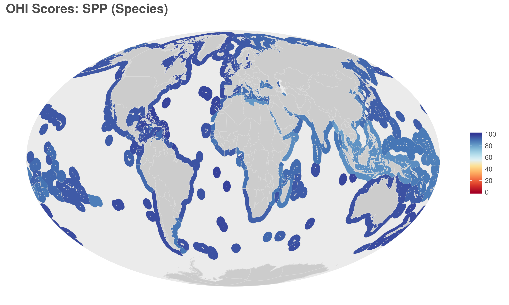
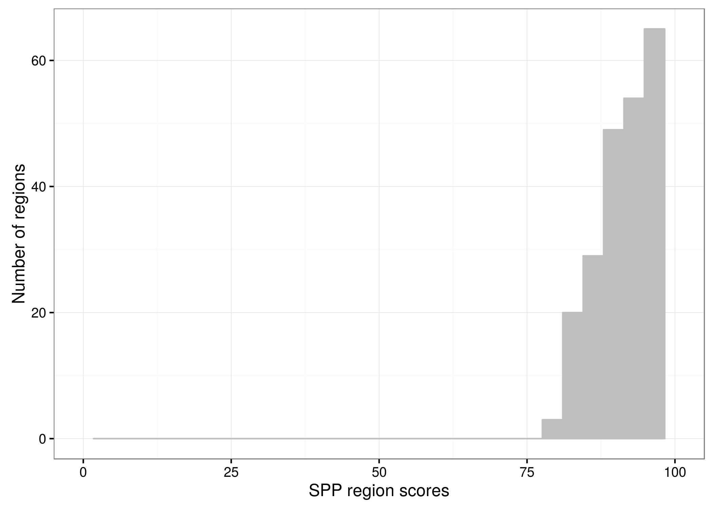

### Top 10 performers
```{r top SPP, message=FALSE, warning=FALSE, error=FALSE, echo=FALSE}

data <- read.csv('data/scores_eez2016.csv') %>%
  filter(region_id != 0) %>%
  select(country, score=SPP) %>%
  arrange(-score) %>%
  filter(!is.na(score))

top <- data[1:10, ]
kable(top)

```

### Bottom 10 performers
```{r bottom SPP, message=FALSE, warning=FALSE, error=FALSE, echo=FALSE}

max <- dim(data)[1]
bottom <- data[(max-9):max, ]
kable(bottom)

```

## Habitat

### Scores
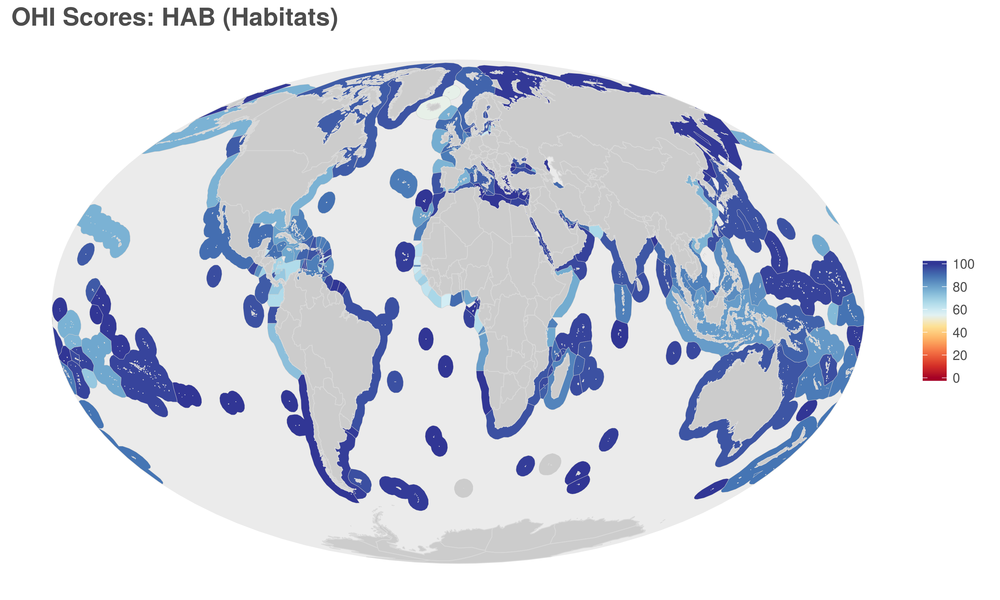
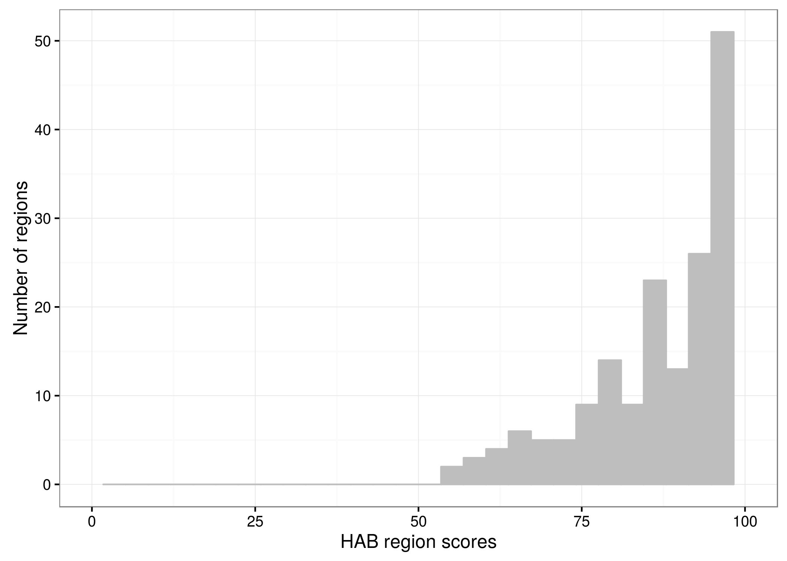

### Top 10 performers
```{r top HAB, message=FALSE, warning=FALSE, error=FALSE, echo=FALSE}

data <- read.csv('data/scores_eez2016.csv') %>%
  filter(region_id != 0) %>%
  select(country, score=HAB) %>%
  arrange(-score) %>%
  filter(!is.na(score))

top <- data[1:10, ]
kable(top)

```

### Bottom 10 performers
```{r bottom HAB, message=FALSE, warning=FALSE, error=FALSE, echo=FALSE}

max <- dim(data)[1]
bottom <- data[(max-9):max, ]
kable(bottom)

```


## Coastal protection

### Scores
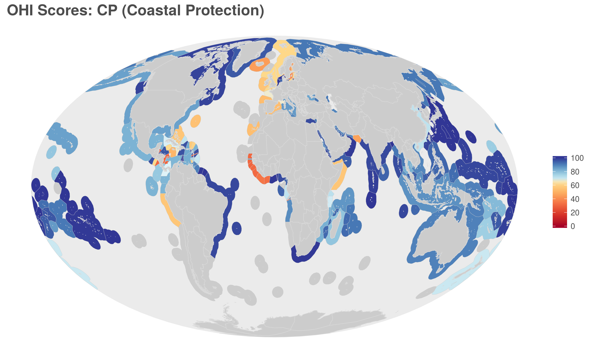
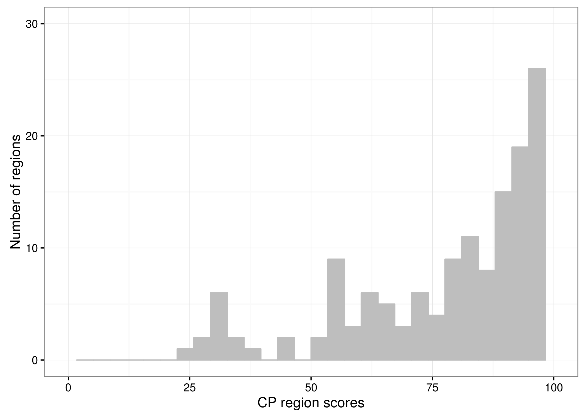

### Top 10 performers
```{r top CP, message=FALSE, warning=FALSE, error=FALSE, echo=FALSE}

data <- read.csv('data/scores_eez2016.csv') %>%
  filter(region_id != 0) %>%
  select(country, score=CP) %>%
  arrange(-score) %>%
  filter(!is.na(score))

top <- data[1:10, ]
kable(top)

```

### Bottom 10 performers
```{r bottom CP, message=FALSE, warning=FALSE, error=FALSE, echo=FALSE}

max <- dim(data)[1]
bottom <- data[(max-9):max, ]
kable(bottom)

```


## Carbon storage

### Scores
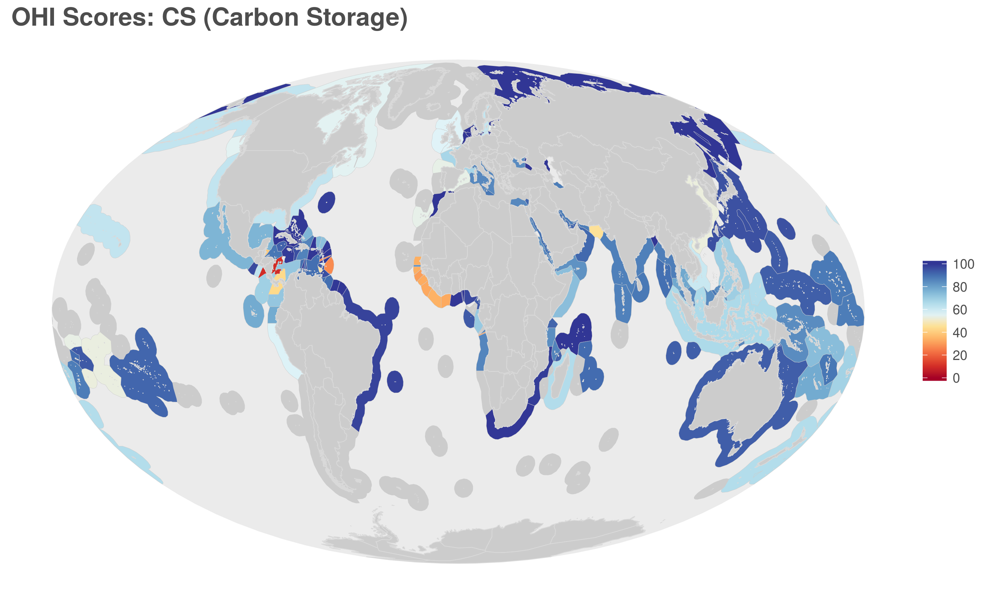
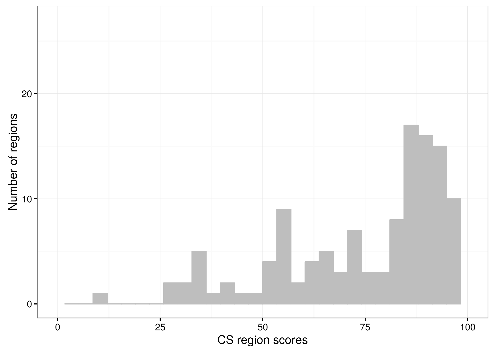

### Top 10 performers
```{r top CS, message=FALSE, warning=FALSE, error=FALSE, echo=FALSE}

data <- read.csv('data/scores_eez2016.csv') %>%
  filter(region_id != 0) %>%
  select(country, score=CS) %>%
  arrange(-score) %>%
  filter(!is.na(score))

top <- data[1:10, ]
kable(top)

```

### Bottom 10 performers
```{r bottom CS, message=FALSE, warning=FALSE, error=FALSE, echo=FALSE}

max <- dim(data)[1]
bottom <- data[(max-9):max, ]
kable(bottom)

```

## Clean waters

### Scores
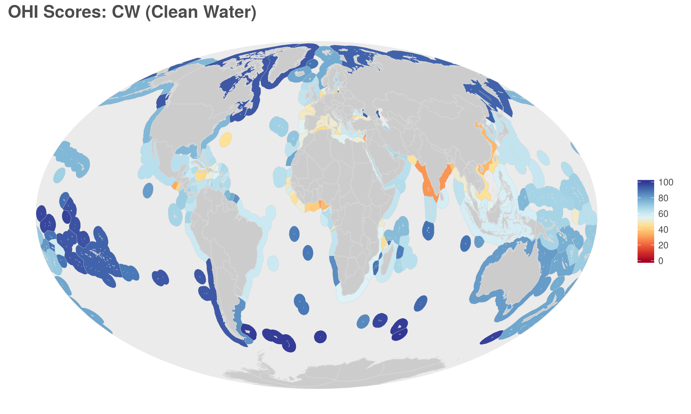
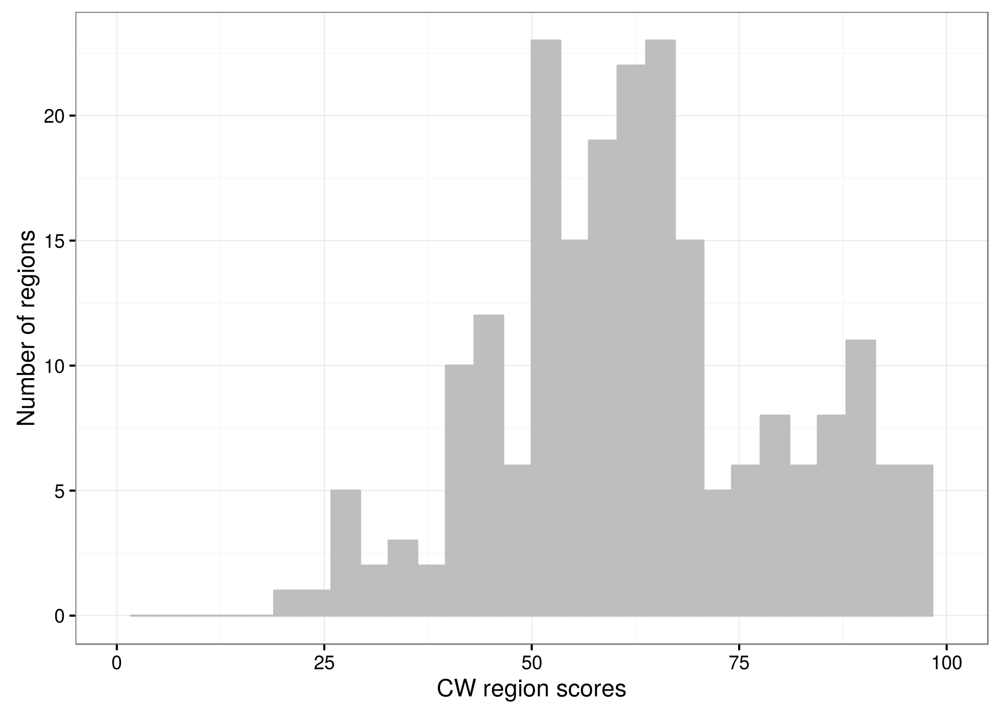

### Top 10 performers
```{r top CW, message=FALSE, warning=FALSE, error=FALSE, echo=FALSE}

data <- read.csv('data/scores_eez2016.csv') %>%
  filter(region_id != 0) %>%
  select(country, score=CW) %>%
  arrange(-score) %>%
  filter(!is.na(score))

top <- data[1:10, ]
kable(top)

```

### Bottom 10 performers
```{r bottom CW, message=FALSE, warning=FALSE, error=FALSE, echo=FALSE}

max <- dim(data)[1]
bottom <- data[(max-9):max, ]
kable(bottom)

```

## Fisheries

### Scores
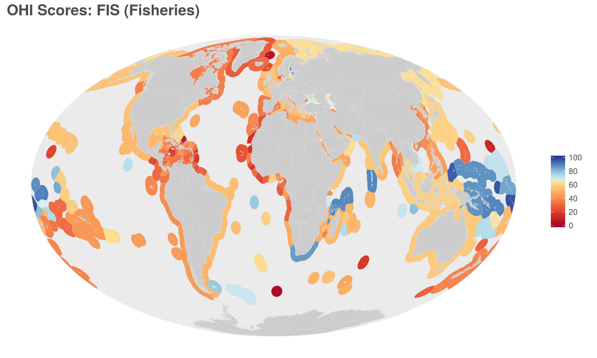
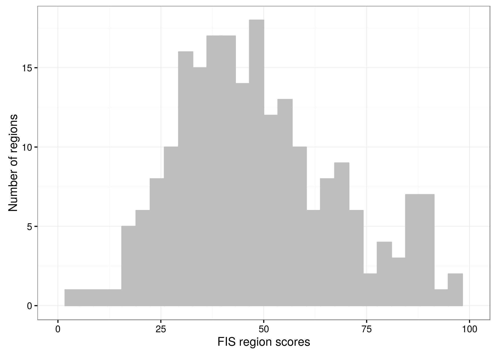

### Top 10 performers
```{r top FIS, message=FALSE, warning=FALSE, error=FALSE, echo=FALSE}

data <- read.csv('data/scores_eez2016.csv') %>%
  filter(region_id != 0) %>%
  select(country, score=FIS) %>%
  arrange(-score) %>%
  filter(!is.na(score))

top <- data[1:10, ]
kable(top)

```

### Bottom 10 performers
```{r bottom FIS, message=FALSE, warning=FALSE, error=FALSE, echo=FALSE}

max <- dim(data)[1]
bottom <- data[(max-9):max, ]
kable(bottom)

```

## Mariculture

### Scores
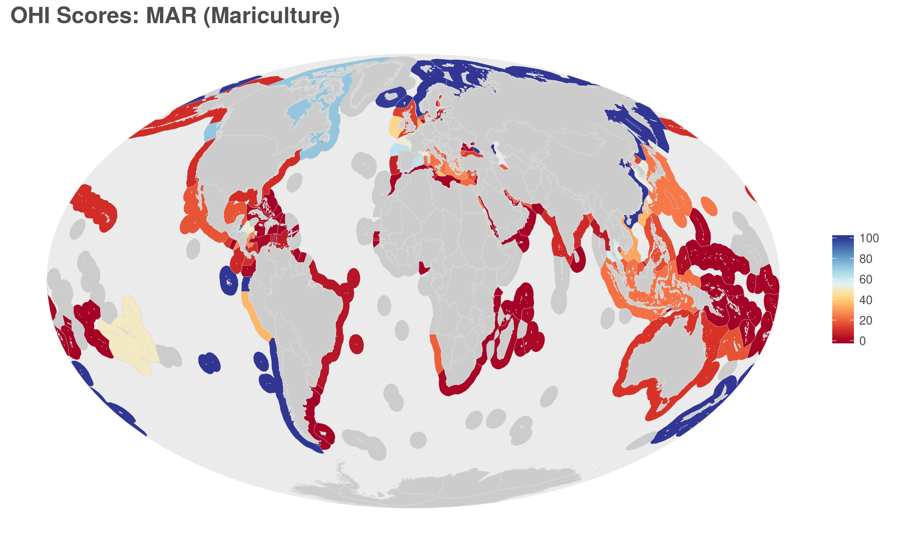
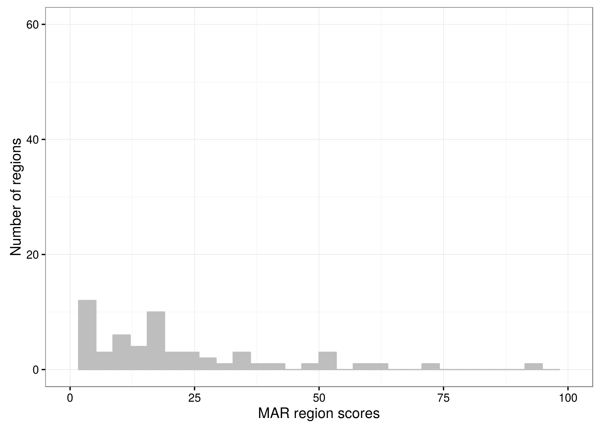

### Top 10 performers
```{r top MAR, message=FALSE, warning=FALSE, error=FALSE, echo=FALSE}

data <- read.csv('data/scores_eez2016.csv') %>%
  filter(region_id != 0) %>%
  select(country, score=MAR) %>%
  arrange(-score) %>%
  filter(!is.na(score))

top <- data[1:10, ]
kable(top)

```

### Bottom 10 performers
```{r bottom MAR, message=FALSE, warning=FALSE, error=FALSE, echo=FALSE}

max <- dim(data)[1]
bottom <- data[(max-9):max, ]
kable(bottom)

```

## Iconic species

### Scores
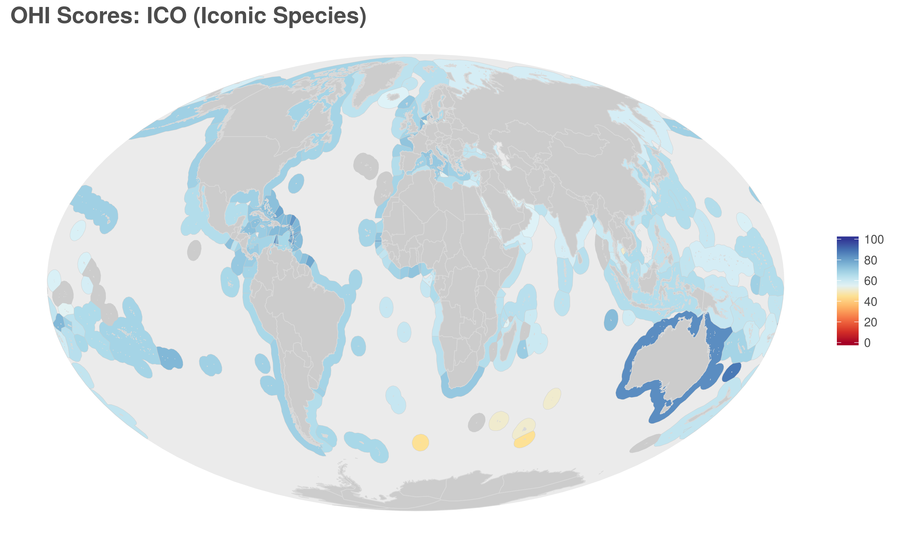
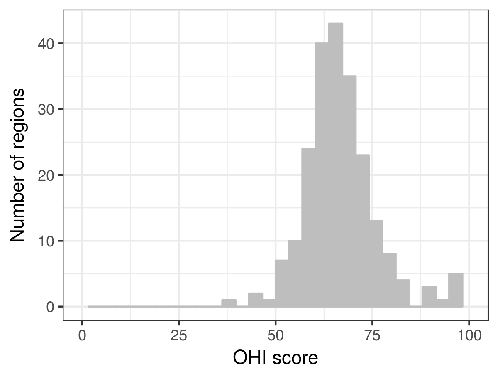

### Top 10 performers
```{r top ICO, message=FALSE, warning=FALSE, error=FALSE, echo=FALSE}

data <- read.csv('data/scores_eez2016.csv') %>%
  filter(region_id != 0) %>%
  select(country, score=AO) %>%
  arrange(-score) %>%
  filter(!is.na(score))

top <- data[1:10, ]
kable(top)

```

### Bottom 10 performers
```{r bottom ICO, message=FALSE, warning=FALSE, error=FALSE, echo=FALSE}

max <- dim(data)[1]
bottom <- data[(max-9):max, ]
kable(bottom)

```

## Lasting special places

### Scores
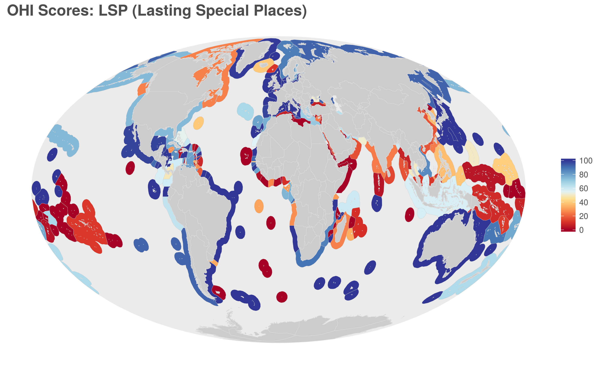
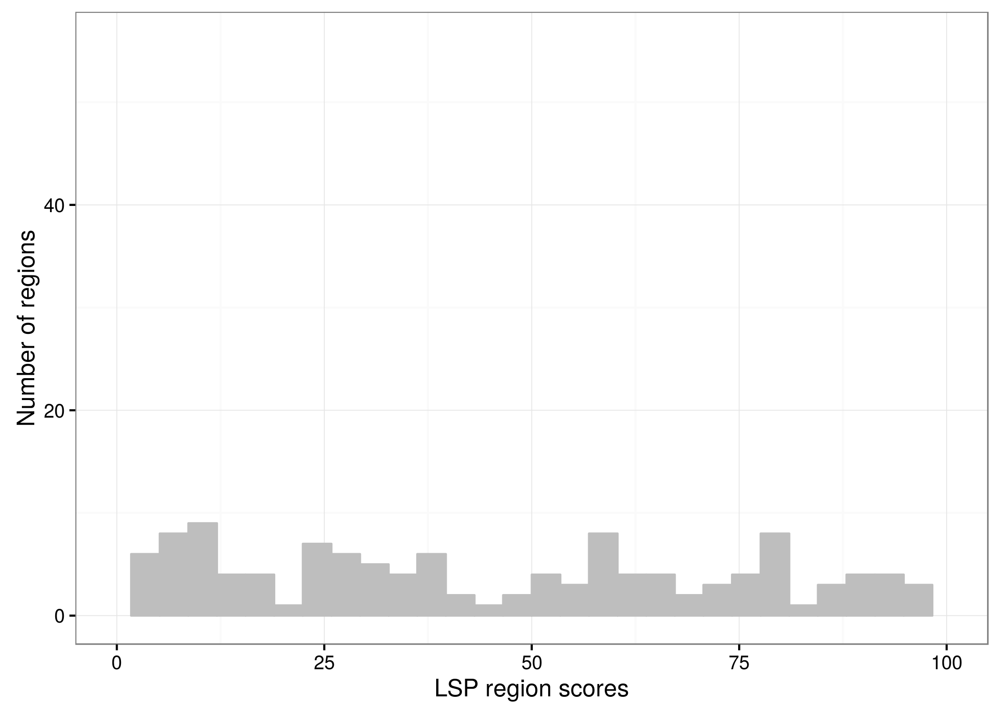

### Top 10 performers
```{r top LSP, message=FALSE, warning=FALSE, error=FALSE, echo=FALSE}

data <- read.csv('data/scores_eez2016.csv') %>%
  filter(region_id != 0) %>%
  select(country, score=LSP) %>%
  arrange(-score) %>%
  filter(!is.na(score))

top <- data[1:10, ]
kable(top)

```

### Bottom 10 performers
```{r bottom LSP, message=FALSE, warning=FALSE, error=FALSE, echo=FALSE}

max <- dim(data)[1]
bottom <- data[(max-9):max, ]
kable(bottom)

```

## Natural products

### Scores
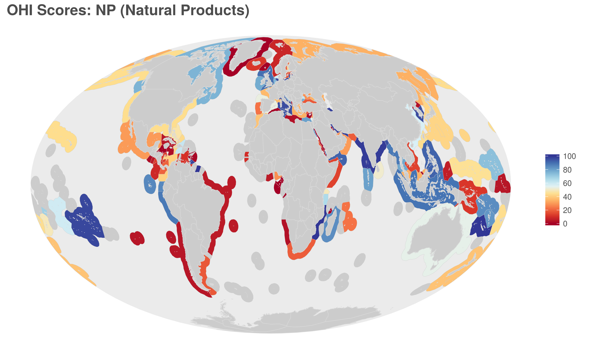
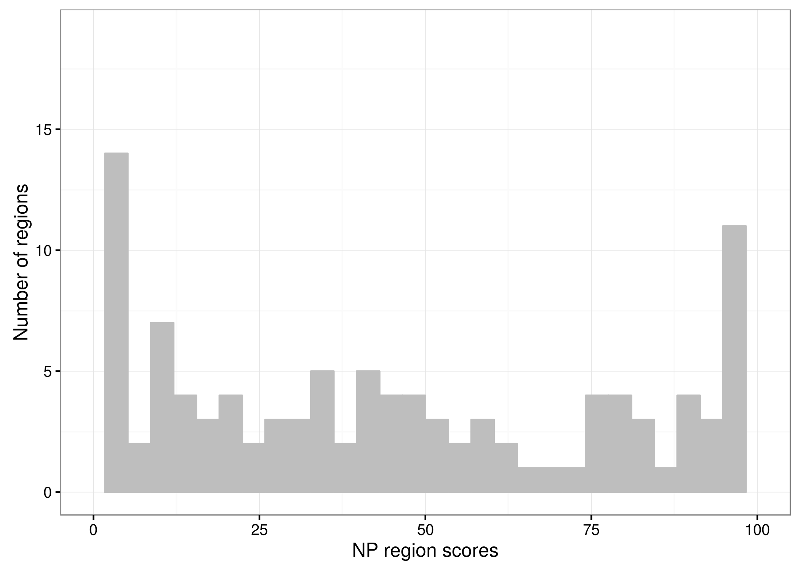

### Top 10 performers
```{r top NP, message=FALSE, warning=FALSE, error=FALSE, echo=FALSE}

data <- read.csv('data/scores_eez2016.csv') %>%
  filter(region_id != 0) %>%
  select(country, score=NP) %>%
  arrange(-score) %>%
  filter(!is.na(score))

top <- data[1:10, ]
kable(top)

```

### Bottom 10 performers
```{r bottom NP, message=FALSE, warning=FALSE, error=FALSE, echo=FALSE}

max <- dim(data)[1]
bottom <- data[(max-9):max, ]
kable(bottom)

```

## Tourism and recreation

### Scores
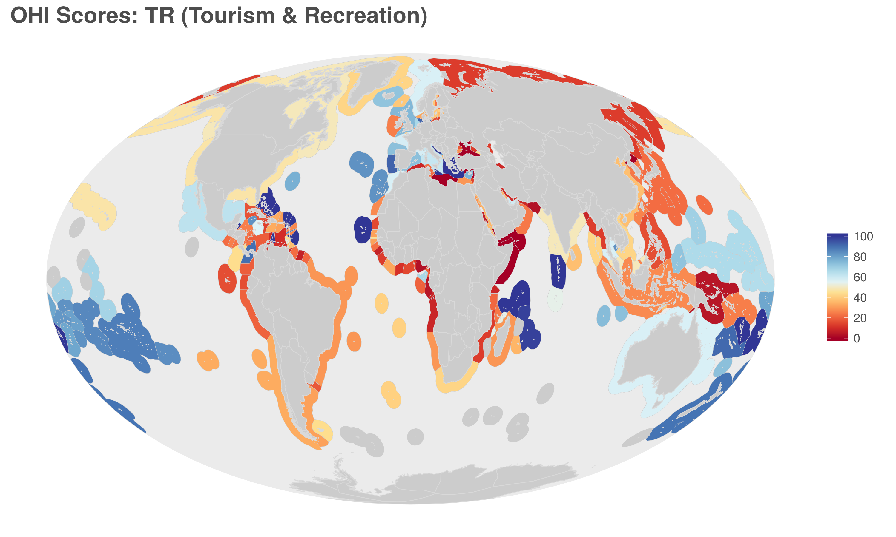
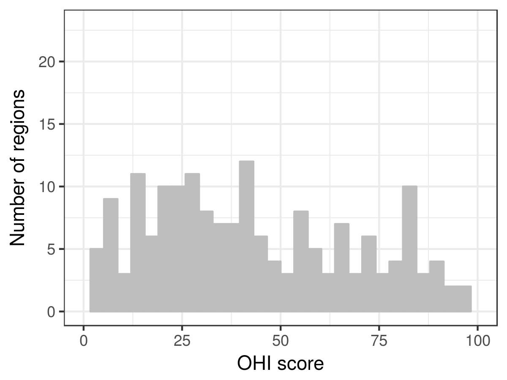

### Top 10 performers
```{r top TR, message=FALSE, warning=FALSE, error=FALSE, echo=FALSE}

data <- read.csv('data/scores_eez2016.csv') %>%
  filter(region_id != 0) %>%
  select(country, score=TR) %>%
  arrange(-score) %>%
  filter(!is.na(score))

top <- data[1:10, ]
kable(top)

```

### Bottom 10 performers
```{r bottom TR, message=FALSE, warning=FALSE, error=FALSE, echo=FALSE}

max <- dim(data)[1]
bottom <- data[(max-9):max, ]
kable(bottom)

```

# Additional checks
This table describes the years of data that were used for each goal for each assessment year.


```{r status years, warning=FALSE, error=FALSE, message=FALSE, echo=FALSE}

# Creates a table showing years of data used for each goal
scenarios <- 2012:scenario

data <- data.frame(goals = goals[-1])

for (scenarioYear in scenarios){ # scenarioYear = 2015

    f <-  read.csv(sprintf('../../eez%s/conf/goals.csv', scenarioYear)) %>%
      select(goal, preindex_function)

goalsYears <- c()    
    for(goal in goals[-1]){ # goal = "FIS"  goal = "AO"
    g <- f[f$goal == goal, ]
    year <- as.numeric(gsub("[^\\d]+", "", g$preindex_function, perl=TRUE))
    
    year <- ifelse(length(year)==0, NA, year)
    goalsYears <- c(goalsYears, year)
    }

goalsYears <- data.frame(goalsYears)
names(goalsYears) <- paste('eez', scenarioYear, sep="_")
data <- cbind(data, goalsYears)
}

kable(data,format="pandoc",caption="Years used in analysis")

```


```{r Flower plots, message=FALSE, warning=FALSE, error=FALSE, echo=FALSE, fig.width=4, fig.height=4, eval = flower_plots}

# This generates the flower plots:

## weights for FIS vs. MAR
weights <- read.csv(sprintf("../../eez%s/layers/fp_wildcaught_weight.csv", scenario), stringsAsFactors=FALSE)
weights_global <- data.frame(rgn_id=0, w_fis=mean(weights$w_fis))
weights <- rbind(weights_global, weights)

# getting the goals that will be plotted:
conf <-  read.csv(sprintf("../../eez%s/conf/goals.csv", scenario), stringsAsFactors=FALSE) 

goals_supra = na.omit(unique(conf$parent)) # goals comprised of subgoals, not included in plot

conf <- conf %>%
  filter(!(goal %in% goals_supra)) %>%
  select(goal, order_color, order_hierarchy, weight, name_flower) %>%
  mutate(name_flower = gsub("\\n", "\n", name_flower, fixed = TRUE)) %>%
  arrange(order_hierarchy)


data <- read.csv(sprintf('../radical_%s.csv', radicalFile), stringsAsFactors=FALSE) 
data <- data[data$scenario == scenario, ]

data <- data %>%
  filter(dimension == "score") %>%   # focus only on score data
  filter(region_id != 0) %>%         # this weighted mean includes high seas and Antarctica
  mutate(region_id = ifelse(region_id==300, 0, region_id)) %>%   #convert the 300 (i.e., only eez's averaged to zero)
  filter(region_id <= 250) %>%       # get rid of high seas regions
  filter(region_id != 213)

# region names, ordered by GLOBAL and alphabetical
rgn_names2 = rbind(
  data.frame(
    region_id=0, 
    country='GLOBAL'),
  rgn_names) %>%
    arrange(country) %>%
  filter(region_id != 213)

# loop through regions to plot flowers
for (rgn_id in unique(rgn_names2$region_id)){  #rgn_id=0
   
  # header md
  rgn_name = subset(rgn_names2, region_id==rgn_id, country, drop=T)
  message(sprintf('\n## %s (%d)\n\n', rgn_name, rgn_id))
  
    # region scores    
  g_x <- subset(data, region_id==rgn_id) %>%
         inner_join(conf, by="goal") %>%
         arrange(order_color)
  x <-  subset(data, region_id==rgn_id & goal == 'Index', value, drop=T)

    # get colors for aster, based on 10 colors, but extended to all goals. subselect for goals.wts
if(colorScheme == "new"){
  g_x$cols.goals.all = cut(g_x$value, breaks=seq(0, 100, by=10), include.lowest=TRUE, 
                       labels=RColorBrewer::brewer.pal(10, 'RdYlBu')) } else {
    g_x$cols.goals.all = colorRampPalette(RColorBrewer::brewer.pal(11, 'Spectral'), space='Lab')(length(goals.all))
   }

       #weights after correcting for fisheries/mariculture contributions
  g_x$weight[g_x$goal == "FIS"] <-   weights$w_fis[weights$rgn_id == rgn_id]
  g_x$weight[g_x$goal == "MAR"] <- 1 - weights$w_fis[weights$rgn_id == rgn_id]
  
        
  # res=72
      
  res=150
   ## start plot
   png(sprintf('figures/FlowerPlots/flower_%s_%s.png', rgn_name, scenario),
          width=res*6, height=res*6, bg = "transparent")
#par(oma=c(0,0,3,0), mar=c(6, 4, 0, 2) + 0.1)
   PlotFlower(main = rgn_name,
                 lengths=ifelse(
                   is.na(g_x$value),
                   100,
                   g_x$value),
                 widths=g_x$weight,
                 fill.col=ifelse(
                   is.na(g_x$cols.goals.all), 
                   'grey80', 
                   as.character(g_x$cols.goals.all)),
                 labels  =ifelse(
                   is.na(g_x$value), 
                   paste(g_x$name_flower, '-', sep='\n'), 
                   paste(as.character(g_x$name_flower), round(g_x$value), sep='\n')),
                 center=round(x),
               #  max.length = 100, disk=0.4, label.cex=0.9, label.offset=0.155, cex=2.2, cex.main=2.5)
           max.length = 100, disk=0.3, label.cex=1.5, label.offset=0.15, cex=3, cex.main=3)

      dev.off()      
      #system(sprintf('convert -density 150x150 %s %s', fig_pdf, fig_png)) # imagemagick's convert
  
# to have flowers included in report    
# PlotFlower(main = rgn_name,
#                  lengths=ifelse(
#                    is.na(g_x$value),
#                    100,
#                    g_x$value),
#                  widths=g_x$weight,
#                  fill.col=ifelse(
#                    is.na(g_x$cols.goals.all), 
#                    'grey80', 
#                    as.character(g_x$cols.goals.all)),
#                  labels  =ifelse(
#                    is.na(g_x$value), 
#                    paste(g_x$name_flower, '-', sep='\n'), 
#                    paste(as.character(g_x$name_flower), round(g_x$value), sep='\n')),
#                  center=round(x),
#                 max.length = 100, disk=0.4, label.cex=0.5, label.offset=0.19, cex=1.2, cex.main=1.2, uin=1)
  }
  

```

```{r scatter plot: old vs new, message=FALSE, warning=FALSE, error=FALSE, echo=FALSE, eval=FALSE}

# Scatterplots comparing the current assessment and the 2015 assessment: not including at this point...seems adequately covered elsewhere
# but will keep as reference 
#-------------------------
  criteria <- ~dimension == score
#-------------------------

# uses compare data calculated above


for(goal in goals){ # goal = "AO"

data_new <- compare %>%
    group_by(goal) %>% 
    mutate(mean = mean(change_in_score, na.rm=TRUE),
           sd =  sd(change_in_score, na.rm=TRUE)) %>%
    ungroup() %>%
    mutate(z_score = (change_in_score - mean)/sd) %>%
    mutate(z_greater_1 = ifelse(abs(z_score) > 1, "yes", "no")) %>%
    filter(region_id != 0) %>%
    mutate(plotLabel = ifelse(z_greater_1=="yes", as.character(country), NA))
  
  data_new <- data_new[data_new$goal==goal,]  

p <-   ggplot(data_new, aes(x=old_value, y=value)) +
    geom_point(shape=19) +
    theme_bw() + 
    labs(title=paste(benchmark, goal, sep=": "), y="New scores", x="Old scores") +
    geom_abline(slope=1, intercept=0, color="red") +
    geom_text(aes(label=plotLabel), vjust=1.5, size=2) +
  xlim(0, 100) +
  ylim(0, 100)

print(p)
}

```


# Analyses of data

One thing we have been interested in is how well the likely future state score actually predicts the future score.

My initial conclusions are that the trend/pressure/resilience components of the likely future state score are not improving our predictions.

### Observed vs. predicted 2016 scores

*Methods:* I compared the likely future status scores in 2012 to the observed status in 2016.  

*Results:* At first glance, this appears promising because there is actaully a nice correlation between the values:

```{r future state dataprep, message=FALSE, warning=FALSE, error=FALSE, echo=FALSE}

meta <- read.csv('../../eez2016/conf/goals.csv', stringsAsFactors=FALSE) %>%
  mutate(parent = ifelse(parent=="", goal, parent)) %>%
  mutate(supragoal = ifelse(goal == parent, "supragoal", NA)) %>%
  filter(supragoal == "supragoal") %>%
  select(goal=parent, weight)

data <- read.csv(sprintf('../radical_%s.csv', radicalFile)) 

### getting index status scores (it seems like this should be output in ohicore,
### I think this change would occur in line 207 in CalculateAll.R)
index_status <- data %>%
  filter(goal != "Index") %>%
  filter(region_id != 0) %>%         # this weighted mean includes high seas and Antarctica
  filter(region_id != 300) %>%
  filter(region_id <= 250) %>%       # get rid of high seas regions
  filter(region_id != 213) %>%
  filter(dimension == "status") %>%
  left_join(meta, by="goal") %>%
  filter(goal %in% meta$goal) %>%
  group_by(scenario, region_id) %>%
  summarize(value = weighted.mean(value, weight, na.rm=TRUE)) %>%
  mutate(goal = "Index") %>%
  mutate(dimension = "status") %>%
  select(scenario, goal, dimension, region_id, value) %>%
  data.frame()

data_and_status <- data %>%
  rbind(index_status) %>%
  filter(goal == "Index") %>%
  filter(region_id != 0) %>%         # this weighted mean includes high seas and Antarctica
  filter(region_id != 300) %>%
  filter(region_id <= 250) %>%       # get rid of high seas regions
  filter(region_id != 213)  %>%
  left_join(rgn_names, by=c('region_id')) %>%
  mutate(variable= paste(dimension, scenario, sep="_")) %>%
  select(region_id, value, country, variable) %>%
  data.frame()

data_sp <- spread(data_and_status, variable, value) %>%
  mutate(pred_change = likely_future_state_2012 - status_2012) %>%
  mutate(obs_change = status_2016 - status_2012)

```


```{r future state first, message=FALSE, warning=FALSE, error=FALSE, echo=FALSE, fig.width=14, fig.height=23}

p <-   ggplot(data_sp, aes(x=likely_future_state_2012, y=status_2016)) +
    geom_point(shape=19) +
    theme_bw() + 
    labs(x="Predicted 2016 status (from 2012 data)", y="Observed 2016 status") +
    geom_abline(slope=1, intercept=0, color="red") +
  xlim(0, 100) +
  ylim(0, 100)
print(p)

```

And, the slope estimate isn't too far from 1 (0.76) and the R2 value is fairly high (0.75):
```{r future state first model, message=FALSE, warning=FALSE, error=FALSE, echo=FALSE}

mod <- lm(status_2016 ~ likely_future_state_2012, data=data_sp)
summary(mod)
```

### Scores 2012 vs. scores 2016
*Methods:* I compared the 2012 and 2016 status scores to get a feel for how well the 2012 scores predicted the 2016 scores.

*Results:* The 2012 scores alone do a better job predicting 2016 scores than incorporating the trend/pressure/resilience data.  The additional information seems to, overall, make our predictions worse:

```{r future state second, message=FALSE, warning=FALSE, error=FALSE, echo=FALSE, fig.width=14, fig.height=23}
p <-   ggplot(data_sp, aes(x=status_2012, y=status_2016)) +
    geom_point(shape=19) +
    theme_bw() + 
    labs(y="Observed 2016 status", x="Observed 2012 status") +
    geom_abline(slope=1, intercept=0, color="red") +
  xlim(0, 100) +
  ylim(0, 100)
print(p)

mod <- lm(status_2016 ~ status_2012, data=data_sp)
summary(mod)

```

### Predicted change in score vs. observed change in score (from 2012 to 2016)
*Methods:* Another way to look at these ata is to compare the predicted and observed changes in status from 2012 to 2016.  

The predicted change in status was calculated as: status (2012) minus likely future score (2012).
The observed change in score was calcualted as status (2012) minus status (2016).

*Results:* There was no correlation between the predicted change in status and the observed change in status:
```{r future state third, message=FALSE, warning=FALSE, error=FALSE, echo=FALSE, fig.width=14, fig.height=23}

p <-   ggplot(data_sp, aes(x=pred_change, y=obs_change)) +
    geom_point(shape=19) +
    theme_bw() + 
    labs(y="Observed change in score", x="Predicted change in score") +
    geom_abline(slope=1, intercept=0, color="red")
print(p)

mod <- lm(obs_change ~ pred_change, data=data_sp)
summary(mod)

```

### Looking more closely at patterns within goals/subgoals
The next step in the above analysis is to look within each goal/subgoal to get a better feel for possible relationships between trend and pressure/resilience components.

```{r future state goal dataprep, message=FALSE, warning=FALSE, error=FALSE, echo=FALSE}

data <- read.csv(sprintf('../radical_%s.csv', radicalFile)) 

data <- data %>%
  filter(goal != "Index") %>%
  filter(region_id != 0) %>%         # this weighted mean includes high seas and Antarctica
  filter(region_id != 300) %>%
  filter(region_id <= 250) %>%       # get rid of high seas regions
  filter(region_id != 213)  %>%
  left_join(rgn_names, by=c('region_id'))

data_goal <- function(data, goal="AO"){ #goal="CP"
  data_g <- data[data$goal==goal, ]
  
  data_g <- data_g %>%
    filter(scenario %in% c(2012, 2016)) %>%
    mutate(dim_scen = paste(dimension, scenario, sep="_")) %>%
    select(dim_scen, region_id, country, value) %>%
    spread(dim_scen, value) %>%
    mutate(pred_change = likely_future_state_2012 - status_2012) %>%
    mutate(obs_change = status_2016 - status_2012) %>%
    mutate(r_minus_p = resilience_2012 - pressures_2012)

p <-   ggplot(data_g, aes(x=pred_change, y=obs_change)) +
    geom_point(shape=19) +
    theme_bw() + 
    labs(title=goal, y="Observed change in status", x="Predicted change in status") +
    geom_abline(slope=1, intercept=0, color="red")
print(p)

mod <- lm(obs_change ~ pred_change, data=data_g)
print(summary(mod))    

mod2 <- lm(obs_change ~ trend_2012 + r_minus_p, data=data_g)
print(summary(mod2))

mod3 <- lm(obs_change ~ trend_2012 + pressures_2012 + resilience_2012, data=data_g)
print(summary(mod3))
}


```

### AO: A closer look
```{r future state AO, message=FALSE, warning=FALSE, error=FALSE, echo=FALSE, fig.width=14, fig.height=23}
data_goal(data, goal="AO")

```

### BD/SPP: A closer look
```{r future state SPP, message=FALSE, warning=FALSE, error=FALSE, echo=FALSE, fig.width=14, fig.height=23}
data_goal(data, goal="SPP")

```

### BD/HAB: A closer look
```{r future state HAB, message=FALSE, warning=FALSE, error=FALSE, echo=FALSE, fig.width=14, fig.height=23}
data_goal(data, goal="HAB")

```

### CP: A closer look
```{r future state CP, message=FALSE, warning=FALSE, error=FALSE, echo=FALSE, fig.width=14, fig.height=23}
data_goal(data, goal="CP")

```

### CS: A closer look
```{r future state CS, message=FALSE, warning=FALSE, error=FALSE, echo=FALSE, fig.width=14, fig.height=23}
data_goal(data, goal="CS")

```

### CW: A closer look
```{r future state CW, message=FALSE, warning=FALSE, error=FALSE, echo=FALSE, fig.width=14, fig.height=23}
data_goal(data, goal="CW")

```

### FP/FIS: A closer look
```{r future state FIS, message=FALSE, warning=FALSE, error=FALSE, echo=FALSE, fig.width=14, fig.height=23}
data_goal(data, goal="FIS")

```

### FP/MAR: A closer look
```{r future state MAR, message=FALSE, warning=FALSE, error=FALSE, echo=FALSE, fig.width=14, fig.height=23}
data_goal(data, goal="MAR")

```

### SP/ICO: A closer look
```{r future state ICO, message=FALSE, warning=FALSE, error=FALSE, echo=FALSE, fig.width=14, fig.height=23}
data_goal(data, goal="ICO")

```

### SP/LSP: A closer look
```{r future state LSP, message=FALSE, warning=FALSE, error=FALSE, echo=FALSE, fig.width=14, fig.height=23}
data_goal(data, goal="LSP")

```

### NP: A closer look
```{r future state NP, message=FALSE, warning=FALSE, error=FALSE, echo=FALSE, fig.width=14, fig.height=23}
data_goal(data, goal="NP")

```

### TR: A closer look
```{r future state TR, message=FALSE, warning=FALSE, error=FALSE, echo=FALSE, fig.width=14, fig.height=23}
data_goal(data, goal="TR")

```
