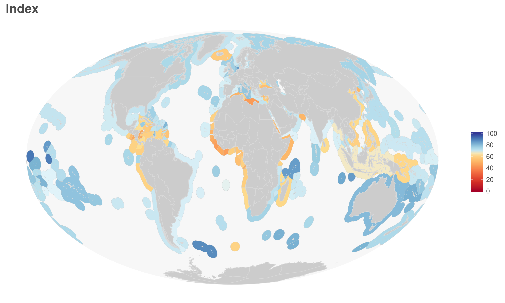
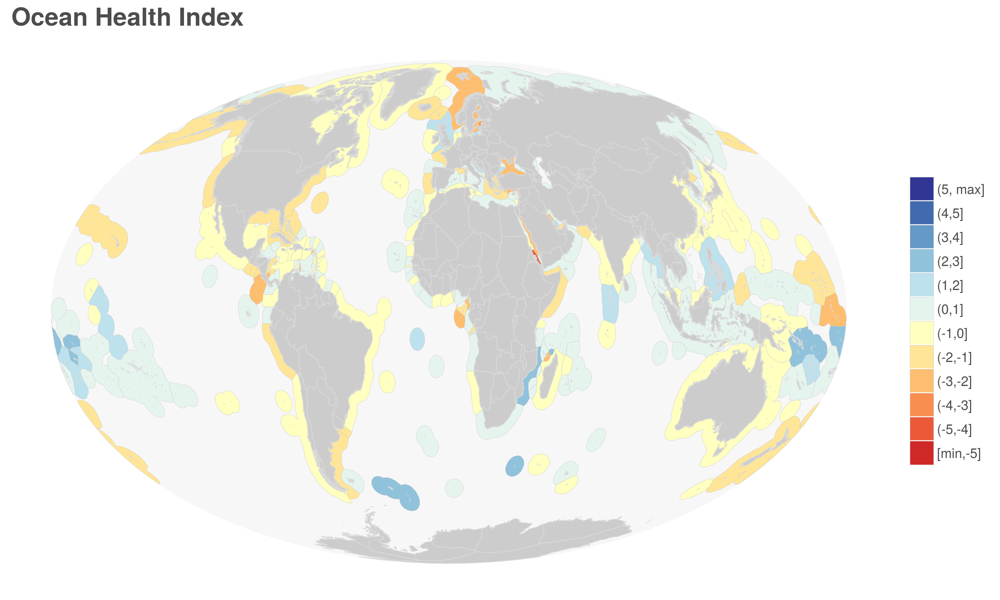

```{r data set up, include=FALSE}

#load libraries
library(dplyr)
library(tidyr)
library(ggplot2)
library(hwriter)
library(RColorBrewer)
library(knitr)
library(DT)
library(gridExtra)
library(grid)
library(png)
library(cowplot)

# Set working directory when not knitting:
# setwd("global2016/Reporting")

goals <- c('Index', 'AO', 'SPP', 'BD', 'HAB', 'CP', 'CS', 'CW', 'ECO', 'LE', 'LIV', 'FIS', 'FP', 'MAR', 'ICO', 'SP', 'LSP', 'NP', 'TR')
goal_names <- data.frame(goal=goals, long_goal=c("Index", 
                                                  "Artisanal opportunities",
                                                  "Species condition\n(Biodiversity)",
                                                  "Biodiversity",
                                                  "Habitat\n(Biodiversity)",
                                                  "Coastal protection",
                                                  "Carbon storage",
                                                  "Clean water",
                                                  "Economies",
                                                  "Livelihoods & economies",
                                                  "Livelihoods",
                                                  "Fisheries\n(Food provisioning)",
                                                  "Food provisioning",
                                                  "Mariculture\n(Food provisioning)",
                                                  "Iconic species\nSense of place)",
                                                  "Sense of place",
                                                  "Lasting special places\n(Sense of place)",
                                                  "Natural products",
                                                  "Tourism & recreation"))

## General settings to control
scenario <- "2016" #identify scenario of focus (this can be changed to obtain data for other years)
benchmark = 2015  # year that is used for old vs. new OHI analyses
oldCommit = '1d4dcb1abb82dc1d20817acca33c7e7d2ef1b52f' # '4da6b4a1d69d694264ea68456359a939b0c03f9c' = commit for 2014 analysis
colorScheme <- 'new'  # color scheme to use on flower plots ("new" = color reflects size score and is not the original rainbow)
saveFile <- 'global2016' #location where files that are created are to be saved

## General files to load
rgn_names <- read.csv(sprintf('../../eez%s/layers/rgn_global.csv', scenario)) %>%
  dplyr::select(region_id = rgn_id, country = label) %>%
  dplyr::mutate(country = as.character(country))

rgn_names$country[rgn_names$region_id == 212] <- "Gilbert Islands (Kiribati)"
rgn_names$country[rgn_names$region_id == 148] <- "Line Islands (Kiribati)"
rgn_names$country[rgn_names$region_id == 157] <- "Phoenix Islands (Kiribati)"


radicalFile = '2016-11-17' #date extension on the radical data files that are used for all tables/figures

```

### Overview of goals and subgoals

##### Table S1. Description of 10 goals used to calculate OHI scores.
In several table and figures we refer to the goals and subgoals by their abbreviation.  Goals and subgoals have a 2 and 3 character abbreviation, respectively.

```{r goal description, echo=FALSE}

data <- read.csv("../../global_supplement/tables/ten_goals.csv")
kable(data)

```

##### Table S2. Description of subgoals used to calculate OHI scores for biodiversity, food provision, sense of place, livelihoods and economies goals.

```{r subgoal description, echo=FALSE}
data <- read.csv("../../global_supplement/tables/Subgoal_Descriptions.csv")
kable(data)

```


### Datasets and additional information
The data from the 2016 assessment is [available] (https://github.com/OHI-Science/ohi-global/raw/draft/global2016/radical_with_region_names_2016-11-17.csv). These data include index and goal/subgoal scores (as well as the dimensions used to calculate scores: status, trend, pressure, resilience) for all 5 assessment years (2012-2016).

Simplified versions of the full dataset which include only the final index scores are available for the 2012-2016 scenarios: [2016](ohi-global/global2016/Reporting/data/scores_eez2016.csv), [2015](ohi-global/global2016/Reporting/data/scores_eez2015.csv), [2014](ohi-global/global2016/Reporting/data/scores_eez2014.csv), [2013](ohi-global/global2016/Reporting/data/scores_eez2013.csv), and [2012](ohi-global/global2016/Reporting/data/scores_eez2012.csv).

The data layers (Supplementary Methods, Table S?) and functions used to calculate scores can be downloaded from Github: [ohi-global v2016.1: Global scenarios data for Ocean Health Index](https://github.com/OHI-Science/ohi-global/releases).  

The files used to prepare data layers for the ohi-global assessment can be downloaded from Github: [ohiprep v2016.1: Preparation of data for 2016 Ocean Health Index global assessment](https://github.com/OHI-Science/ohiprep/releases).

The core functions used to calculate OHI scores can be downloaded as a package from Github: 

For more information about the models used to calculate OHI scores as well as the underlying data see the Supplementary Methods document.

```{r install ohicore, eval=FALSE}

install.packages('devtools')
library(devtools)

install_github('ohi-science/ohicore')
library(ohicore)

```

### Summary of score results

##### Figure S1A. Map and flowerplot of OHI scores for overall index for 2016.

```{r score figures, echo=FALSE, fig.height=10, fig.width=10}
## Figure created in Reporting.Rmd

## including multiple figures on a page
## https://cran.r-project.org/web/packages/gridExtra/vignettes/arrangeGrob.html

Index_map <- rasterGrob(readPNG("figures/maps_by_goal_mol/global_map_Index_2016_mol.png"), interpolate=TRUE)
Index_flower <- rasterGrob(readPNG("figures/FlowerPlots/flower_GLOBAL_2016.png"), interpolate=TRUE)

grid.arrange(Index_map, Index_flower,
             ncol=1, heights=c(5,5))

#
```

##### Figure S1B. Maps and histograms of OHI goal scores for 2016.

```{r testing images, echo=FALSE, fig.height=30, fig.width=10}

## Figures created in Reporting.Rmd

AO_map <- rasterGrob(readPNG("figures/maps_by_goal_mol/year_2016_nolegend/global_map_AO_2016_mol.png"), interpolate=TRUE)
AO_hist <- rasterGrob(readPNG("figures/goal_histograms/AO_scores.png"), interpolate=TRUE)

BD_map <- rasterGrob(readPNG("figures/maps_by_goal_mol/year_2016_nolegend/global_map_BD_2016_mol.png"), interpolate=TRUE)
BD_hist <- rasterGrob(readPNG("figures/goal_histograms/BD_scores.png"), interpolate=TRUE)

CP_map <- rasterGrob(readPNG("figures/maps_by_goal_mol/year_2016_nolegend/global_map_CP_2016_mol.png"), interpolate=TRUE)
CP_hist <- rasterGrob(readPNG("figures/goal_histograms/CP_scores.png"), interpolate=TRUE)

CS_map <- rasterGrob(readPNG("figures/maps_by_goal_mol/year_2016_nolegend/global_map_CS_2016_mol.png"), interpolate=TRUE)
CS_hist <- rasterGrob(readPNG("figures/goal_histograms/CS_scores.png"), interpolate=TRUE)

CW_map <- rasterGrob(readPNG("figures/maps_by_goal_mol/year_2016_nolegend/global_map_CW_2016_mol.png"), interpolate=TRUE)
CW_hist <- rasterGrob(readPNG("figures/goal_histograms/CW_scores.png"), interpolate=TRUE)

FP_map <- rasterGrob(readPNG("figures/maps_by_goal_mol/year_2016_nolegend/global_map_FP_2016_mol.png"), interpolate=TRUE)
FP_hist <- rasterGrob(readPNG("figures/goal_histograms/FP_scores.png"), interpolate=TRUE)

LE_map <- rasterGrob(readPNG("figures/maps_by_goal_mol/year_2016_nolegend/global_map_LE_2016_mol.png"), interpolate=TRUE)
LE_hist <- rasterGrob(readPNG("figures/goal_histograms/LE_scores.png"), interpolate=TRUE)

NP_map <- rasterGrob(readPNG("figures/maps_by_goal_mol/year_2016_nolegend/global_map_NP_2016_mol.png"), interpolate=TRUE)
NP_hist <- rasterGrob(readPNG("figures/goal_histograms/NP_scores.png"), interpolate=TRUE)

SP_map <- rasterGrob(readPNG("figures/maps_by_goal_mol/year_2016_nolegend/global_map_SP_2016_mol.png"), interpolate=TRUE)
SP_hist <- rasterGrob(readPNG("figures/goal_histograms/SP_scores.png"), interpolate=TRUE)

TR_map <- rasterGrob(readPNG("figures/maps_by_goal_mol/year_2016_nolegend/global_map_TR_2016_mol.png"), interpolate=TRUE)
TR_hist <- rasterGrob(readPNG("figures/goal_histograms/TR_scores.png"), interpolate=TRUE)

grid.arrange(AO_map, AO_hist,
             BD_map, BD_hist,
             CP_map, CP_hist,
             CS_map, CS_hist,
             CW_map, CW_hist,
             FP_map, FP_hist,
             LE_map, LE_hist,
             NP_map, NP_hist,
             SP_map, SP_hist,
             TR_map, TR_hist,
             ncol=2, widths=c(5,4))
             

```

##### Figure S1C. Map and histogram of OHI scores for subgoals of biodiversity, foob provisioning, sense of place, and livelihoods and economies.

###### Biodiversity

```{r subgoal BD, echo=FALSE}

HAB_map <- rasterGrob(readPNG("figures/maps_by_goal_mol/year_2016_nolegend/global_map_HAB_2016_mol.png"), interpolate=TRUE)
HAB_hist <- rasterGrob(readPNG("figures/goal_histograms/HAB_scores.png"), interpolate=TRUE)

SPP_map <- rasterGrob(readPNG("figures/maps_by_goal_mol/year_2016_nolegend/global_map_SPP_2016_mol.png"), interpolate=TRUE)
SPP_hist <- rasterGrob(readPNG("figures/goal_histograms/SPP_scores.png"), interpolate=TRUE)


grid.arrange(HAB_map, HAB_hist,
             SPP_map, SPP_hist,
             ncol=2, widths=c(5,4))
```

###### Food Provision

```{r subgoal FP, echo=FALSE}

FIS_map <- rasterGrob(readPNG("figures/maps_by_goal_mol/year_2016_nolegend/global_map_FIS_2016_mol.png"), interpolate=TRUE)
FIS_hist <- rasterGrob(readPNG("figures/goal_histograms/FIS_scores.png"), interpolate=TRUE)

MAR_map <- rasterGrob(readPNG("figures/maps_by_goal_mol/year_2016_nolegend/global_map_MAR_2016_mol.png"), interpolate=TRUE)
MAR_hist <- rasterGrob(readPNG("figures/goal_histograms/MAR_scores.png"), interpolate=TRUE)


grid.arrange(FIS_map, FIS_hist,
             MAR_map, MAR_hist,
             ncol=2, widths=c(5,4))
```


###### Sense of place

```{r subgoal SP, echo=FALSE}

LSP_map <- rasterGrob(readPNG("figures/maps_by_goal_mol/year_2016_nolegend/global_map_LSP_2016_mol.png"), interpolate=TRUE)
LSP_hist <- rasterGrob(readPNG("figures/goal_histograms/LSP_scores.png"), interpolate=TRUE)

ICO_map <- rasterGrob(readPNG("figures/maps_by_goal_mol/year_2016_nolegend/global_map_ICO_2016_mol.png"), interpolate=TRUE)
ICO_hist <- rasterGrob(readPNG("figures/goal_histograms/ICO_scores.png"), interpolate=TRUE)


grid.arrange(LSP_map, LSP_hist,
             ICO_map, ICO_hist,
             ncol=2, widths=c(5,4))
```


###### Livelihoods and economies

```{r subgoal LE, echo=FALSE}

LIV_map <- rasterGrob(readPNG("figures/maps_by_goal_mol/year_2016_nolegend/global_map_LIV_2016_mol.png"), interpolate=TRUE)
LIV_hist <- rasterGrob(readPNG("figures/goal_histograms/LIV_scores.png"), interpolate=TRUE)

ECO_map <- rasterGrob(readPNG("figures/maps_by_goal_mol/year_2016_nolegend/global_map_ECO_2016_mol.png"), interpolate=TRUE)
ECO_hist <- rasterGrob(readPNG("figures/goal_histograms/ECO_scores.png"), interpolate=TRUE)


grid.arrange(LIV_map, LIV_hist,
             ECO_map, ECO_hist,
             ncol=2, widths=c(5,4))
```

##### Figure S2. Carpet plot describing scores for each region and year.
This figure provides an overview of the scores from the 2016 assessment.  Each row represents a region, the main groupings represent goals, and within each goal there are 5 years of data.  Black regions indicate no data.  Download the [png version](https://github.com/OHI-Science/ohi-global/raw/draft/global2016/Reporting/figures/carpetPlot_2016.png) to zoom in to see specific regions.

This plot is good for providing a quick overview of:

* What is the range of scores?
* Which goals tend to have high scores across most regions (species, habitat)
* Which goals have a lot of variation across regions (tourism & recreation, lasting special places)
* Which goals are volatile across years (natural products, tourism & recreation)


```{r carpet plot, echo=FALSE, height=40, width=10}
## Figure created in Reporting.Rmd

knitr::include_graphics("figures/carpetPlot_2016.png")
```

### Summary of trend results

##### Figure S3A. Maps of score trends for overall Index and 10 goals.
The values represented on the maps are the slope estimate from a linear regression model of the scores from 2012 to 2016 for each region and goal.
```{r trends index, echo=FALSE}
## Figure created in Reporting.Rmd


```

```{r trends goals, echo=FALSE, fig.height=15, fig.width=10}

## Figures created in Reporting.Rmd

AO_map <- rasterGrob(readPNG("figures/maps_trends/trends_map_AO_2016_mol.png"), interpolate=TRUE)

BD_map <- rasterGrob(readPNG("figures/maps_trends/trends_map_BD_2016_mol.png"), interpolate=TRUE)

CP_map <- rasterGrob(readPNG("figures/maps_trends/trends_map_CP_2016_mol.png"), interpolate=TRUE)

CS_map <- rasterGrob(readPNG("figures/maps_trends/trends_map_CS_2016_mol.png"), interpolate=TRUE)

CW_map <- rasterGrob(readPNG("figures/maps_trends/trends_map_CW_2016_mol.png"), interpolate=TRUE)

FP_map <- rasterGrob(readPNG("figures/maps_trends/trends_map_FP_2016_mol.png"), interpolate=TRUE)

LE_map <- rasterGrob(readPNG("figures/maps_trends/trends_map_LE_2016_mol.png"), interpolate=TRUE)

NP_map <- rasterGrob(readPNG("figures/maps_trends/trends_map_NP_2016_mol.png"), interpolate=TRUE)

SP_map <- rasterGrob(readPNG("figures/maps_trends/trends_map_SP_2016_mol.png"), interpolate=TRUE)

TR_map <- rasterGrob(readPNG("figures/maps_trends/trends_map_TR_2016_mol.png"), interpolate=TRUE)

grid.arrange(AO_map,
             BD_map,
             CP_map,
             CS_map,
             CW_map,
             FP_map,
             LE_map,
             NP_map,
             SP_map,
             TR_map,
             ncol=2)
             

```

##### Figure S3B. Maps of trends in OHI scores for subgoals of biodiversity, foob provision, sense of place, and livelihoods and economies

```{r subgoal BD trend, echo=FALSE, fig.width=10, fig.height=15}

BD <- textGrob("Biodiversity")
bd <- textGrob("")
HAB_map <- rasterGrob(readPNG("figures/maps_trends/trends_map_HAB_2016_mol.png"), interpolate=TRUE)
SPP_map <- rasterGrob(readPNG("figures/maps_trends/trends_map_SPP_2016_mol.png"), interpolate=TRUE)

FP <- textGrob("Food provision")
fp <- textGrob("")
FIS_map <- rasterGrob(readPNG("figures/maps_trends/trends_map_FIS_2016_mol.png"), interpolate=TRUE)
MAR_map <- rasterGrob(readPNG("figures/maps_trends/trends_map_MAR_2016_mol.png"), interpolate=TRUE)

SP <- textGrob("Sense of place")
sp <- textGrob("")
ICO_map <- rasterGrob(readPNG("figures/maps_trends/trends_map_ICO_2016_mol.png"), interpolate=TRUE)
LSP_map <- rasterGrob(readPNG("figures/maps_trends/trends_map_LSP_2016_mol.png"), interpolate=TRUE)

LE <- textGrob("Livelihoods and economies")
le <- textGrob("")
LIV_map <- rasterGrob(readPNG("figures/maps_trends/trends_map_LIV_2016_mol.png"), interpolate=TRUE)
ECO_map <- rasterGrob(readPNG("figures/maps_trends/trends_map_ECO_2016_mol.png"), interpolate=TRUE)

grid.arrange(BD, bd,
             HAB_map, SPP_map, 
             FP, fp,
             FIS_map, MAR_map,
             SP, sp,
             ICO_map, LSP_map,
             LE, le,
             LIV_map, ECO_map,
             ncol=2, widths=c(5,5), heights=c(0.2, 5, 0.2, 5, 0.2, 5, 0.2, 5))
```


##### Figure S4. Barplot of goal trends for each region.
The values are the slope estimate from a linear regression model of the scores from 2012 to 2016 for each region and goal.

```{r trend barplot, echo=FALSE, fig.height=30, fig.width=10}

## Figure created in trend_barplot.R


```

### Relationship between goal scores

##### Figure S5. Pairwise comparison of goal scores.
Two-letter codes in the diagonal are goal labels (FP = food provision, AO = artisanal fishing
opportunity, NP = natural products, CS = carbon storage, CP = coastal protection, LE = coastal livelihoods and economies, TR = tourism and recreation, SP = sense of place, CW = clean water, and BD = biodiversity). Values in the upper right are the correlation coefficients for each comparison, with larger font size indicating stronger significance of the result. Plots in lower left are scatterplots of the data with locally-weighted polynomial regression (LOWESS) fits shown in red.


### Relationship between OHI Index scores and other region variables

We explored several models to determine whether there was a relationship between OHI scores and the [Human Development Index](http://hdr.undp.org/en/content/human-development-index-hdi), [Cumulative Human Impacts to marine systems](https://www.nceas.ucsb.edu/globalmarine), and coastal population (ln population, 10 miles from shoreline).  

OHI scores tended to be higher for regions with higher Human Development Index scores and lower for regions with more marine pressures (i.e., cumulative human impacts).  

##### Table S3. Model comparison (AIC) to determine the relationship between OHI Index scores and the Human Development Index (HDI), Cumulative Human Impacts (CHI), and coastal population.

Model     | df   | AIC   | R^2^ (adj)
---------- | ------ | ------- | --------
CHI        | 3      | 1027 | 0.05
HDI        | 3      | 989  | 0.27
ln(pop) |    3      | 1035 | <0.01
CHI + HDI  | 4      | 978  | 0.33
ln(pop) + HDI | 4   | 990  | 0.27
ln(pop) + CHI | 4   | 1029 | 0.041
ln(pop) + CHI + HDI | 5 | 980 | 0.32

##### Figure S6. Relationship between OHI Index and other variables

```{r OHI vs HDI CHI pop, echo=FALSE, fig.width=10, fig.height=4}
HDI <- rasterGrob(readPNG("figures/OHIvsHDI.png"), interpolate=TRUE)
CHI <- rasterGrob(readPNG("figures/OHIvsCHI.png"), interpolate=TRUE)
pop <- rasterGrob(readPNG("figures/OHIvsCoastalPop.png"), interpolate=TRUE)

#dev.new(width=10, height=5)
#grid.arrange(HDI, CHI, pop, ncol=3, nrow=1, widths=unit(0.5, "npc"), heights=unit(0.5, "npc"))
grid.arrange(HDI, CHI, pop, ncol=3, nrow=1)

```

### Comparison of scores vs. ranks

##### Figure S7A. Comparison of change in score vs. change in rank for 10 goals.

```{r rank analysis, echo=FALSE, warning=FALSE, error=FALSE, message=FALSE, fig.width=5, fig.height=5}

data <- read.csv(sprintf('../radical_with_region_names_%s.csv', radicalFile)) 

### function to make interactive plot

rank <- function(goal_rank){
  
data_sub <- data[data$goal %in% goal_rank, ] %>%
  filter(dimension=="score") %>%
  filter(region_id != 0) %>%
  filter(region_id != 213) %>%
  filter(region_id <= 250) %>%
  mutate(scenario = paste0("scenario", scenario)) %>%
  spread(scenario, value) %>%  
  mutate(rank_2016 = min_rank(desc(scenario2016))) %>%
  mutate(rank_2012 = min_rank(desc(scenario2012))) %>%
  mutate(rank_delta = rank_2016 - rank_2012) %>%
  mutate(index_delta = scenario2016 - scenario2012) %>%
  arrange(rank_2016)

## compare 2012 vs 2016 ranks
  # p <- ggplot2::ggplot(data_sub, aes(x=rank_2012, y=rank_2016)) +
  #   geom_point(aes(text=paste0("rgn = ", region_name)), shape=19, size=2, color="gray", alpha = 0.5) +
  #   theme_bw()  + 
  #   geom_abline(slope = 1, intercept=0, color="red", size=0.5) + 
  #   labs(y="2016 rank of scores", x="2012 rank of scores",    
  #        title=as.character(goal_names$long_goal[goal_names$goal==goal_rank])) 

#plot(p)
#ggsave(sprintf("figures/rank_figs/scenario2012vs_scenario2016/ranks_%s_2012_2016.png", goal_rank))

# plotly_fig <- plotly::ggplotly(p)
# plotly_fig

## compare change in ranks vs change in scores
  p <- ggplot2::ggplot(data_sub, aes(x= index_delta, y=rank_delta)) +
    geom_point(aes(text=paste0("rgn = ", region_name)), shape=19, size=2, color="gray", alpha = 0.5) +
    theme_bw()  + #c( top, right, bottom, and left margins) 
   labs(y="change in rank (2016-2012)", x="change in score (2016-2012)", title = as.character(goal_names$long_goal[goal_names$goal==goal_rank])) + 
    stat_smooth(method = lm, se=FALSE, size=0.5, color="black") +
    theme(plot.margin=unit(c(5.5, 5.5, 40, 5.5),"pt"))

# plot(p)   
# ggsave(sprintf("figures/rank_figs/delta_ranks_vs_delta_score/delta_ranks_scores_%s.png", goal_rank))

  plotly_fig <- plotly::ggplotly(p)
  plotly_fig
}

rank("AO")

rank("BD")

rank("CP")

rank("CS")

rank("CW")

rank("FP")

rank("LE")

rank("NP")

rank("SP")

rank("TR")
```


##### Figure S7B. Comparison of change in score vs. change in rank for subgoals of biodiversity, food provision, sense of place, and livelihoods and economies.

##### Biodiversity

```{r subgoal BD score vs rank, echo=FALSE, warning=FALSE, error=FALSE, message=FALSE, fig.width=5, fig.height=5}

rank("HAB")
rank("SPP")

```

##### Food Provision

```{r subgoal score vs rank, echo=FALSE, warning=FALSE, error=FALSE, message=FALSE, fig.width=5, fig.height=5}

rank("FIS")
rank("MAR")

```


##### Sense of place

```{r subgoal SP score vs rank, echo=FALSE, warning=FALSE, error=FALSE, message=FALSE, fig.width=5, fig.height=5}

rank("LSP")
rank("ICO")

```


##### Livelihoods and economies

```{r subgoal LE score vs rank, echo=FALSE, warning=FALSE, error=FALSE, message=FALSE, fig.width=5, fig.height=5}

rank("LIV")
rank("ECO")

```
