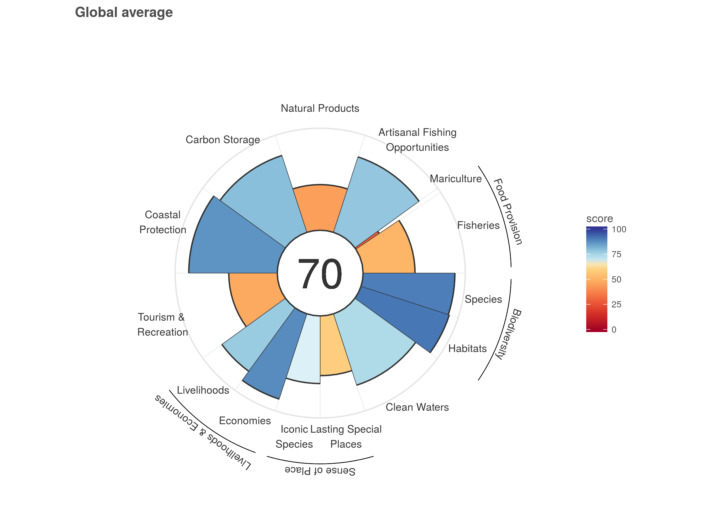
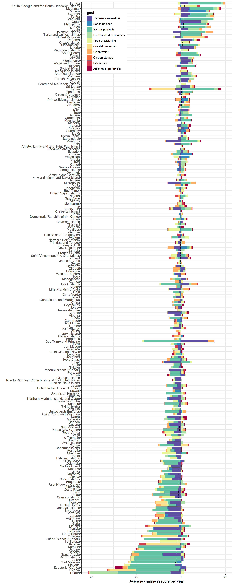

```{r data set up, include=FALSE}

#load libraries
library(dplyr)
library(tidyr)
library(ggplot2)
library(hwriter)
library(RColorBrewer)
library(knitr)
library(DT)
library(gridExtra)
library(grid)
library(png)
library(cowplot)

## See ohi-global/global2017/Reporting/Results.Rmd and ohi-global/global2017/first_look.Rmd for code used to create some of the figures included here

# Set working directory when not knitting:
# setwd("global2017/Results")

goals <- c('Index', 'AO', 'SPP', 'BD', 'HAB', 'CP', 'CS', 'CW', 'ECO', 'LE', 'LIV', 'FIS', 'FP', 'MAR', 'ICO', 'SP', 'LSP', 'NP', 'TR')
goal_names <- data.frame(goal=goals, long_goal=c("Index", 
                                                  "Artisanal opportunities",
                                                  "Species condition\n(Biodiversity)",
                                                  "Biodiversity",
                                                  "Habitat\n(Biodiversity)",
                                                  "Coastal protection",
                                                  "Carbon storage",
                                                  "Clean water",
                                                  "Economies",
                                                  "Livelihoods & economies",
                                                  "Livelihoods",
                                                  "Fisheries\n(Food provision)",
                                                  "Food provision",
                                                  "Mariculture\n(Food provision)",
                                                  "Iconic species\n(Sense of place)",
                                                  "Sense of place",
                                                  "Lasting special places\n(Sense of place)",
                                                  "Natural products",
                                                  "Tourism & recreation"))
goal_names2 <- data.frame(goal=goals, long_goal=c("Index", 
                                                  "Artisanal opportunities",
                                                  "Species condition",
                                                  "Biodiversity",
                                                  "Habitat",
                                                  "Coastal protection",
                                                  "Carbon storage",
                                                  "Clean water",
                                                  "Economies",
                                                  "Livelihoods & economies",
                                                  "Livelihoods",
                                                  "Fisheries",
                                                  "Food provisioning",
                                                  "Mariculture",
                                                  "Iconic species",
                                                  "Sense of place",
                                                  "Lasting special places",
                                                  "Natural products",
                                                  "Tourism & recreation"))

## General settings to control
scenario <- "2017" #identify scenario of focus (this can be changed to obtain data for other years)
# benchmark = 2016  # year that is used for old vs. new OHI analyses
# oldCommit = '1d4dcb1abb82dc1d20817acca33c7e7d2ef1b52f' # '4da6b4a1d69d694264ea68456359a939b0c03f9c' = commit for 2014 analysis
# colorScheme <- 'new'  # color scheme to use on flower plots ("new" = color reflects size score and is not the original rainbow)
# saveFile <- 'global2016' #location where files that are created are to be saved

## General files to load
rgn_names <- read.csv('../../eez/layers/rgn_global.csv') %>%
  dplyr::select(region_id = rgn_id, country = label) %>%
  dplyr::mutate(country = as.character(country))


radicalFile = '2017-11-20' #date extension on the radical data files that are used for all tables/figures

```

### Overview of goals and subgoals

##### Table A. Description of 10 goals used to calculate OHI scores.
In several tables and figures we refer to the goals and subgoals by their abbreviation.  Goals and subgoals have a 2 and 3 character abbreviation, respectively.

```{r goal description, echo=FALSE}

data <- read.csv("../../global_supplement/tables/ten_goals.csv")
kable(data)

```

##### Table B. Description of subgoals used to calculate OHI scores.
The following goals are comprised of 2 subgoals:biodiversity, food provision, sense of place, livelihoods and economies goals.

```{r subgoal description, echo=FALSE}
data <- read.csv("../../global_supplement/tables/Subgoal_Descriptions.csv")
kable(data)

```


### Datasets and additional information

See the [Methods](link here) document for more information about the models and data used to calculate the global Ocean Health Index.

A CSV formatted dataset from the 2017 assessment is [available](https://raw.githubusercontent.com/OHI-Science/ohi-global/draft/global2017/OHI_final_formatted_scores_2017-11-20.csv), right click on data and select "Save as...". These data include index and goal/subgoal scores (as well as the dimensions used to calculate scores: status, trend, pressure, resilience) for all 6 assessment years (2012-2017). See [README](https://rawgit.com/OHI-Science/ohi-global/draft/global2017/README.html) for description of data.

<!--The data layers (described in section 6 in Methods) and functions used to calculate scores can be downloaded from Github: [ohi-global v2016.1: Global scenarios data for Ocean Health Index](https://github.com/OHI-Science/ohi-global/releases).  

The files used to prepare data layers for the ohi-global assessment can be downloaded from Github: [ohiprep v2016.1: Preparation of data for 2016 Ocean Health Index global assessment](https://github.com/OHI-Science/ohiprep/releases).

The core functions used to calculate OHI scores can be downloaded as a package from Github, using the following code in the [R](https://cran.r-project.org/): 


```{r install ohicore, eval=FALSE}

install.packages('devtools')
library(devtools)

install_github('ohi-science/ohicore')
library(ohicore)

```

-->

### Summary of score results

##### Figure A. Map and flowerplot of 2017 OHI index scores.
Map (top) and histogram (bottom) of index scores for each OHI region. 

```{r score figures, echo=FALSE, fig.height=10, fig.width=10}
## Figure created in Reporting.Rmd

## including multiple figures on a page
## https://cran.r-project.org/web/packages/gridExtra/vignettes/arrangeGrob.html
## https://github.com/baptiste/gridextra/wiki/arranging-ggplot

Index_map <- rasterGrob(readPNG("figures/maps_by_goal_mol/global_map_Index_2017_mol.png"), interpolate=TRUE)
map_label <- textGrob("", just=19, gp=gpar(fontsize=18))
Index_hist <- rasterGrob(readPNG("figures/score_histogram_color.png"), interpolate=TRUE)
hist_label <- textGrob("", just=19, gp=gpar(fontsize=18))

grid.arrange(map_label, Index_map, hist_label, Index_hist,
             ncol=1, heights=c(1,5,1,6))

```

##### Figure B. Flowerplot of goal/subgoal scores
Average global scores for each goal/subgoal, weighted by each region's eez area.

```{r flowerplot, echo=FALSE, height=5, width=10}
## Figure created in Reporting.Rmd


```


##### Figure C. Maps and histograms of 2017 OHI goal scores.
The scores for each of the 10 OHI goals displayed for each region (left) and as a histogram (right).

```{r testing images, echo=FALSE, fig.height=30, fig.width=10}

## Figures created in Reporting.Rmd

AO_map <- rasterGrob(readPNG("figures/maps_by_goal_mol/year_2017_nolegend/global_map_AO_2017_mol.png"), interpolate=TRUE)
AO_hist <- rasterGrob(readPNG("figures/goal_histograms/AO_scores.png"), interpolate=TRUE)
AO_text <- textGrob("", gp=gpar(fontsize=14), vjust=-9.5)

BD_map <- rasterGrob(readPNG("figures/maps_by_goal_mol/year_2017_nolegend/global_map_BD_2017_mol.png"), interpolate=TRUE)
BD_hist <- rasterGrob(readPNG("figures/goal_histograms/BD_scores.png"), interpolate=TRUE)
BD_text <- textGrob("", gp=gpar(fontsize=14), vjust=-9.5)

CP_map <- rasterGrob(readPNG("figures/maps_by_goal_mol/year_2017_nolegend/global_map_CP_2017_mol.png"), interpolate=TRUE)
CP_hist <- rasterGrob(readPNG("figures/goal_histograms/CP_scores.png"), interpolate=TRUE)
CP_text <- textGrob("", gp=gpar(fontsize=14), vjust=-9.5)

CS_map <- rasterGrob(readPNG("figures/maps_by_goal_mol/year_2017_nolegend/global_map_CS_2017_mol.png"), interpolate=TRUE)
CS_hist <- rasterGrob(readPNG("figures/goal_histograms/CS_scores.png"), interpolate=TRUE)
CS_text <- textGrob("", gp=gpar(fontsize=14), vjust=-9.5)

CW_map <- rasterGrob(readPNG("figures/maps_by_goal_mol/year_2017_nolegend/global_map_CW_2017_mol.png"), interpolate=TRUE)
CW_hist <- rasterGrob(readPNG("figures/goal_histograms/CW_scores.png"), interpolate=TRUE)
CW_text <- textGrob("", gp=gpar(fontsize=14), vjust=-9.5)

FP_map <- rasterGrob(readPNG("figures/maps_by_goal_mol/year_2017_nolegend/global_map_FP_2017_mol.png"), interpolate=TRUE)
FP_hist <- rasterGrob(readPNG("figures/goal_histograms/FP_scores.png"), interpolate=TRUE)
FP_text <- textGrob("", gp=gpar(fontsize=14), vjust=-9.5)

LE_map <- rasterGrob(readPNG("figures/maps_by_goal_mol/year_2017_nolegend/global_map_LE_2017_mol.png"), interpolate=TRUE)
LE_hist <- rasterGrob(readPNG("figures/goal_histograms/LE_scores.png"), interpolate=TRUE)
LE_text <- textGrob("", gp=gpar(fontsize=14), vjust=-9.5)

NP_map <- rasterGrob(readPNG("figures/maps_by_goal_mol/year_2017_nolegend/global_map_NP_2017_mol.png"), interpolate=TRUE)
NP_hist <- rasterGrob(readPNG("figures/goal_histograms/NP_scores.png"), interpolate=TRUE)
NP_text <- textGrob("", gp=gpar(fontsize=14), vjust=-9.5)

SP_map <- rasterGrob(readPNG("figures/maps_by_goal_mol/year_2017_nolegend/global_map_SP_2017_mol.png"), interpolate=TRUE)
SP_hist <- rasterGrob(readPNG("figures/goal_histograms/SP_scores.png"), interpolate=TRUE)
SP_text <- textGrob("", gp=gpar(fontsize=14), vjust=-9.5)

TR_map <- rasterGrob(readPNG("figures/maps_by_goal_mol/year_2017_nolegend/global_map_TR_2017_mol.png"), interpolate=TRUE)
TR_hist <- rasterGrob(readPNG("figures/goal_histograms/TR_scores.png"), interpolate=TRUE)
TR_text <- textGrob("", gp=gpar(fontsize=14), vjust=-9.5)

grid.arrange(AO_text, AO_map, AO_hist,
             BD_text, BD_map, BD_hist,
             CP_text, CP_map, CP_hist,
             CS_text, CS_map, CS_hist,
             CW_text, CW_map, CW_hist,
             FP_text, FP_map, FP_hist,
             LE_text, LE_map, LE_hist,
             NP_text, NP_map, NP_hist,
             SP_text, SP_map, SP_hist,
             TR_text, TR_map, TR_hist,
             ncol=3, widths=c(1,5,4))
             

```

##### Figure D. Maps and histograms of 2017 OHI subgoal scores.
The subgoal scores for the following goals: biodiversity, foob provision, sense of place, and livelihoods and economies.  The scores are displayed as a map (left) and histogram (right).

```{r subgoal scores, echo=FALSE, fig.width=10, fig.height=25}

# BD
BD <- textGrob("Biodiversity", gp=gpar(fontsize=12), just="left", x=0)
bd <- textGrob("")
HAB_map <- rasterGrob(readPNG("figures/maps_by_goal_mol/year_2017_nolegend/global_map_HAB_2017_mol.png"), interpolate=TRUE)
HAB_hist <- rasterGrob(readPNG("figures/goal_histograms/HAB_scores.png"), interpolate=TRUE)
SPP_map <- rasterGrob(readPNG("figures/maps_by_goal_mol/year_2017_nolegend/global_map_SPP_2017_mol.png"), interpolate=TRUE)
SPP_hist <- rasterGrob(readPNG("figures/goal_histograms/SPP_scores.png"), interpolate=TRUE)

## FP
FP <- textGrob("Food provision", gp=gpar(fontsize=12), just="left", x=0)
fp <- textGrob("")
FIS_map <- rasterGrob(readPNG("figures/maps_by_goal_mol/year_2017_nolegend/global_map_FIS_2017_mol.png"), interpolate=TRUE)
FIS_hist <- rasterGrob(readPNG("figures/goal_histograms/FIS_scores.png"), interpolate=TRUE)

MAR_map <- rasterGrob(readPNG("figures/maps_by_goal_mol/year_2017_nolegend/global_map_MAR_2017_mol.png"), interpolate=TRUE)
MAR_hist <- rasterGrob(readPNG("figures/goal_histograms/MAR_scores.png"), interpolate=TRUE)

SP <- textGrob("Sense of place", gp=gpar(fontsize=12), just="left", x=0)
sp <- textGrob("")
LSP_map <- rasterGrob(readPNG("figures/maps_by_goal_mol/year_2017_nolegend/global_map_LSP_2017_mol.png"), interpolate=TRUE)
LSP_hist <- rasterGrob(readPNG("figures/goal_histograms/LSP_scores.png"), interpolate=TRUE)

ICO_map <- rasterGrob(readPNG("figures/maps_by_goal_mol/year_2017_nolegend/global_map_ICO_2017_mol.png"), interpolate=TRUE)
ICO_hist <- rasterGrob(readPNG("figures/goal_histograms/ICO_scores.png"), interpolate=TRUE)

# LE
LE <- textGrob("Livelihoods & economies", gp=gpar(fontsize=12), just="left", x=0)
le <- textGrob("")
LIV_map <- rasterGrob(readPNG("figures/maps_by_goal_mol/year_2017_nolegend/global_map_LIV_2017_mol.png"), interpolate=TRUE)
LIV_hist <- rasterGrob(readPNG("figures/goal_histograms/LIV_scores.png"), interpolate=TRUE)

ECO_map <- rasterGrob(readPNG("figures/maps_by_goal_mol/year_2017_nolegend/global_map_ECO_2017_mol.png"), interpolate=TRUE)
ECO_hist <- rasterGrob(readPNG("figures/goal_histograms/ECO_scores.png"), interpolate=TRUE)

grid.arrange(BD, bd,
             HAB_map, HAB_hist,
             SPP_map, SPP_hist,
             FP, fp,
             FIS_map, FIS_hist, 
             MAR_map, MAR_hist,
             SP, sp,
             ICO_map, ICO_hist,
             LSP_map, LSP_hist,
             LE, le,
             LIV_map, LIV_hist, 
             ECO_map, ECO_hist,
             ncol=2, widths=c(5,4), heights=c(0.6, 5, 5, 0.6, 5,5, 0.6, 5,5, 0.6, 5,5))

```

<!-- ##### Figure D. Carpet plot describing scores for each region and year.
Overview of the scores from the 2017 assessment.  Each row represents a region, the main groupings represent goals, and within each goal there are 7 years of data.  Black regions indicate no data.  Download the [png version](https://github.com/OHI-Science/ohi-global/raw/draft/global2017/Reporting/figures/carpetPlot_2017.png) to zoom in to see specific regions.

This plot is good for providing a quick overview of:

* What is the range of scores?
* Which goals tend to have high scores across most regions (species, habitat)
* Which goals have a lot of variation across regions (tourism & recreation, lasting special places)
* Which goals are volatile across years (natural products, tourism & recreation)


```{r carpet plot, echo=FALSE, height=40, width=10}
## Figure created in Reporting.Rmd

#knitr::include_graphics("figures/carpetPlot_2017.png")
```
-->

### Summary of average annual change in scores

##### Figure E. Average annual change in OHI Index scores.
Map (top) and histogram (bottom) of the slope estimates from a linear regression model of the Index scores from 2012 to 2017 for each region.


```{r trend figures, echo=FALSE, fig.height=10, fig.width=10}
## Figure created in Reporting.Rmd

## including multiple figures on a page
## https://cran.r-project.org/web/packages/gridExtra/vignettes/arrangeGrob.html
## https://github.com/baptiste/gridextra/wiki/arranging-ggplot

Index_map <- rasterGrob(readPNG("figures/map_trends/trends_map_Index_2017_mol.png"), interpolate=TRUE)
map_label <- textGrob("", just=19, gp=gpar(fontsize=18))
Index_hist <- rasterGrob(readPNG("figures/trend_histogram_color.png"), interpolate=TRUE)
hist_label <- textGrob("", just=19, gp=gpar(fontsize=18))

grid.arrange(map_label, Index_map, hist_label, Index_hist,
             ncol=1, heights=c(1,5,1,6))

```


##### Figure F. Average annual change in OHI goal scores.
Map of the slope estimates from a linear regression model of the 10 goal scores from 2012 to 2017 for each region.

```{r trends goals, echo=FALSE, fig.height=15, fig.width=10}

## Figures created in Reporting.Rmd

AO_map <- rasterGrob(readPNG("figures/map_trends/trends_map_AO_2017_mol.png"), interpolate=TRUE)

BD_map <- rasterGrob(readPNG("figures/map_trends/trends_map_BD_2017_mol.png"), interpolate=TRUE)

CP_map <- rasterGrob(readPNG("figures/map_trends/trends_map_CP_2017_mol.png"), interpolate=TRUE)

CS_map <- rasterGrob(readPNG("figures/map_trends/trends_map_CS_2017_mol.png"), interpolate=TRUE)

CW_map <- rasterGrob(readPNG("figures/map_trends/trends_map_CW_2017_mol.png"), interpolate=TRUE)

FP_map <- rasterGrob(readPNG("figures/map_trends/trends_map_FP_2017_mol.png"), interpolate=TRUE)

LE_map <- rasterGrob(readPNG("figures/map_trends/trends_map_LE_2017_mol.png"), interpolate=TRUE)

NP_map <- rasterGrob(readPNG("figures/map_trends/trends_map_NP_2017_mol.png"), interpolate=TRUE)

SP_map <- rasterGrob(readPNG("figures/map_trends/trends_map_SP_2017_mol.png"), interpolate=TRUE)

TR_map <- rasterGrob(readPNG("figures/map_trends/trends_map_TR_2017_mol.png"), interpolate=TRUE)

grid.arrange(AO_map,
             BD_map,
             CP_map,
             CS_map,
             CW_map,
             FP_map,
             LE_map,
             NP_map,
             SP_map,
             TR_map,
             ncol=2)
             

```

##### Figure G. Average annual change in OHI subgoal scores.
Map of the slope estimates from a linear regression model of the 8 subgoal scores from 2012 to 2017 for each region. The subgoal scores for the following goals: biodiversity, food provision, sense of place, and livelihoods and economies.  The scores are displayed as a map (left) and histogram (right).

<br>
```{r subgoal trends, echo=FALSE, fig.width=10, fig.height=15}

BD <- textGrob("Biodiversity", gp=gpar(fontsize=12), just="left", x=0)
bd <- textGrob("")
HAB_map <- rasterGrob(readPNG("figures/map_trends/trends_map_HAB_2017_mol.png"), interpolate=TRUE)
SPP_map <- rasterGrob(readPNG("figures/map_trends/trends_map_SPP_2017_mol.png"), interpolate=TRUE)

FP <- textGrob("Food provision", gp=gpar(fontsize=12), just="left", x=0)
fp <- textGrob("")
FIS_map <- rasterGrob(readPNG("figures/map_trends/trends_map_FIS_2017_mol.png"), interpolate=TRUE)
MAR_map <- rasterGrob(readPNG("figures/map_trends/trends_map_MAR_2017_mol.png"), interpolate=TRUE)

SP <- textGrob("Sense of place", gp=gpar(fontsize=12), just="left", x=0)
sp <- textGrob("")
ICO_map <- rasterGrob(readPNG("figures/map_trends/trends_map_ICO_2017_mol.png"), interpolate=TRUE)
LSP_map <- rasterGrob(readPNG("figures/map_trends/trends_map_LSP_2017_mol.png"), interpolate=TRUE)

LE <- textGrob("Livelihoods and economies", gp=gpar(fontsize=12), just="left", x=0)
le <- textGrob("")
LIV_map <- rasterGrob(readPNG("figures/map_trends/trends_map_LIV_2017_mol.png"), interpolate=TRUE)
ECO_map <- rasterGrob(readPNG("figures/map_trends/trends_map_ECO_2017_mol.png"), interpolate=TRUE)

grid.arrange(BD, bd,
             HAB_map, SPP_map, 
             FP, fp,
             FIS_map, MAR_map,
             SP, sp,
             ICO_map, LSP_map,
             LE, le,
             LIV_map, ECO_map,
             ncol=2, widths=c(5,5), heights=c(0.2, 5, 0.2, 5, 0.2, 5, 0.2, 5))
```


##### Figure H. Barplot of average annual change in goal trends for each region.
The values are the slope estimate from a linear regression model of the scores from 2012 to 2017 for each region and goal.

```{r trend barplot, echo=FALSE, fig.height=30, fig.width=10}

## Figure created in trend_barplot.R


```


### Relationship between goal scores

##### Figure I. Pairwise comparison of goal scores.
Two-letter codes in the diagonal are goal abbreviations (FP = food provision, AO = artisanal fishing
opportunity, NP = natural products, CS = carbon storage, CP = coastal protection, LE = coastal livelihoods and economies, TR = tourism and recreation, SP = sense of place, CW = clean water, and BD = biodiversity). Values in the upper right are correlation coefficients for each comparison, with larger font sizes indicating larger coefficients. Plots in lower left are scatterplots of the data with locally-weighted polynomial regression (LOWESS) fits shown in red.


### Relationship between OHI Index scores and social variables

We explored several models to determine whether there was a relationship between OHI scores and the [Human Development Index](http://hdr.undp.org/en/content/human-development-index-hdi), [Cumulative Human Impacts to marine systems](https://www.nceas.ucsb.edu/globalmarine), and coastal population (ln population, 10 miles from shoreline).  

OHI scores tended to be higher for regions with higher Human Development Index scores and lower for regions with more marine pressures (i.e., cumulative human impacts).  

##### Table D. Relationship between Index scores and social variables
Model comparison to determine the relationship between OHI Index scores and the Human Development Index (HDI), Cumulative Human Impacts (CHI), and coastal population.  The model with the lowest AIC score is best supported.  All the best supported models included the HDI.

Model     | df   | AIC   | R^2^ (adj)
---------- | ------ | ------- | --------
CHI        | 3      | 1025 | 0.04
HDI        | 3      | 984  | 0.28
ln(pop) |    3      | 1031 | <0.01
CHI + HDI  | 4      | 974  | 0.33
ln(pop) + HDI | 4   | 985  | 0.28
ln(pop) + CHI | 4   | 1026 | 0.04
ln(pop) + CHI + HDI | 5 | 976 | 0.33

##### Figure J. Relationship between OHI Index and social variables
Higher OHI Index scores are associated with higher Human Development Index scores (HDI, the three best performing models included this variable).  Lower OHI Index scores are associated with higher cumulative human impacts (CHI) and coastal populations, although the best model only included CHI.  This relationship is difficult to resolve given there is a positive relationship between CHI and coastal population.  

```{r OHI vs HDI CHI pop, echo=FALSE, fig.width=10, fig.height=6}

HDI <- rasterGrob(readPNG("figures/OHIvsHDI.png"), interpolate=TRUE, y=.7)
HDI_txt <- textGrob("", gp=gpar(fontsize=12), just="left", x=0.15, y=0)

CHI <- rasterGrob(readPNG("figures/OHIvsCHI.png"), interpolate=TRUE, y=.7)
CHI_txt <- textGrob("", gp=gpar(fontsize=12), just="left", x=0.15, y=0)

pop <- rasterGrob(readPNG("figures/OHIvsCoastalPop.png"), interpolate=TRUE, y=.7)
pop_txt <- textGrob("", gp=gpar(fontsize=12), just="left", x=0.15, y=0)

grid.arrange(HDI_txt, CHI_txt, pop_txt, HDI, CHI, pop, ncol=3, nrow=2, heights=c(0.2, 4))

```

