This document describes results from the OHI 2018 global assessment.


```{r data set up, echo=FALSE, error=FALSE, warning=FALSE, include = FALSE}

## make these changes when data changes:
 # 1. update dateFile on ~line 83
 # 2. point to the correct data file ~ line 98
 # 3. summary of trend data around line 750

#load libraries
library(dplyr)
library(tidyr)
library(ggplot2)
library(hwriter)
library(RColorBrewer)
library(knitr)
library(googleVis)
library(ohicore)
library(sp)
library(rgdal)
library(DT)
library(broom)
library(here)
library(repmis)
library(ggalt)

setwd(here::here("global2018","Results"))

goals <- c('Index', 'AO', 'SPP', 'BD', 'HAB', 'CP', 'CS', 'CW', 'ECO', 'LE', 'LIV', 'FIS', 'FP', 'MAR', 'ICO', 'SP', 'LSP', 'NP', 'TR')

goal_names <- data.frame(goal=goals, long_goal=c("Index", 
                                                  "Artisanal opportunities",
                                                  "Species condition (subgoal)",
                                                  "Biodiversity",
                                                  "Habitat (subgoal)",
                                                  "Coastal protection",
                                                  "Carbon storage",
                                                  "Clean water",
                                                  "Economies",
                                                  "Livelihoods & economies",
                                                  "Livelihoods",
                                                  "Fisheries (subgoal)",
                                                  "Food provision",
                                                  "Mariculture (subgoal)",
                                                  "Iconic species (subgoal)",
                                                  "Sense of place",
                                                  "Lasting special places (subgoal)",
                                                  "Natural products",
                                                  "Tourism & recreation"))

## General settings to control
scenario <- "2018" #identify scenario of focus (this can be changed to obtain data for other years)
benchmark = 2017  # year that is used for old vs. new OHI analyses
oldCommit = 'e0ed46b5988bb108faa7ae8bc839ba9a9f2bcf12' # sha commit for 2017 analysis
colorScheme <- 'new'  # color scheme to use on flower plots ("new" = color reflects size score and is not the original rainbow)
saveFile <- 'global2017' #location where files that are created are to be saved

## General files to load
rgn_names <- read.csv(sprintf('../../eez/layers/rgn_global.csv', scenario)) %>%
  dplyr::select(region_id = rgn_id, country = label) %>%
  dplyr::mutate(country = as.character(country))

# the date in the below variable must be updated (for the results to reflect the new data)
dateFile = '2018-10-03' #date extension on data files used for all tables/figures


### code to run (change these if data is updated, otherwise takes a while to run):
update_data = TRUE           # Select true if there are updates to the OHI data!!  Also be sure to change dateFile above
map_create = FALSE            # Updates the map figures (takes a while to run)
goal_hists = TRUE            # Updates the goal histograms
flower_plots = FALSE         # Updates the flower plot figures

```

# Description of reference datasets and figures

### Primary dataset
[Data](https://raw.githubusercontent.com/OHI-Science/ohi-global/draft/global2018/OHI_final_formatted_scores_2018-10-03.csv) are the OHI scores for the eez regions of 220 countries and territories from 2012 to 2018.

Region 0 is the global average scores, which are calculated using an area-weighted average of the region scores (status, likely future state, and score).

```{r final_data, eval=FALSE, include=FALSE}

# Saves the last version of eez/scores.csv with a date appended to filename.
ohi_final <- read.csv("../../eez/scores.csv")
write.csv(ohi_final, sprintf("../OHI_final_scores_%s.csv", dateFile), row.names=FALSE)

# User friendly version of data: region names are also added to data and full goal names.
ohi_final_formatted <- read.csv("../../eez/scores.csv") %>%
  left_join(rgn_names, by= "region_id") %>%
  mutate(country = ifelse(region_id == 0, "Global average", country)) %>%
  left_join(goal_names, by="goal") %>%
  select(scenario=year, goal, long_goal, dimension, region_id, region_name=country, value=score)

write.csv(ohi_final_formatted, sprintf("../OHI_final_formatted_scores_%s.csv", dateFile), row.names=FALSE)

## create a version of data with region index scores wide
ohi_final_wide <- read.csv(sprintf('../OHI_final_formatted_scores_%s.csv', dateFile)) %>%
  filter(dimension == "score") %>%
  filter(goal == "Index") 

ohi_final_avg <- ohi_final_wide %>%
  group_by(region_id) %>%
  summarize(average = mean(value, na.rm=TRUE))

ohi_final_wide <- ohi_final_wide %>%
  select(scenario, region_id, region_name, value) %>%
  spread(scenario, value) %>%
  left_join(ohi_final_avg, by = "region_id")

write.csv(ohi_final_wide, sprintf("data/Index_wide_all_years_%s.csv", Sys.Date()), row.names=FALSE)

### create a version of the data that averages all years of scores
### so the best/worst overall can be identified
index_avg <- read.csv(sprintf('../OHI_final_formatted_scores_%s.csv', dateFile), stringsAsFactors = FALSE) %>%
  filter(dimension == "score") %>%
  group_by(goal, region_id, region_name) %>%
  summarize(avg_score = mean(value, na.rm=TRUE)) %>%
  ungroup()

index_avg$goal <- factor(index_avg$goal, levels = goals)

index_avg_spread <- spread(index_avg, goal, avg_score) %>%
  arrange(-Index) %>%
  data.frame()

write.csv(index_avg_spread, sprintf("data/avg_goal_scores_%s.csv", dateFile), row.names=FALSE)

```

### Figures that provide an overview of scores
This carpet plot figure ([download as high resolution png](https://raw.githubusercontent.com/OHI-Science/ohi-global/draft/global2018/Results/figures/carpetPlot.png)) provides a full overview of the scores from the 2018 assessment.  Each row represents a region, the main groupings represent goals, and within each goal there are 6 years of data.  Black regions indicate no data.

*Don't try too hard to interpret the results for specific countries/goals/years!!*

This plot is good for providing a quick overview of things like:

* What is the range of scores?
* Which goals tend to have high scores across most regions (species, habitat)
* Which goals have a lot of variation across regions (tourism & recreation, lasting special places)
* Which goals are volatile across years (natural products, tourism & recreation)


```{r carpet plot, message=FALSE, warning=FALSE, error=FALSE, echo=FALSE, fig.width=14, fig.height=23}

data <- read.csv(sprintf('../OHI_final_formatted_scores_%s.csv', dateFile)) 

data <- data %>%
  filter(dimension == "score") %>%   # focus only on score data
  filter(region_id != 213)  %>% # eliminate Antarctica
  mutate(value = round(value, 0)) %>%
  mutate(region_name = as.character(region_name)) %>%
  group_by(region_id) %>% 
  mutate(meanIndex=mean(value[goal=="Index"])) %>%
  ungroup() %>%
  data.frame()
  

global <- data %>%
  select(region_name, meanIndex) %>%
  filter(region_name == "Global average") %>%
  unique()

order_rgn <- data %>%
  filter(region_name != "Global average") %>%
  select(region_name, meanIndex) %>%
  unique() %>%
  arrange(meanIndex)
  
order_rgn <- rbind(order_rgn, global)

data$goal <- factor(data$goal, levels = goals)
data$region_name <- factor(data$region_name, levels=order_rgn$region_name)

reds <-  colorRampPalette(c("#A50026", "#D73027", "#F46D43", "#FDAE61", "#FEE090"), space="Lab")(65)
blues <-  colorRampPalette(c("#E0F3F8", "#ABD9E9", "#74ADD1", "#4575B4", "#313695"))(35)
myPalette <-   c(reds, blues)

ggplot(data, aes(y=region_name, x=scenario, fill=value)) + 
  geom_tile() +
  facet_grid(~goal) + 
  scale_fill_gradientn(colours=myPalette, na.value="black") +
  theme(axis.text.x  = element_text(angle=90, vjust=0.5), axis.text.y=element_text(size=10)) +
  ylab("") + 
  xlab("")
ggsave(sprintf("figures/carpetPlot.png", scenario), width=20, height=35)


```

Another resource that can be useful for examining scores is this [interactive plot](https://rawgit.com/OHI-Science/ohi-global/draft/global2017/Results/figures/GoogleVisScores.html).  This can be used to (some example screen shots): 

*explore the distribution of scores*
 

*compare different goal scores* 
 

*observe change over time*

 

```{r GoogleVis, message=FALSE, warning=FALSE, error=FALSE, echo=FALSE}

## creates a GoogleVis file that can be viewed:

data <- read.csv(sprintf('../OHI_final_formatted_scores_%s.csv', dateFile)) 

data <- data %>%
  filter(dimension == "score") %>%   # focus only on score data
  filter(region_id != 213)  %>%
  mutate(value = round(value, 2)) %>%
  mutate(region_name = as.character(region_name)) %>%
  select(year=scenario, goal, country=region_name, score=value)

data <- spread(data, goal, score)

#https://cran.r-project.org/web/packages/googleVis/vignettes/googleVis.pdf
# can't change color of bubbles in motion charts!

myStateSettings <- '{"iconKeySettings":[],
  "duration":{"timeUnit":"Y","multiplier":1},
  "iconType":"BUBBLE","playDuration":15000,"xLambda":1,
  "yZoomedDataMin":41.49,
  "xZoomedDataMin":1325376000000,
  "yZoomedDataMax":91.36,
  "time":"2012",
  "dimensions":{"iconDimensions":["dim0"]},
  "showTrails":true,
  "yAxisOption":"12",
  "yLambda":1,
  "nonSelectedAlpha":0.4,
  "orderedByY":false,
  "xZoomedIn":false,
  "colorOption":"12",
  "yZoomedIn":false,
  "xZoomedDataMax":1451606400000,
  "sizeOption":"_UNISIZE",
  "orderedByX":false,
  "uniColorForNonSelected":false,
  "xAxisOption":"_TIME"}'

# Motion=gvisMotionChart(data, 
#                        idvar="country", 
#                        timevar="year",
#                        options=list(state=myStateSettings))

Motion=gvisMotionChart(data, 
                       idvar="country", 
                       timevar="year")

#plot(Motion)

print(Motion, file=sprintf('figures/GoogleVisScores2.html', saveFile))

```

### More figure resources

* The location of maps describing goal and index scores can be downloaded from [here](https://github.com/OHI-Science/ohi-global/tree/draft/global2018/Results/figures/maps_by_goal_mol)
* Flower plots for each region can be downloaded from [here](https://github.com/OHI-Science/ohi-global/tree/draft/global2018/Results/figures/FlowerPlots)


# Overview of global scores 

```{r data prep score table, echo=FALSE}

## create a score dataframe 

data_all <- read.csv(sprintf("../OHI_final_formatted_scores_%s.csv", dateFile))

for(year in 2012:scenario){ # year = 2016

data <- data_all[data_all$scenario == year, ]

data <- data %>%
  filter(dimension == "score") %>%   # focus only on score data
  filter(region_id != 213)  %>%         # Antarctica (calculated in a very different way)
  mutate(region_name = as.character(region_name)) %>%
  mutate(value = round(value, 2)) %>%
  select(-long_goal)

data <- spread(data, goal, value)

index <- data %>%
  filter(region_name == 'Global average')

data <- data %>%
  arrange(-Index) %>%
  filter(region_name != 'Global average')

data_final <- rbind(index, data) %>%
    select(region_name, region_id, Index, AO, SPP, BD, HAB, CP, CS, CW, ECO, LE, LIV, FIS, FP, MAR, ICO, SP, LSP, NP, TR)

write.csv(data_final, sprintf("data/scores_eez%s.csv", year), row.names = FALSE, na='')

}

data_final <- read.csv(sprintf("data/scores_eez%s.csv", scenario))

```

This section describes global patterns in index and goal scores.  The overall global score was `r data_final %>% filter(region_name == "Global average") %>% select(Index) %>% .[['Index']]`.


``` {r Maps, message=FALSE, warning=FALSE, error=FALSE, echo=FALSE, eval=map_create}

## Making the maps of goal scores that will be reported, these figures are not reported here, but will be called in 
## different parts of the text.

source('../../global2016/Reporting/map_fxns.R')

### set scenario and desired map projection
prj      <- 'mol'    ### note: 'gcs' is way faster.

# brewer.pal(10, "RdYlBu")
reds <-  colorRampPalette(c("#A50026", "#D73027", "#F46D43", "#FDAE61", "#FEE090"), space="Lab")(65)
blues <-  colorRampPalette(c("#E0F3F8", "#ABD9E9", "#74ADD1", "#4575B4", "#313695"))(35)
colors <-   c(reds, blues)


### get OHI data and rename column headings

for(year in 2012:scenario){ #year=2018

if(year != scenario){
  if(sum(grepl(sprintf("year_%s", year), list.files("figures/maps_by_goal_mol"))) == 0){
  dir.create(sprintf("figures/maps_by_goal_mol/year_%s", year))
  }
  }
    
scores_df <- read.csv(sprintf('data/scores_eez%s.csv', year), stringsAsFactors = FALSE) %>%
  rename(rgn_name = region_name, rgn_id = region_id) %>%
  mutate(rgn_id = as.character(rgn_id))

### load region data frame, so doesn't need to reload every time through the loop.  Also
### load the land data frame, if plotting in Mollweide projection.
rgn_df <- get_rgn_df(prj = prj)
if(prj == 'mol' & !exists('land_poly')) {
  land_poly  <- get_land_df()
  ocean_poly <- get_ocean_df() ### assume if land_poly doesn't exist, ocean_poly doesn't either...
}


### establish list of fields for mapping
mapFlds   <- names(scores_df %>% select(-rgn_name, -rgn_id))

### Loop over each field, plotting each map in turn and saving to file.
for (fld in mapFlds) { # fld <- mapFlds[1]

  if(year==scenario){
   fig_save = sprintf('figures/maps_by_goal_%s/global_map_%s_%s_%s.png', prj, fld, year, prj)
} else{ 
    fig_save = sprintf('figures/maps_by_goal_%s/year_%s/global_map_%s_%s_%s.png', prj, year, fld, year, prj)
    }
  
   ohiplot <- plot_scores_easy(scores_df, fld, rgn_df, title = title, prj = prj, fig_save = fig_save,
                                 #colors_spec = colors, 
                               leg_on = TRUE)
   
   #print(ohiplot)
}
}


## save a version of 2018 maps without legend
year = scenario

scores_df <- read.csv(sprintf('data/scores_eez%s.csv', year), stringsAsFactors = FALSE) %>%
  rename(rgn_name = region_name, rgn_id = region_id) %>%
  mutate(rgn_id = as.character(rgn_id))

dir.create(sprintf('figures/maps_by_goal_%s/year_%s_nolegend', prj, year))

### load region data frame, so doesn't need to reload every time through the loop.  Also
### load the land data frame, if plotting in Mollweide projection.
rgn_df <- get_rgn_df(prj = prj)
if(prj == 'mol' & !exists('land_poly')) {
  land_poly  <- get_land_df()
  ocean_poly <- get_ocean_df() ### assume if land_poly doesn't exist, ocean_poly doesn't either...
}


### establish list of fields for mapping
mapFlds   <- names(scores_df %>% select(-rgn_name, -rgn_id))

### Loop over each field, plotting each map in turn and saving to file.
for (fld in mapFlds) { # fld <- mapFlds[1]

   fig_save = sprintf('figures/maps_by_goal_%s/year_%s_nolegend/global_map_%s_%s_%s.png', prj, year, fld, year, prj)

   ohiplot <- plot_scores_easy(scores_df, fld, rgn_df, title = title, prj = prj, fig_save = fig_save,
                                 colors_spec = colors, leg_on = FALSE)
   
   #print(ohiplot)
}

```


### Map of index scores

Map png files can be downloaded [here](https://github.com/OHI-Science/ohi-global/tree/draft/global2018/Results/figures/maps_by_goal_mol).

(Maps of goal scores are described below)

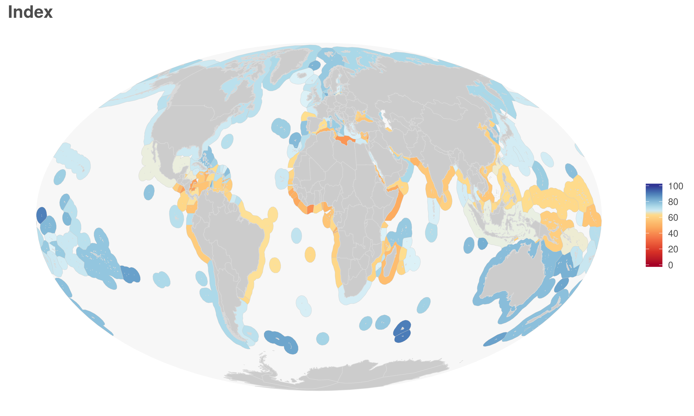 

```{r Flower plots, message=FALSE, warning=FALSE, error=FALSE, echo=FALSE, eval = flower_plots}

source('flowerPlot.R')
PlotFlower(
  region_plot     = NA,
  dir_fig_save = "figures/FlowerPlots",
  assessment_name = "Global average",
  year_plot = 2018,
  scores_file = sprintf("../OHI_final_scores_%s.csv", dateFile),
  scenario_folder = "../../eez"
)

```


Average global performance of the 10 goals:
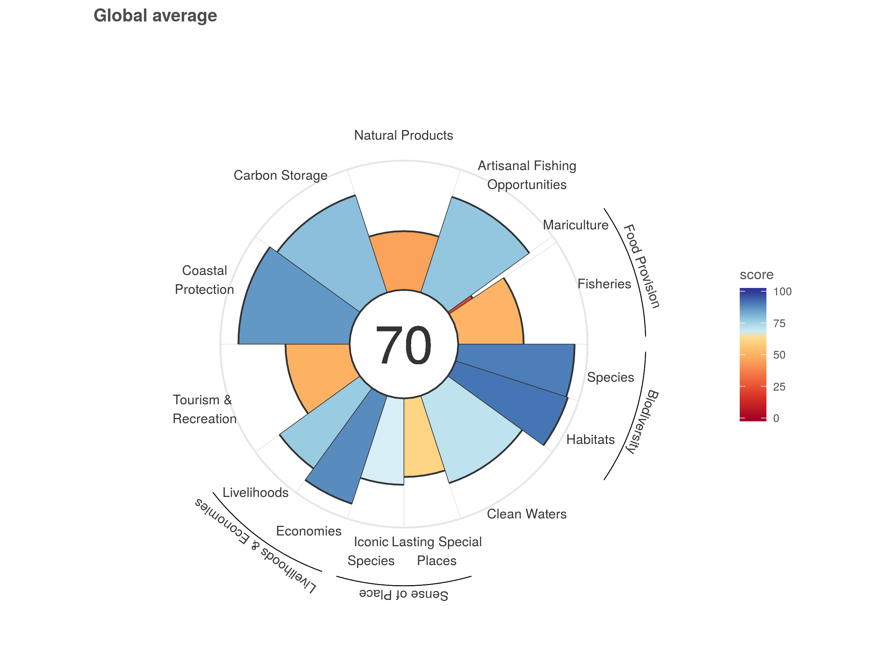 

### Distribution of scores

The median index score was `r median(data_final$Index)`. The highest score was 91 for  Howland Island and Baker Island, and the lowest score was 41 for Ivory Coast.  


The following histogram describes the distribution of overall index scores:

```{r histogram, echo=FALSE, warning=FALSE, error=FALSE, message=FALSE}

hist_data <- data_final %>%
select(region_name, Index)

g <- ggplot(hist_data, aes(x=Index)) +
geom_histogram(color = "gray", fill="gray", binwidth=1) +
labs(y="Number of regions", x="Index scores") + 
theme_bw()

plot(g)
```

The regions with index scores of 80 or greater are:

```{r top performers, echo=FALSE, warning=FALSE, error=FALSE, message=FALSE}

top <- hist_data %>%
  filter(Index >= 80)

kable(top)
```

The regions with index scores of 50 or less are:

```{r low performers, echo=FALSE, warning=FALSE, error=FALSE, message=FALSE}

low <- hist_data %>%
  filter(Index <= 50)

kable(low)
```


This interactive table describes the index and goal scores for the regions in 2018 (and here's a [link](https://rawgit.com/OHI-Science/ohi-global/draft/global2018/Results/data/scores_eez2018.html) to a color coded table, and a csv file can also be [downloaded](https://raw.githubusercontent.com/OHI-Science/ohi-global/draft/global2018/Results/data/scores_eez2018.csv)). 

```{r score table, message=FALSE, warning=FALSE, error=FALSE, echo=FALSE}

data_final_inlay <- data_final %>%
  select(-region_id) %>%
  data.frame()


# myTable <- data_final_inlay %>%
# DT::datatable(caption = '2018 OHI scores')

shiny::div(DT::datatable(data_final_inlay), style = "font-size: 60%; width: 60%")


## make an html file that is color coded:
pal = brewer.pal(10, 'RdYlBu')

cols <- data.frame(country=data_final$region_name)
for(goal in goals){ #goal="Index"
  tmp <- data_final[, goal]
  tmp <- assign(goal, cut(tmp, breaks=c(0,10,20,30,40,50,60,70,80,90,100), include.lowest = TRUE, labels=pal))
  tmp <- data.frame(goal=tmp)
  names(tmp) <- goal
  cols <- cbind(cols, tmp)
}


hwrite(data_final, sprintf('data/scores_eez%s.html', scenario), br=TRUE, center=TRUE, border=0, 
       row.style=list(goal='text-align:center'), table.style='padding: 10px; margin:20px;', 
       col.bgcolor=list(scenario='#fff',dimension='#fff',country='#fff', region_id='#fff', Index = cols$Index, 
                        AO = cols$AO, SPP = cols$SPP, BD = cols$BD, HAB = cols$HAB, CP = cols$CP, CS = cols$CS, CW = cols$CW, 
                        ECO = cols$ECO, LE = cols$LE, LIV = cols$LIV, FIS = cols$FIS, FP = cols$FP, MAR = cols$MAR, ICO = cols$ICO, 
                        SP = cols$SP, LSP = cols$LSP, NP = cols$NP, TR = cols$TR))

```

<br>
<br>
<br>

# Change over time


```{r trends, message=FALSE, warning=FALSE, error=FALSE, echo=FALSE}

scores <- read.csv(sprintf("../OHI_final_formatted_scores_%s.csv", dateFile))
  
region_trends <- scores %>%
  filter(dimension == "score") %>%
  filter(!is.na(value)) %>%
  group_by(goal, region_id) %>%
  do(mdl = lm(value ~ scenario, data = .))

# data.frame(glance(data_lm, mdl))
region_trends <- tidy(region_trends, mdl) %>%
  ungroup() %>%
  filter(term == "scenario") %>%
#  left_join(goal_names) %>%
  select(region_id, goal, trend = estimate, p.value) %>%
  data.frame()


region_trends <- region_trends %>%  
  left_join(rgn_names, by=c('region_id')) %>%
  mutate(country = ifelse(is.na(country), "eez_weighted_avg", as.character(country))) %>%
  mutate(trend = round(trend, 2)) %>%
  select(goal, country, region_id, trend, p.value) %>%
  data.frame()

#filter(region_trends, goal == "Index" & region_id == 0)

trends_spread <- spread(select(region_trends, -p.value), goal, trend)

index <- trends_spread %>%
  filter(country == 'eez_weighted_avg')

eez_spread <- trends_spread %>%
  arrange(-Index) %>%
  filter(country != 'eez_weighted_avg')
# sum(trends_spread$Index>0) # 79
# sum(trends_spread$Index<0) # 141
# sum(trends_spread$Index==0) # none

trends_spread <- rbind(index, eez_spread) %>%
    select(country, region_id, Index, AO, SPP, BD, HAB, CP, CS, CW, ECO, LE, LIV, FIS, FP, MAR, ICO, SP, LSP, NP, TR)

write.csv(trends_spread, sprintf("data/trends_%s.csv", scenario), row.names = FALSE, na='')

## make an html file that is color coded:
pal = brewer.pal(10, 'RdYlBu')

cols <- data.frame(country=trends_spread$country)

for(goal in goals){ #goal="CW"
  tmp <- trends_spread[, goal]
  tmp <- assign(goal, cut(tmp, breaks=c(-1000, -10, -5, -2, -1, 0, 1, 2, 5, 10, 1000), include.lowest = TRUE, labels=pal))
  tmp <- data.frame(goal=tmp)
  names(tmp) <- goal
  cols <- cbind(cols, tmp)
}


hwrite(trends_spread, sprintf('data/trends_%s.html', scenario), br=TRUE, center=TRUE, border=0, 
       row.style=list(goal='text-align:center'), table.style='padding: 10px; margin:20px;', 
       col.bgcolor=list(country='#fff', region_id='#fff', Index = cols$Index, 
                        AO = cols$AO, SPP = cols$SPP, BD = cols$BD, HAB = cols$HAB, CP = cols$CP, CS = cols$CS, CW = cols$CW, 
                        ECO = cols$ECO, LE = cols$LE, LIV = cols$LIV, FIS = cols$FIS, FP = cols$FP, MAR = cols$MAR, ICO = cols$ICO, 
                        SP = cols$SP, LSP = cols$LSP, NP = cols$NP, TR = cols$TR))

```

A color-coded table of 6 year trends is available [here](https://rawgit.com/OHI-Science/ohi-global/draft/global2018/Results/data/trends_2018.html) (and a [csv file](https://raw.githubusercontent.com/OHI-Science/ohi-global/draft/global2018/Results/data/trends_2018.csv)).  

These values are calculated using a linear model of scores for each region/goal over the past 7 years. Positive values indicate potentially increasing scores during the past 7 years and negative values indicate potentially decreasing scores.

NOTE: Currently, these data include the livelihoods and economies goal but this trends should probably be calculated without this goal.


```{r trend maps, message=FALSE, warning=FALSE, error=FALSE, echo=FALSE}

source('../Reporting/map_fxns_trend.R')

### set scenario and desired map projection
prj      <- 'mol'    ### note: 'gcs' is way faster.
values <-   brewer.pal(11, "RdYlBu")
values <- colorRampPalette(values, space = 'Lab')(13)[2:13]
col.brks  <- c(-100, -5, -4, -3, -2, -1, 0, 1, 2, 3, 4, 5, 100)

### get OHI data and rename column headings
scores_df <- read.csv(sprintf('data/trends_%s.csv', scenario), stringsAsFactors = FALSE) %>%
  rename(rgn_name = country, rgn_id = region_id) %>%
  mutate(rgn_id = as.factor(rgn_id))

### load region data frame, so doesn't need to reload every time through the loop.  Also
### load the land data frame, if plotting in Mollweide projection.
rgn_df <- get_rgn_df(prj = prj)

if(prj == 'mol' & !exists('land_poly')) {
  land_poly  <- get_land_df()
  ocean_poly <- get_ocean_df() ### assume if land_poly doesn't exist, ocean_poly doesn't either...
}


### establish list of fields for mapping

mapFlds   <- names(scores_df %>% select(-rgn_name, -rgn_id))

### Loop over each field, plotting each map in turn and saving to file.
for (fld in mapFlds) { # fld <- mapFlds[1]

    fig_save = sprintf('figures/map_trends/trends_map_%s_%s_%s.png', fld, year, prj)

   ohiplot <- plot_scores_easy(scores_df, fld, rgn_df, title = title, prj = prj, fig_save = fig_save,
                               leg_on = ifelse(fld=="Index", TRUE, FALSE))
   
   #print(ohiplot)
}


```

### Trends of regional index scores
The global average decreased by an average of `r index$Index` points per year.  There was a good deal of variation in trend among regions and goals.  

(Maps of goal scores are described below)

 


The following histogram describes the distribution of trend (e.g., change in score per year) in index scores:

```{r trend histogram, message=FALSE, warning=FALSE, error=FALSE, echo=FALSE}

trends_hist <- region_trends %>%
  filter(goal=="Index") %>%
  filter(region_id != 0) %>%
  arrange(trend)

values <-   brewer.pal(11, "RdYlBu")
values <- colorRampPalette(values, space = 'Lab')(13)[2:13]
col.brks  <- c(-100, -5, -4, -3, -2, -1, 0, 1, 2, 3, 4, 5, 100)

trends_hist$colors <- cut(trends_hist$trend, breaks=col.brks, include.lowest=TRUE, labels=values)
cols <- as.character(unique(trends_hist$colors))


g <- ggplot(trends_hist, aes(x=trend)) +
geom_histogram(aes(fill=colors), bins=25, center=1.01, col="gray") +
scale_fill_manual("", breaks=colors, values=cols, guide=FALSE) +
labs(y="Number of regions", x="Index scores: 5 year trend") + 
geom_vline(xintercept=0, color="red") +  
theme_bw()

print(g)

ggsave("figures/trend_histogram_color.png", width=5, height=4)
```

The 10 regions with the largest increases in index scores are:

Georgia, Pitcairn, Mauritania, Solomon Islands, Bangladesh, Samoa, Myanmar, Tongo, Yemen, and the Philippines

```{r trend best, message=FALSE, warning=FALSE, error=FALSE, echo=FALSE}

trends_order <- region_trends %>%
  filter(goal=="Index") %>%
  filter(region_id != 0) %>%
  select(country, trend) %>%
  arrange(-trend)

kable(trends_order[1:10, ])

```

The 10 regions with the largest decreases in index scores are: 

Lithuania, Sint Maarten, Amsterdam Island and Saint Paul Island, Trinidad and Tobago, Syria, Marshall Islands, Mayotte, Equatorial Guinea, Estonia, Eritrea

```{r trend worst, message=FALSE, warning=FALSE, error=FALSE, echo=FALSE}
bottom <- dim(trends_order)[1]

kable(trends_order[(bottom-9):bottom, ])

```

### Exploring change over time of goals

The following table provides the global scores (eez area weighted average of region scores) for the Index and goals/subgoals.

(NOTE: Livelihood and economy goals are not included here)

```{r overview, echo=FALSE}

data <- read.csv(sprintf('../OHI_final_formatted_scores_%s.csv', dateFile)) 

data_filter <- data %>%
  filter(region_id != 213)  %>%         # Antarctica (calculated in a very different way)
  mutate(region_name = as.character(region_name)) %>%
  mutate(value = round(value, 2))

data_index <- data_filter %>%
  filter(region_id == 0) %>%
  filter(dimension == "score") %>%
  select(scenario, goal, long_goal, value)

data_index$goal <- factor(data_index$goal, levels = goals)

data_spread <- spread(data_index, scenario, value) %>%
  arrange(goal) %>%
  filter(!goal %in% c("ECO", "LE", "LIV")) %>%
  select(-goal) %>%
  rename(goal = long_goal)
```

Plot View
```{r overview-plot, echo=FALSE}

# library(reshape2)
# library(plotly)
#
# plot_data <- data_index %>%
#   filter(goal != "Index")
# 
# sp <- ggplot(plot_data, aes(x=scenario, y=value)) +
#   geom_jitter(aes(col=goal)) +
#   geom_smooth(aes(col=goal), method="lm",se=F) +
#   facet_wrap(goal ~.) +
#   theme_bw()
# 
# ggplotly()

```

Table View
```{r overview-table, echo=FALSE}
kable(data_spread)
```

The following is a very preliminary analysis of how the global scores changed over time.  Global index scores decreased by an average `r index$Index` points per year (although, not significant with this rough analysis), with `r sum(trends_spread$Index<0)` regions having decreasing trends and `r sum(trends_spread$Index>0)` having increasing trends. 

#### Declining scores

* Fisheries declined by nearly 1.4 points per year on average, which is a greater decline rate than it was last year. Previous years before that had increasing trends (p  = 0.004, 148 regions with decreasing trend and 71 with increasing trend)
* Natural products declined by about 1.25 points per year on average, which is a greater rate of decline than last year (p = 0.0010, 90 regions with decreasing trend and 48 with increasing).  However, there is a very large variation in trends for this goal (i.e., large standard deviation 7.44), indicating that some regions have had relatively large increases.
* Tourism and recreation declined by about 0.74 points per year on average, which is a slower rate of decline than it was last year (p = 0.018, 111 regions with decreasing trend and 68 with increasing). However, this goal had a fairly large amount of variation in trend results.
* Coastal protection declined by 0.35 points per year on average, which is greater than it was last year (p = 0.0008, 83 regions with decreasing trend and 27 with increasing).  However, there is a fairly large amount of variation suggesting a few regions may be driving this trend, due to seaice loss.
* Iconic species (sub-goal) declined by 0.09 points per year on average (p = 0.46, 136 countries with decreasing trends, 76 increasing). Small variation

#### Improving scores

* Carbon storage increased by 0.01 per year on average (p = 0.11, 43 regions with increasing trend and 54 decreasing)
* Species condition (sub-goal) increased by 0.03 per year on average (p = 0.002, 110 countries with increasing trend and 74 countries decreasing)
* Biodiversity increased by 0.07 per year on average (p = 0.01, 111 countries with increasing trend and 82 countries decreasing)
* Livelihoods increased by 0.07 per year on average (p = 0.11, 75 countries with increasing trend and 69 countries decreasing)
* Clean waters increased by 0.09 per year on average, in contrast to decline by 0.11 points last year (p = 0.03, 101 regions with increasing trend and 107 with decreasing)
* Habitat (sub-goal) increased by 0.12 per year on average (p = 0.03, 79 regions with increasing trend and 77 with decreasing)
* Artisanal opportunities scores increased by 0.17 points per year on average, about the same as last year (p = 0.0003, 181 regions with increasing trend and 31 with decreasing)
* Sense of place increased by 0.25 points per year on average (p = 0.003, 91 regions with increasing trend and 121 with decreasing)
* Livelihoods and economies increased by 0.38 points per year on average (p = 0.14, 133 regions with increasing trend and 42 with decreasing)
* Mariculture (sub-goal) increased by 0.58 points per year on average (p = 0.00005, 52 regions with increasing trend and 44 with decreasing)
* Lasting special places scores increased by an average of 0.59 points per year, at a significantly greater rate of change than last year (p = 0.001, 66 regions with increasing trend and 45 with decreasing)
* Economies increased by 0.70 points per year on average (p = 0.14, 116 regions with increasing trend and 21 with decreasing)


```{r Global goal trends, message=FALSE, warning=FALSE, error=FALSE, echo=FALSE}
### analysis:
data_lm <- data_index %>%
  group_by(goal) %>%
  do(mdl = lm(value ~ scenario, data = .))

# data.frame(glance(data_lm, mdl))
results_lm <- tidy(data_lm, mdl) %>%
  ungroup() %>%
  filter(term == "scenario") %>%
  arrange(estimate) %>%
  left_join(goal_names) %>%
  select(goal=long_goal, average_change_per_year = estimate, p_value = p.value) %>%
  mutate(average_change_per_year = round(average_change_per_year, 2)) %>%
  mutate(p_value = round(p_value, 4)) %>%
  data.frame()


# calculate how many regions with increases vs. decreasing scores

index_vals <- region_trends %>%
  filter(region_id == 0) %>%
  select(goal, trend, p.value)

region_summary <- filter(region_trends, region_id != 0) %>%
  group_by(goal) %>%
  summarize(num_rgns_pos_trend = sum(trend > 0),
            num_rgns_neg_trend = sum(trend < 0),
            mean_trend = round(mean(trend, na.rm=TRUE), 2),
            sd_trend = round(sd(trend, na.rm=TRUE), 2))

trend_summary <- region_summary %>%
  left_join(index_vals, by = "goal") %>%
  left_join(goal_names) %>%
  select(long_goal, average_change_per_year=trend,	p_value = p.value,
         num_rgns_pos_trend, num_rgns_neg_trend, mean_trend, sd_trend) %>%
  arrange(average_change_per_year)

kable(trend_summary)

```


# Comparing assessment years

The following is a comparison of the global status scores generated for the 2017 scenario by this year's assessment vs. last year's assessment. 

If the models and source data remains the same, these scores should be exactly the same.  Differences indicate changes in methods or source data.  

These changes do not reflect changes in actual system health!   


### Global averages

We made a few changes to some goals, such as the addition of edible seaweed species to Mariculture and removal of edible seaweed species from Natural Products. Furthermore we changed the data source used for Fisheries from SAUP to Watson.

Changes in scores for the 2017 scenario were..

The largest changes were for CW (-2.57) and MAR (-6.33). The change in mariculture reflects additions to source data, mentioned above. 

Other regions changed by less than 2 points.

```{r compare assessments, message=FALSE, warning=FALSE, error=FALSE, echo=FALSE}

data <- read.csv(sprintf("../OHI_final_formatted_scores_%s.csv", dateFile), stringsAsFactors = FALSE) %>%
  rename("assess2018"=value)

data_old <- read.csv('../../global2017/OHI_final_formatted_scores_2017-11-22.csv', stringsAsFactors = FALSE) %>%
  rename("assess2017"=value) %>%
  #filter(region_id != 0) %>%  # this weighted mean includes high seas and Antarctica
  #mutate(region_id = ifelse(region_id==300, 0, region_id)) %>%   #convert the 300 (i.e., only eez's averaged to zero)
  filter(region_id <= 250) %>%       # get rid of high seas regions
  filter(region_id != 213)  %>%         # Antarctica (calculated in a very different way)
  left_join(data, by = c("scenario", "goal", "long_goal", "dimension", "region_id", "region_name")) %>%
  mutate(region_name = ifelse(is.na(region_name), "eez_weighted_avg", as.character(region_name)))

data_old <- data_old %>%
  filter(region_id == 0) %>%
  filter(dimension == "status") %>%
  filter(scenario==2017)

data_old$goal <- factor(data_old$goal, levels = goals)

data_old <- data_old %>%
  arrange(goal) %>%
  select(goal = long_goal, assess2018, assess2017) %>%
  mutate(change = assess2018 - assess2017)

kable(data_old)

```

Light blue is status for the 2017 assessment, and the dark blue is the status for the 2018 assessment.

```{r compare assessments-plot, echo=FALSE}

theme_set(theme_classic())

data_old <- data_old %>% arrange(assess2017)

data_old$goal <- factor(data_old$goal, levels=as.character(data_old$goal))  # for right ordering of the dumbells

# health$Area <- factor(health$Area)
ggplot(data_old, aes(x=assess2017, xend=assess2018, y=goal, group=goal)) + 
        geom_dumbbell(color="#a3c4dc",
                      colour_x="#a3c4dc", 
                      size=0.75, 
                      colour_xend="#0e668b") + 
        scale_x_continuous("Status") +  
        labs(x=NULL, 
             y=NULL, 
             title="Change in Scenario Year 2017 Status") +
        theme(plot.title = element_text(hjust=0.5, face="bold"),
              plot.background=element_rect(fill="#f7f7f7"),
              panel.background=element_rect(fill="#f7f7f7"),
              panel.grid.minor=element_blank(),
              panel.grid.major.y=element_blank(),
              panel.grid.major.x=element_line(colour="grey"),
              axis.ticks=element_blank(),
              legend.position="top",
              panel.border=element_blank())

```

### Regional data 

This color-coded [table](https://rawgit.com/OHI-Science/ohi-global/draft/global2018/Results/data/change_in_scores_benchmark2017_eez2018.html) compares how the 2017 scenario index scores for each region/goal changed from the 2017 to 2018 assessment.  

Because these are index scores, changes reflect updates to pressure and resilience scores as well as status.  

The following interactive plot provides an overview of how the 2017 scenario scores changed between the 2017 and 2018 assessment for all goals and dimensions.

```{r compare plot, message=FALSE, warning=FALSE, error=FALSE, echo=FALSE, fig.width=4.5, fig.height=3.5}

data <- read.csv(sprintf("../OHI_final_formatted_scores_%s.csv", dateFile), stringsAsFactors = FALSE) %>%
  rename("assess2018" = value)

data_old <- read.csv('../../global2017/OHI_final_formatted_scores_2017-11-22.csv', stringsAsFactors = FALSE) %>%  
  rename("assess2017" = value) %>%
  #filter(region_id != 0) %>%         # this weighted mean includes high seas and Antarctica
  #mutate(region_id = ifelse(region_id==300, 0, region_id)) %>%   #convert the 300 (i.e., only eez's averaged to zero)
  filter(region_id <= 250) %>%       # get rid of high seas regions
  filter(region_id != 213)  %>%         # Antarctica (calculated in a very different way)
  left_join(data, by = c("scenario", "goal", "long_goal", "dimension", "region_id", "region_name")) %>%
  mutate(region_name = ifelse(is.na(region_name), "eez_weighted_avg", as.character(region_name))) 

data_old <- data_old %>%
  filter(scenario==2017) %>%
  mutate(change = assess2018 - assess2017)


  p <- ggplot2::ggplot(data_old, aes(x=goal, y=change, color=dimension)) +
    #geom_point(shape=19, size=1) +
    theme_bw() + 
    labs(title="Change in 2017 scores ", y="Change in score", x="") +
    scale_x_discrete(limits = c("Index", "AO", "SPP", "BD", "HAB", "CP", "CS", "CW", "FIS", "FP", 
                                "MAR", "ECO", "LE", "LIV", "NP", "LSP", "SP", "ICO", "TR")) +
    scale_colour_brewer(palette="Dark2") +
    geom_jitter(aes(text=paste0("rgn = ", region_name)), position = position_jitter(width=0.2, height=0), shape=19, size=1)
  
  plotly_fig <- plotly::ggplotly(p)
  plotly_fig
  htmlwidgets::saveWidget(plotly::as_widget(plotly_fig), "change_plot.html", 
        selfcontained = TRUE)
  
```


```{r difference table, message=FALSE, warning=FALSE, error=FALSE, echo=FALSE}

data <- read.csv(sprintf("../OHI_final_formatted_scores_%s.csv", dateFile), stringsAsFactors = FALSE)

data <- data[data$scenario == benchmark, ]

data <- data %>%
  filter(dimension == "score") %>%   # focus only on score data
  filter(region_id != 213)  

# get the older data
oldDataAddress <- paste0('https://raw.githubusercontent.com/',
                         'OHI-Science/ohi-global/', oldCommit,
                        sprintf('/eez/scores.csv'))

oldData <- repmis::source_data(oldDataAddress) %>%
  filter(dimension == "score") %>%
  filter(year == 2017) %>% 
  filter(region_id != 213) %>%
  select(goal, dimension, region_id, old_value=score)

oldData$scenario <- benchmark

compare <- data %>%
  left_join(oldData) %>%
  left_join(rgn_names, by=c('region_id')) %>%
  mutate(country = ifelse(is.na(country), "eez_weighted_avg", as.character(country))) %>%
  mutate(change_in_score = round((value - old_value), 2))

compare_table <- compare %>%
  group_by(goal) %>%
  summarize(standard_deviation = round(sd(change_in_score, na.rm=TRUE), 2)) %>%
  mutate(goal = factor(goal, levels = goals)) %>%
  arrange(goal)

# Decided this table was more confusing than helpful:
# kable(compare_table)

compare_wide <- compare %>%
  select(scenario, goal, dimension, country, region_id, change_in_score) %>%
  tidyr::spread(goal, change_in_score)

index <- compare_wide %>%
  filter(country == 'eez_weighted_avg')

compare_wide <- compare_wide %>%
  arrange(-Index) %>%
  filter(country != 'eez_weighted_avg')

compare_wide <- rbind(index, compare_wide) %>%
    select(scenario, dimension, country, region_id, Index, AO, SPP, BD, HAB, CP, CS, CW, ECO, LE, LIV, FIS, FP, MAR, ICO, SP, LSP, NP, TR)

write.csv(compare_wide, sprintf("data/change_in_scores_benchmark%s_eez%s.csv", benchmark, scenario), row.names = FALSE, na='')

## make an html file that is color coded:
pal = brewer.pal(10, 'RdYlBu')

cols <- data.frame(country=compare_wide$country)
for(goal in goals){ #goal="CW"
  tmp <- compare_wide[, goal]
   tmp <- assign(goal, cut(tmp, breaks=c(-100, -50, -30, -20, -10, 0, 10, 20, 30, 50, 100), include.lowest = TRUE, labels=pal))
  tmp <- data.frame(goal=tmp)
  names(tmp) <- goal
  cols <- cbind(cols, tmp)
}


hwrite(compare_wide, sprintf('data/change_in_scores_benchmark%s_eez%s.html', benchmark, scenario), br=TRUE, center=TRUE, border=0, 
       row.style=list(goal='text-align:center'), table.style='padding: 10px; margin:20px;', 
       col.bgcolor=list(scenario='#fff',dimension='#fff',country='#fff', region_id='#fff', Index = cols$Index, 
                        AO = cols$AO, SPP = cols$SPP, BD = cols$BD, HAB = cols$HAB, CP = cols$CP, CS = cols$CS, CW = cols$CW, 
                        ECO = cols$ECO, LE = cols$LE, LIV = cols$LIV, FIS = cols$FIS, FP = cols$FP, MAR = cols$MAR, ICO = cols$ICO, 
                        SP = cols$SP, LSP = cols$LSP, NP = cols$NP, TR = cols$TR))


```


# A closer look at goals

This section takes a closer look at each goal/subgoal.

```{r goal histograms, message=FALSE, warning=FALSE, error=FALSE, echo=FALSE, eval=goal_hists}

data <- read.csv(sprintf('data/scores_eez%s.csv', scenario)) %>%
  filter(region_id != 0) %>%
  select(-region_name, -region_id)

for(goal in names(data)){ # goal = "LSP"
  
  data_goal <- data[, goal]
  
g <- ggplot(data, aes(x=data_goal)) +
geom_histogram(color = "gray", fill="gray") +
labs(y="Number of regions", x= "OHI score") +
xlim(-5,105) +
theme_bw()

ggsave(g, filename=sprintf("figures/goal_histograms/%s_scores.png", goal), height=3, width=4)
}

```

## Artisanal opportunities

### Scores
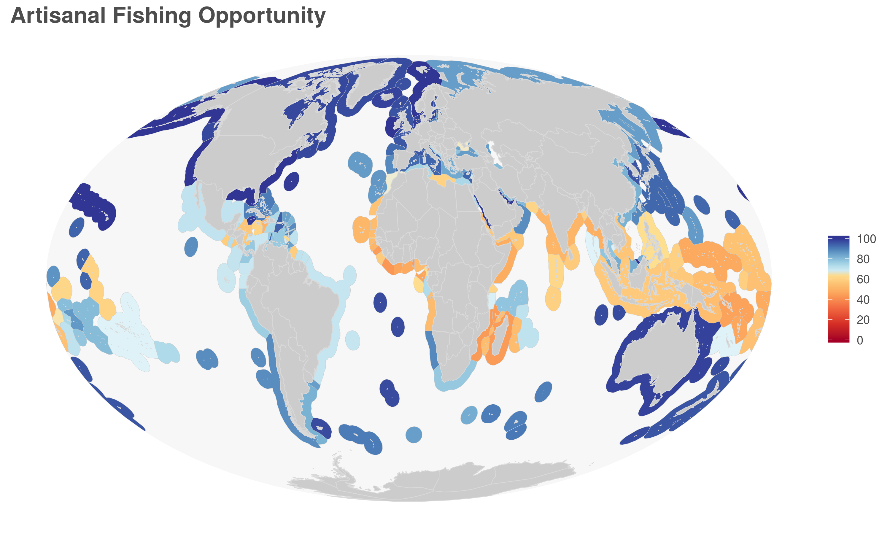

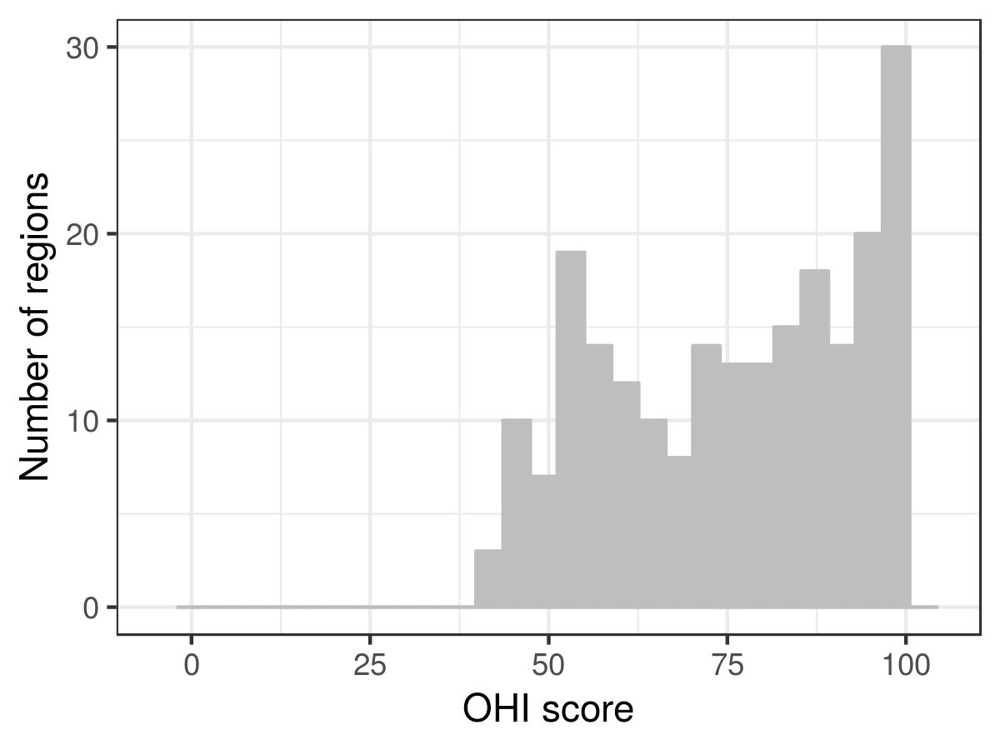

### Top 10 performers

```{r top AO, message=FALSE, warning=FALSE, error=FALSE, echo=FALSE}

data <- read.csv(sprintf('data/scores_eez%s.csv', scenario)) %>%
  filter(region_id != 0) %>%
  select(region_name, score=AO) %>%
  arrange(-score) %>%
  filter(!is.na(score))

top <- data[1:10, ]
kable(top)

```


### Bottom 10 performers
```{r bottom AO, message=FALSE, warning=FALSE, error=FALSE, echo=FALSE}

max <- dim(data)[1]
bottom <- data[(max-9):max, ]
kable(bottom)

```


## Species condition

### Scores
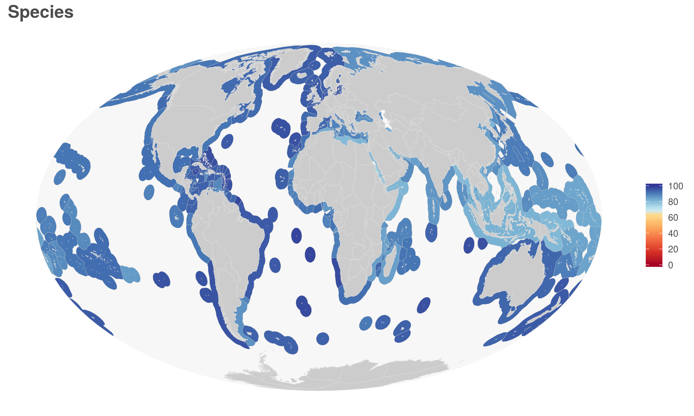

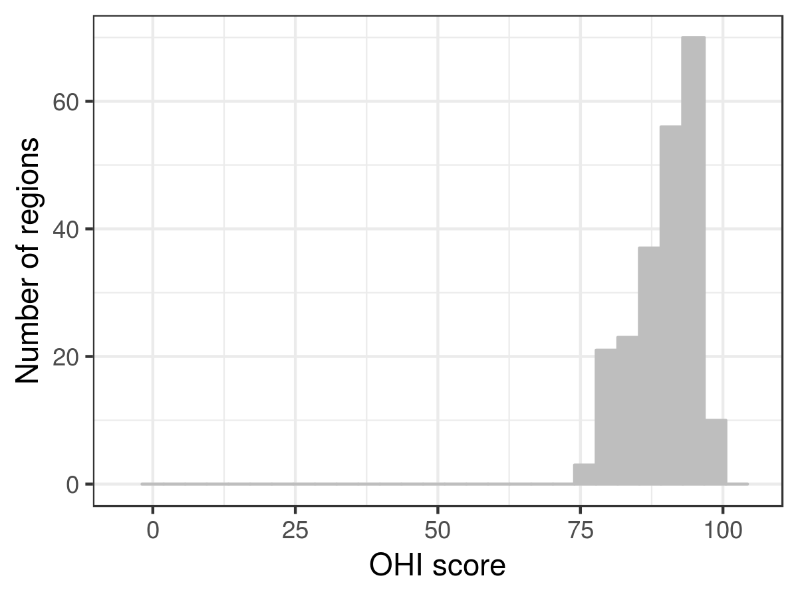


### Top 10 performers
```{r top SPP, message=FALSE, warning=FALSE, error=FALSE, echo=FALSE}

data <- read.csv(sprintf('data/scores_eez%s.csv', scenario)) %>%
  filter(region_id != 0) %>%
  select(region_name, score=SPP) %>%
  arrange(-score) %>%
  filter(!is.na(score))

top <- data[1:10, ]
kable(top)

```


### Bottom 10 performers
```{r bottom SPP, message=FALSE, warning=FALSE, error=FALSE, echo=FALSE}

max <- dim(data)[1]
bottom <- data[(max-9):max, ]
kable(bottom)

```


## Habitat

### Scores
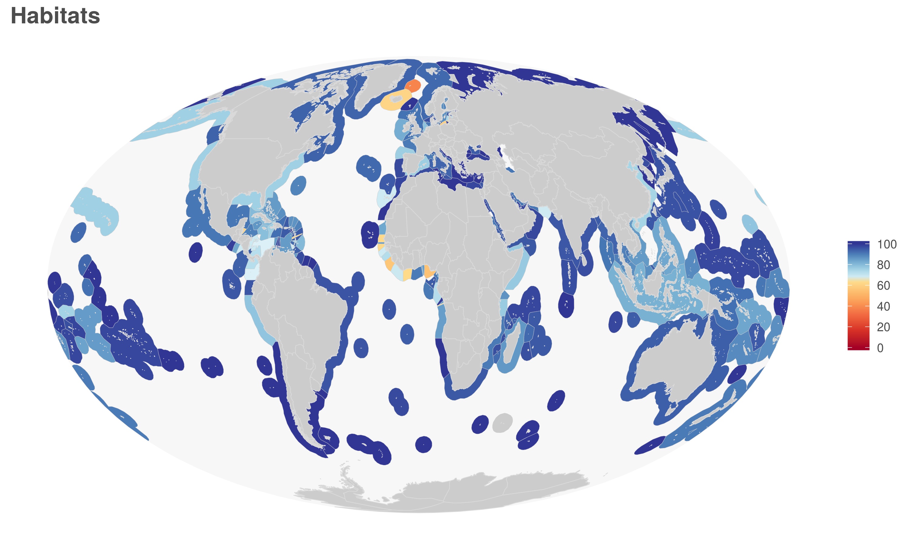


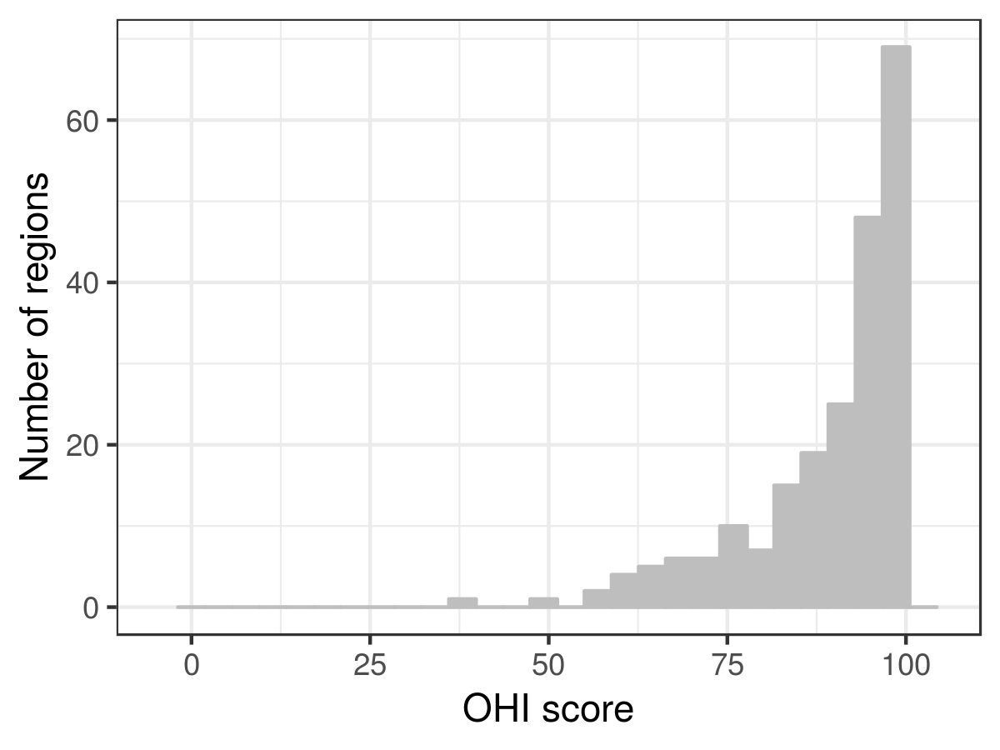

### Top 10 performers
```{r top HAB, message=FALSE, warning=FALSE, error=FALSE, echo=FALSE}

data <- read.csv(sprintf('data/scores_eez%s.csv', scenario)) %>%
  filter(region_id != 0) %>%
  select(region_name, score=HAB) %>%
  arrange(-score) %>%
  filter(!is.na(score))

top <- data[1:10, ]
kable(top)

```


### Bottom 10 performers
```{r bottom HAB, message=FALSE, warning=FALSE, error=FALSE, echo=FALSE}

max <- dim(data)[1]
bottom <- data[(max-9):max, ]
kable(bottom)

```


## Coastal protection

### Scores


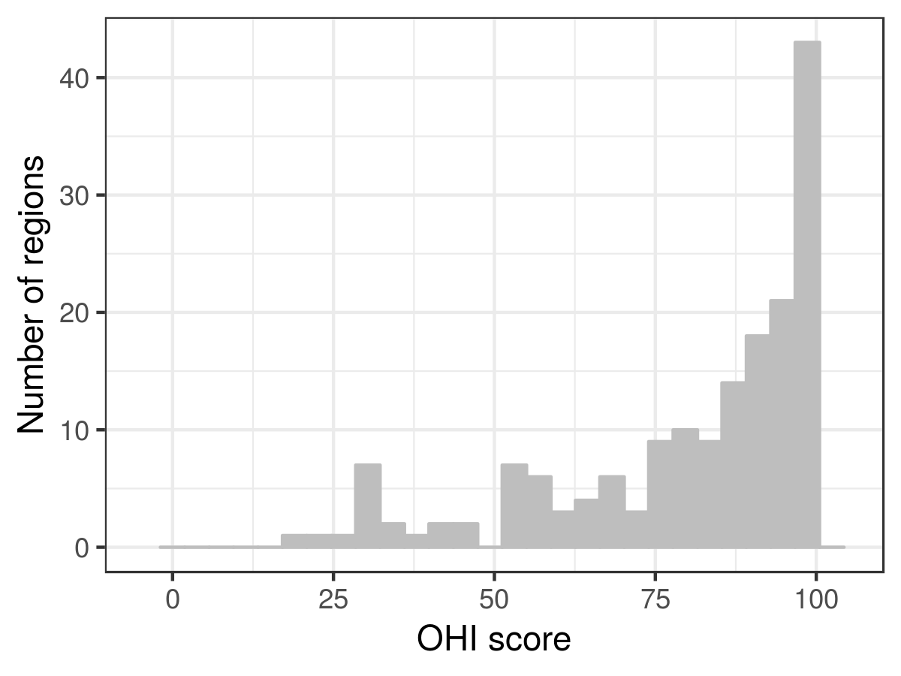

### Top 10 performers
```{r top CP, message=FALSE, warning=FALSE, error=FALSE, echo=FALSE}

data <- read.csv(sprintf('data/scores_eez%s.csv', scenario)) %>%
  filter(region_id != 0) %>%
  select(region_name, score=CP) %>%
  arrange(-score) %>%
  filter(!is.na(score))

top <- data[1:10, ]
kable(top)

```


### Bottom 10 performers
```{r bottom CP, message=FALSE, warning=FALSE, error=FALSE, echo=FALSE}

max <- dim(data)[1]
bottom <- data[(max-9):max, ]
kable(bottom)

```


## Carbon storage

### Scores
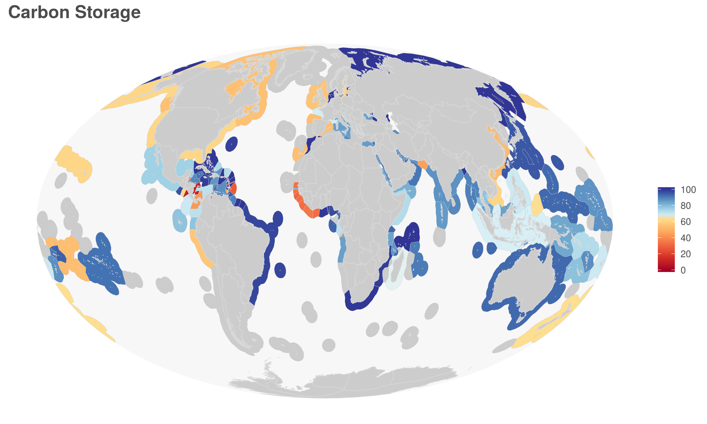

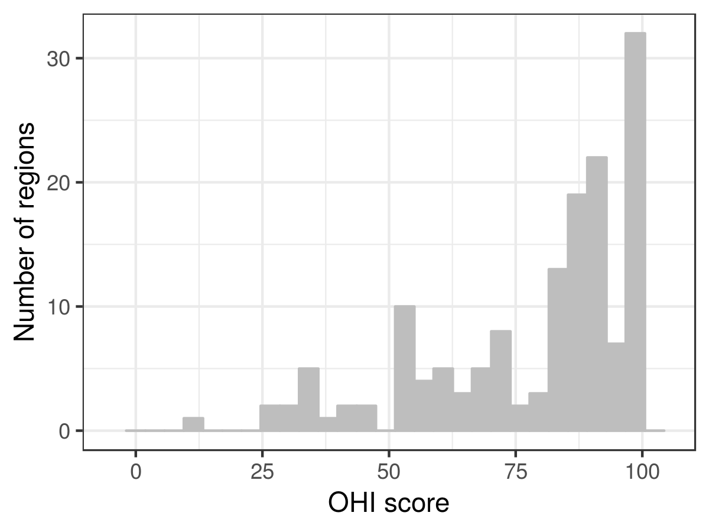

### Top 10 performers
```{r top CS, message=FALSE, warning=FALSE, error=FALSE, echo=FALSE}

data <- read.csv(sprintf('data/scores_eez%s.csv', scenario)) %>%
  filter(region_id != 0) %>%
  select(region_name, score=CS) %>%
  arrange(-score) %>%
  filter(!is.na(score))

top <- data[1:10, ]
kable(top)

```


### Bottom 10 performers
```{r bottom CS, message=FALSE, warning=FALSE, error=FALSE, echo=FALSE}

max <- dim(data)[1]
bottom <- data[(max-9):max, ]
kable(bottom)

```


## Clean waters

### Scores
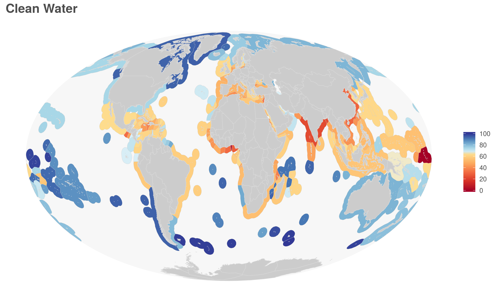


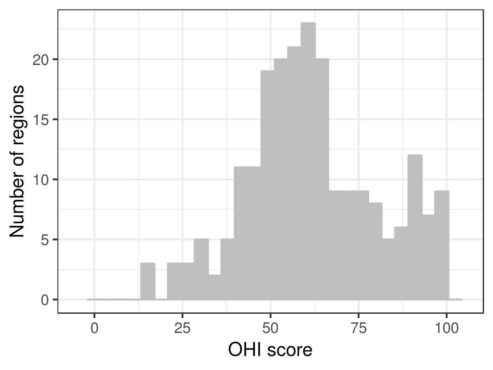

### Top 10 performers
```{r top CW, message=FALSE, warning=FALSE, error=FALSE, echo=FALSE}

data <- read.csv(sprintf('data/scores_eez%s.csv', scenario)) %>%
  filter(region_id != 0) %>%
  select(region_name, score=CW) %>%
  arrange(-score) %>%
  filter(!is.na(score))

top <- data[1:10, ]
kable(top)


```


### Bottom 10 performers
```{r bottom CW, message=FALSE, warning=FALSE, error=FALSE, echo=FALSE}

max <- dim(data)[1]
bottom <- data[(max-9):max, ]
kable(bottom)

```


## Fisheries

### Scores
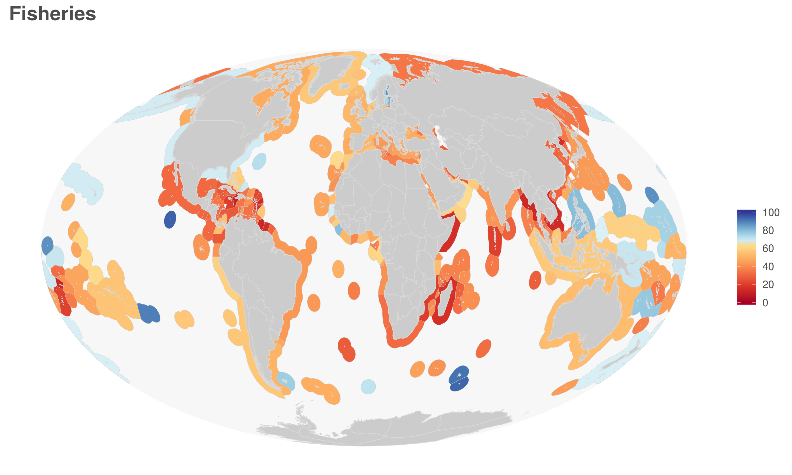

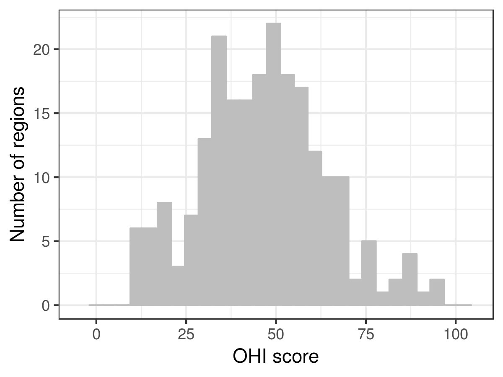

### Top 10 performers
```{r top FIS, message=FALSE, warning=FALSE, error=FALSE, echo=FALSE}

data <- read.csv(sprintf('data/scores_eez%s.csv', scenario)) %>%
  filter(region_id != 0) %>%
  select(region_name, score=FIS) %>%
  arrange(-score) %>%
  filter(!is.na(score))

top <- data[1:10, ]
kable(top)

```


### Bottom 10 performers
```{r bottom FIS, message=FALSE, warning=FALSE, error=FALSE, echo=FALSE}

max <- dim(data)[1]
bottom <- data[(max-9):max, ]
kable(bottom)

```


## Mariculture

### Scores


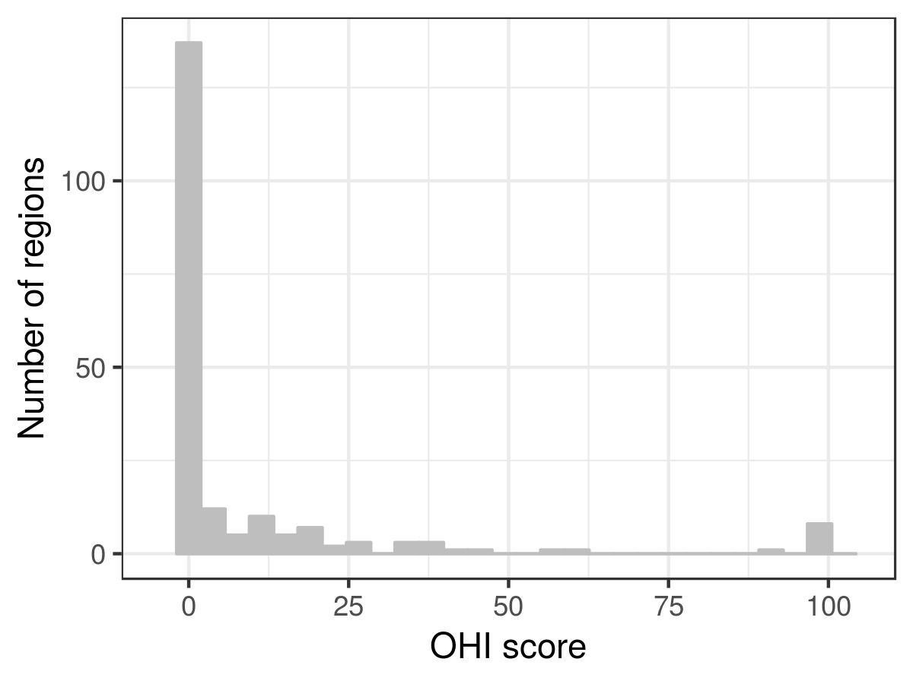

### Top 10 performers
```{r top MAR, message=FALSE, warning=FALSE, error=FALSE, echo=FALSE}

data <- read.csv(sprintf('data/scores_eez%s.csv', scenario)) %>%
  filter(region_id != 0) %>%
  select(region_name, score=MAR) %>%
  arrange(-score) %>%
  filter(!is.na(score))

top <- data[1:10, ]
kable(top)

```


### Bottom 10 performers
```{r bottom MAR, message=FALSE, warning=FALSE, error=FALSE, echo=FALSE}

max <- dim(data)[1]
bottom <- data[(max-9):max, ]
kable(bottom)

```


## Iconic species

### Scores
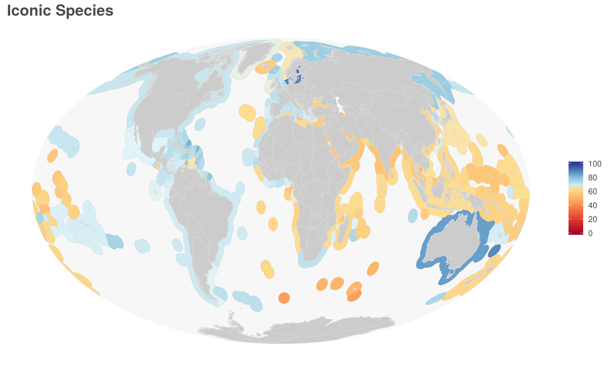

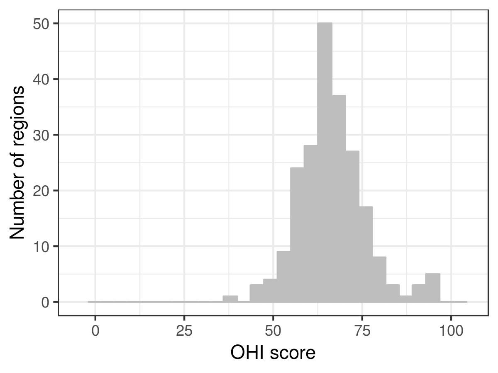


### Top 10 performers
```{r top ICO, message=FALSE, warning=FALSE, error=FALSE, echo=FALSE}

data <- read.csv(sprintf('data/scores_eez%s.csv', scenario)) %>%
  filter(region_id != 0) %>%
  select(region_name, score=ICO) %>%
  arrange(-score) %>%
  filter(!is.na(score))

top <- data[1:10, ]
kable(top)

```


### Bottom 10 performers
```{r bottom ICO, message=FALSE, warning=FALSE, error=FALSE, echo=FALSE}

max <- dim(data)[1]
bottom <- data[(max-9):max, ]
kable(bottom)

```


## Lasting special places

### Scores
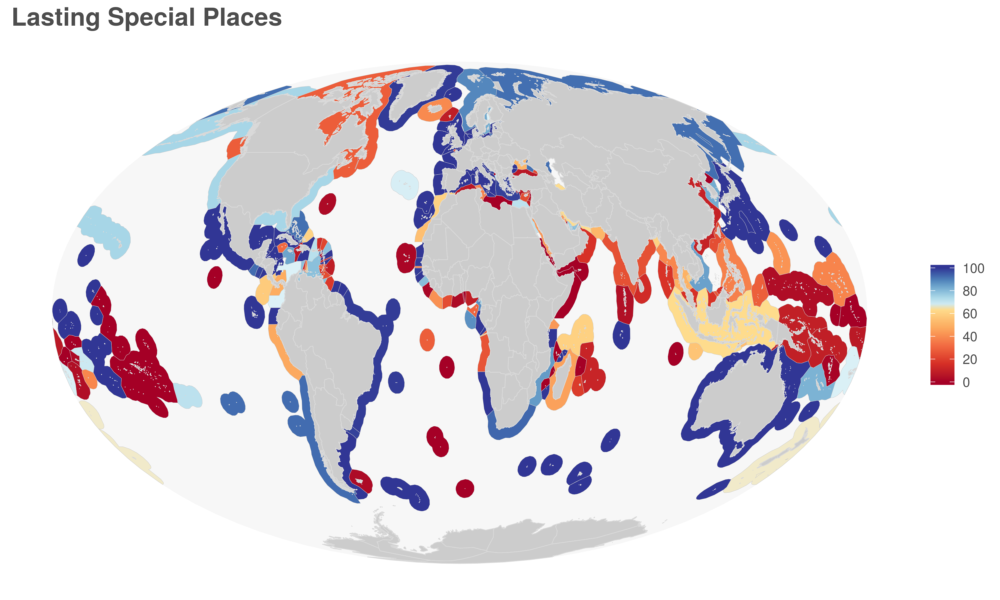

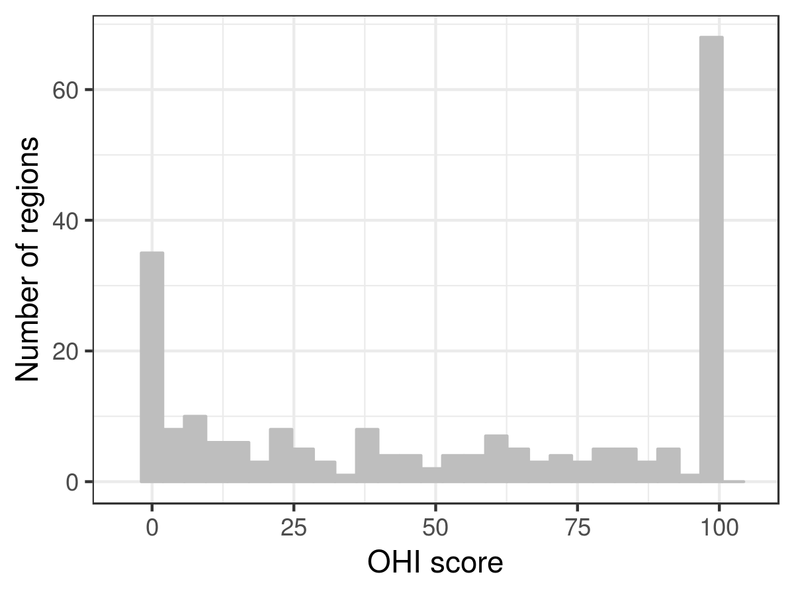


### Top 10 performers
```{r top LSP, message=FALSE, warning=FALSE, error=FALSE, echo=FALSE}

data <- read.csv(sprintf('data/scores_eez%s.csv', scenario)) %>%
  filter(region_id != 0) %>%
  select(region_name, score=LSP) %>%
  arrange(-score) %>%
  filter(!is.na(score))

top <- data[1:10, ]
kable(top)

```


### Bottom 10 performers
```{r bottom LSP, message=FALSE, warning=FALSE, error=FALSE, echo=FALSE}

max <- dim(data)[1]
bottom <- data[(max-9):max, ]
kable(bottom)

```


## Natural products

### Scores
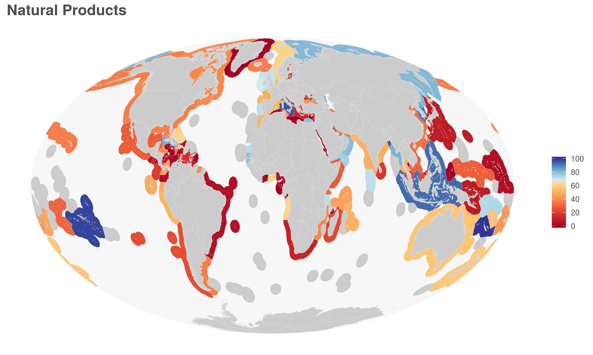

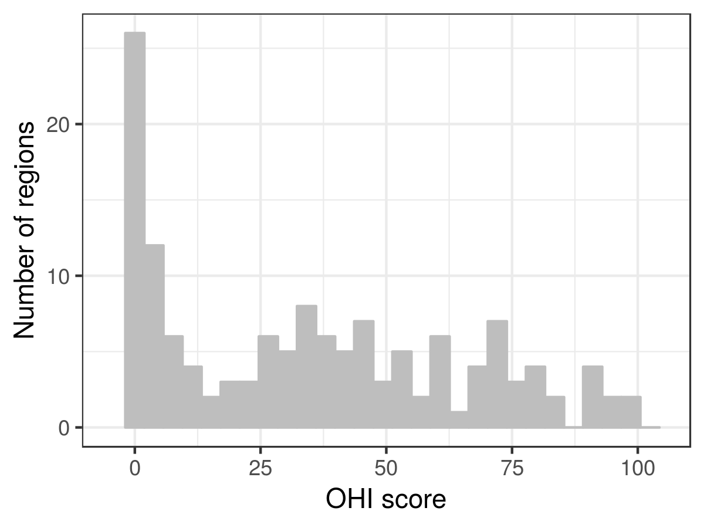

### Top 10 performers
```{r top NP, message=FALSE, warning=FALSE, error=FALSE, echo=FALSE}

data <- read.csv(sprintf('data/scores_eez%s.csv', scenario)) %>%
  filter(region_id != 0) %>%
  select(region_name, score=NP) %>%
  arrange(-score) %>%
  filter(!is.na(score))

top <- data[1:10, ]
kable(top)

```


### Bottom 10 performers
```{r bottom NP, message=FALSE, warning=FALSE, error=FALSE, echo=FALSE}

max <- dim(data)[1]
bottom <- data[(max-9):max, ]
kable(bottom)

```


## Tourism and recreation

### Scores
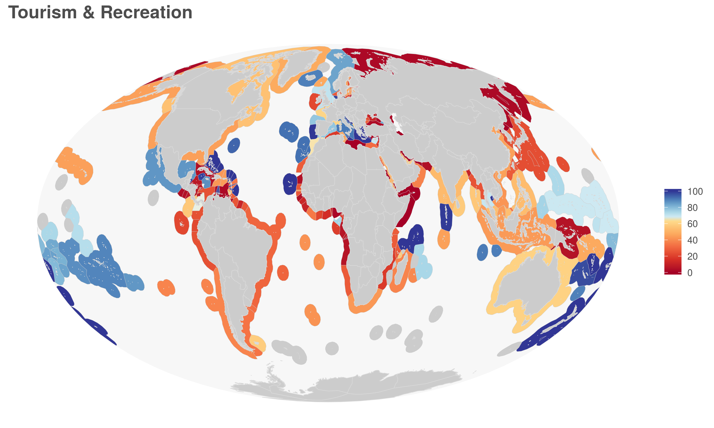

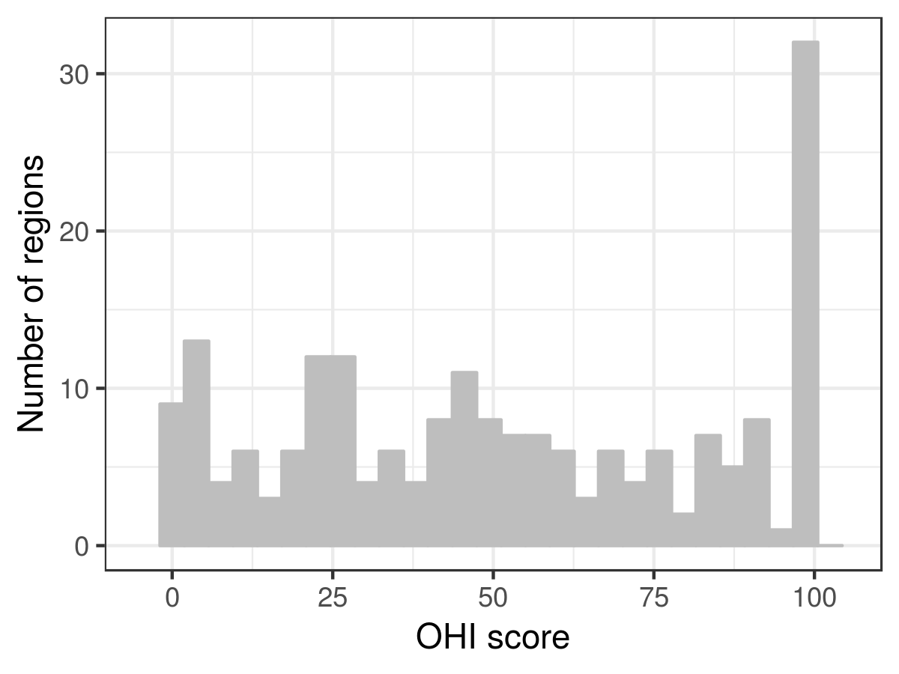

### Top 10 performers
```{r top TR, message=FALSE, warning=FALSE, error=FALSE, echo=FALSE}

data <- read.csv(sprintf('data/scores_eez%s.csv', scenario)) %>%
  filter(region_id != 0) %>%
  select(region_name, score=TR) %>%
  arrange(-score) %>%
  filter(!is.na(score))

top <- data[1:10, ]
kable(top)

```

### Bottom 10 performers
```{r bottom TR, message=FALSE, warning=FALSE, error=FALSE, echo=FALSE}

max <- dim(data)[1]
bottom <- data[(max-9):max, ]
kable(bottom)

```


# Additional checks

Plot years of data for each data layer....

Table with spark plots for each region showing trends

Julie has plotting suggestion to check out

Add # of iconic species in list for each country


# Comparing trend and average index scores

To obtain a more complete picture of which regions are doing well and which are doing poorly we compared the average index scores (averaged over 2012 to 2018) and the trends for each region.

Of most concern are regions that have poor scores and declining trends: Eritrea, Somalia, Ivory Coast, Nicaragua, and Lebanon.

The following is an interactive plot (region names are visible when hovering over the points) showing the relationship between average index scores and trend.  The horizontal line represents the 0 trend and the vertical line is the average of the average index scores.

```{r trend vs avg index, message=FALSE, warning=FALSE, error=FALSE, echo=FALSE, eval=TRUE, fig.width=4, fig.height=3}

index <- read.csv(sprintf("data/avg_goal_scores_%s.csv", dateFile), stringsAsFactors = FALSE) %>%
  select(region_id, country=region_name, index_avg = Index)

trend <- read.csv(sprintf("data/trends_%s.csv", scenario)) %>%
  select(region_id, index_trend = Index) %>%
  left_join(index, by= "region_id")

avg_index <- index %>%
  filter(region_id != 0) %>%
  summarize(mean(index_avg, na.rm=TRUE))

  p <- ggplot2::ggplot(trend, aes(x=index_avg, y=index_trend)) +
    geom_point(aes(text=paste0("rgn = ", country)), shape=19, size=2, color="gray", alpha = 0.5) +
    geom_hline(yintercept = 0, color="red", size=.5, linetype=3) +
    geom_vline(xintercept = 67, color="red", size=.5, linetype=3) +
    theme_bw() + 
    labs(title="Index scores", y="Trend (change in score per year)", x="Average (2012 to 2018 scores)") 
    

  plotly_fig <- plotly::ggplotly(p)
  plotly_fig

```