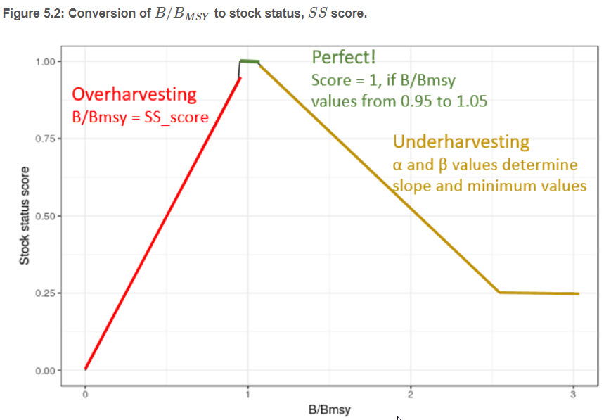
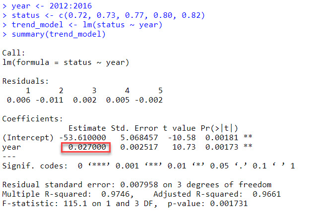
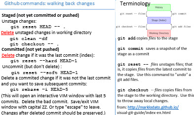

Work together to answer these questions.  

All the information you need should be in the OHI Methods [document](https://rawgit.com/OHI-Science/ohi-global/draft/global_supplement/Supplement.html#1_the_theory).

I will be around to answer any questions...so don't hesitate to get clarification, extra guidance, or request hints!

### OHI score models and data
1. What is the difference between a goal's "status" and "score"?

 
 

2. If a region's food provision goal has the following values, what would its food provision score be?

Predicted future status: 80

Current status: 60

 
 

3. Given the following data, what would this region's Index score be?

Goal/subgoal  | Abbreviation   | Score
------------- | -------------- | -------------
Artisanal Fishing Opportunity | AO | 90
Habitat | HAB | 50
Species Condition | SPP | 30
Carbon Storage | CS | 20
Clean Waters | CW | 95
Coastal Livelihoods and Economies | LE | 60
Coastal Protection | CP | 80
Food Provision | FP | 85
Natural Products | NP | 100
Sense of Place | SP | 10
Tourism and Recreation | TR | 50

NOTE: The abbreviations for subgoals have 3 letters and goals have 2 letters.

 
 

4. Fill in the missing values.  

NOTE: Pressure and resilience must be multiplied by 0.01.  Trend and status are not modified.  I think we should probably change the way report trend (or, alternatively, pressures/resilience) so they are treated consistently.

Dimension | Scenario 1 | Scenario 2
---------- | ---------- | ---------
Score      |            | 
Current status |  75 | 75
Predicted future status |  |  80
Trend | 0.10 | 0.10
Pressure | 100 | 50
Resilience | 50 | 50

QUESTION: How did a pressure change from 100 to 50 affect the final score?  Was this a larger or smaller effect than you would have expected?

 
 

5. Look at how OHI scores are reported in the output from the ohi-global toolbox:
https://raw.githubusercontent.com/OHI-Science/ohi-global/draft/eez/scores.csv

Provide the metadata for each variable (using "score" as an example):

Variable     | Metadata
------------ | ------------------
goal        |
dimension   |
region_id   |  
score       | numeric score that ranges from 0-100 for all dimensions, except trend (-1 to 1)
year        |

 
 

### Humans as part of the ecosystem
 
6. To calculate the Fishery subgoal, we:

a. Obtain B/Bmsy  scores for each stock that is harvested.   B/Bmsy is defined as: the ratio of observed biomass to the biomass that would provide maximum sustainable yield. When B/BMSY = 1, then biomass equals BMSY. If B/BMSY falls below 1, biomass is too low to provide maximum sustainable yield. For example, if B/BMSY = 0.5, then biomass is only 50% of that needed for maximum sustainable yield. (from: http://www.catchshareindicators.org/wp-content/uploads/2013/12/NE_Biomass_Feb-2014.pdf)

b. Convert B/Bmsy into a stock status score that ranges from 0-1, with one reflecting a perfect score.  The relationship between B/Bmsy values and stock status scores looks like this:

c. Take some sort of average of the stock status scores within each region (for the global we use a geometric mean weighted by catch).

QUESTION: B/Bmsy scores greater than 1 indicate the stock is doing well!  Given this, why are B/Bmsy scores > 1.05 penalized (i.e., stock status score is less than 1)? 

 
 

### Gapfilling
7. Imagine you are calculating OHI scores for 10 regions.  The data you can find for an economic variable that is used to calculate the status of one of the goals looks like this:

rgn_id   | data
-------- | -------
1        | 72
2        | 74
3        | 80
4        | 70
5        | NA
6        | NA
7        | 71
8        | 75
9        | 76
10       | 76

QUESTION: Should the missing values (NA is a missing value in R) remain missing?  If so, why?

Or, should you try to estimate the missing values?  If so, how might you go about estimating them?
 
 

### Goal status and trend
 

8. Read the methods section for the Lasting Special Places subgoal: https://rawgit.com/OHI-Science/ohi-global/draft/global_supplement/Supplement.html#592_lasting_special_places_(subgoal_of_sense_of_place)

The information in this section describes how status and trend are calculated for this goal, it also includes the data used to calculate the pressure and resilience dimensions.

QUESTION: What is the reference point for this subgoal?

Explore the links to the pressures and resilience data layers.

Follow this link to the functions.R file in ohi-global: https://github.com/OHI-Science/ohi-global/blob/draft/eez/conf/functions.R

Find the Lasting Special Places function.  See if you can reconcile the model described in the Methods with the code. (NOTE: Just aim for a large picture overview...at this point you do not need to understand every step….or even most of this)

 
 

9. The trend for the Tourism and Recreation goal for the United States is -0.15.  Describe what this means.

 
 

10. We are going to walk through a trend calculation.  If R is installed on your computer, follow along.

Status data for a region's Tourism and Recreation goal:

Year  | Status
------ | ----------
2010  | 72
2011  | 71
2012  | 72
2013  | 73
2014  | 77
2015  | 80
2016  | 82

*STEP 1* Estimate the average change per year using a linear regression model

The 0.027 value is the slope estimate, which is the average change in status per year estimated by the linear model.

*STEP 2* Obtain proportional change by dividing the slope estimate by the earliest status value used in the linear model:

`0.027/0.72 = 0.0375`

There has been nearly a 4% increase in status per year.

*STEP 3* The goal is to predict the change in 5 years, so we multiply the yearly proportional change by 5:

`0.0375 * 5 = 0.1875`

Status is predicted to increase about 19% in 5 years.

In 2021, status is predicted to be (ignoring pressure/resilience dimensions):
82 * (1 + 0.1875) = 97

QUESTION: What assumptions are we making by using this formulation of trend to calculate the likely future status?

QUESTION: Can you think of any scenarios when we would not use 5 years of data to estimate trend?

 
 

### Goal pressure and resilience
 

11. The pressure dimension plays a relatively small role in goal scores (see figure 4.1), but it takes a lot of effort to prepare the data!

The final pressure dimension is calculated for each region and goal using a function from the ohicore package.  The function requires several pieces of information:

a. A data layer for each pressure layer describing the magnitude of the pressure on a scale of 0-1.  For example, here is the sea surface temperature pressure layer (low pressures are good and high pressures are bad): https://github.com/OHI-Science/ohiprep_v2018/blob/master/globalprep/prs_sst/v2016/output/sst_updated.csv

b. Classifying the pressure category for each data layer. The pressure dimension is based on two types of pressures: Ecological and Social (Figure 4.2).  The ecological pressures are broken into 5 categories (pollution, alien species, habitat destruction, fishing, and climate change).  Each pressure data layer is assigned to a category in this file: https://github.com/OHI-Science/ohi-global/blob/draft/eez/conf/pressure_categories.csv

QUESTION: How many climate change pressures are there? 

c. Pressure x goal weighting. Pressures have little or no effect on some goals, but huge effects on others.  The relationship between the goals and the pressure variables is described here: https://github.com/OHI-Science/ohi-global/blob/draft/eez/conf/pressures_matrix.csv

QUESTION: Which pressure layers affect the FIS  subgoal?  How many regulatory pressure layers are there?  How many social layers are there?  Which is more important: Ecological or Social pressures? 

QUESTION: Some goals, like Coastal Protection, have multiple “elements”.  Why? 

NOTE: It is convention to add a superscript to the pressure name that describes its category:
* po=pollution
* hd=habitat destruction
* sp=alien species
* fp=fishing pressure
* cc=climate change

 
 

12.  Similar to the pressures dimension, resilience plays a relatively small role in goal scores (see figure 4.1) but still takes a lot of effort.

The final pressure dimension is calculated for each region and goal using a function from the ohicore package.  The function requires several pieces of information:

a. A data layer for each pressure layer describing the magnitude of the pressure on a scale of 0-1. For example, here is the Social Progress Index layer (low resilience is bad and high resilience is good): https://github.com/OHI-Science/ohiprep/blob/master/globalprep/prs_res_spi/v2017/output/spi_res.csv

b. The resilience dimension includes two major categories: Ecological and Social (Figure 4.3). Ecological resilience has two subcategories: Ecosystem and Regulatory.  Regulatory is comprised of the same 5 subcomponents as the Ecological *pressures*: pollution, alien species, habitat destruction, fishing, and climate change.  There is also a “goal” specific subcomponent.   Each resilience data layer is assigned to a category in this file: https://github.com/OHI-Science/ohi-global/blob/draft/eez/conf/resilience_categories.csv

c. The relationship between goals and resilience is described here: https://github.com/OHI-Science/ohi-global/blob/draft/eez/conf/resilience_matrix.csv
 
 

### Data layers
 

13. Explore table 6.0.1 and describe where the links take you.

 
 

### Other
 

14.  Take a critical look at table 1.3 and figure 1.1.  Do these seem helpful?  Can you think of any ways to improve them?  Can you think of any improvements (large or small) to the Methods document that would make things clearer?

 
 

15. I am obsessed with making reference index cards that I refer to.  Here is an example of one I have made for walking back github changes:

Design an index card (or, cards) that capture relevant OHI information (e.g., formulas for calculating goal scores and likely future status; table/figure describing dimensions and/or goals; file locations; how everything links together; etc.).  

The primary goal is to make it useful to you.  But, we will discuss whether we should provide this product through our website or blog.  

Here is a link to download the [template](https://github.com/OHI-Science/ohi-global/raw/draft/global_supplement/exercises/figures/blank_3x5cards.pptx).

When finished, email me the files and I will print them and mail them to you.
