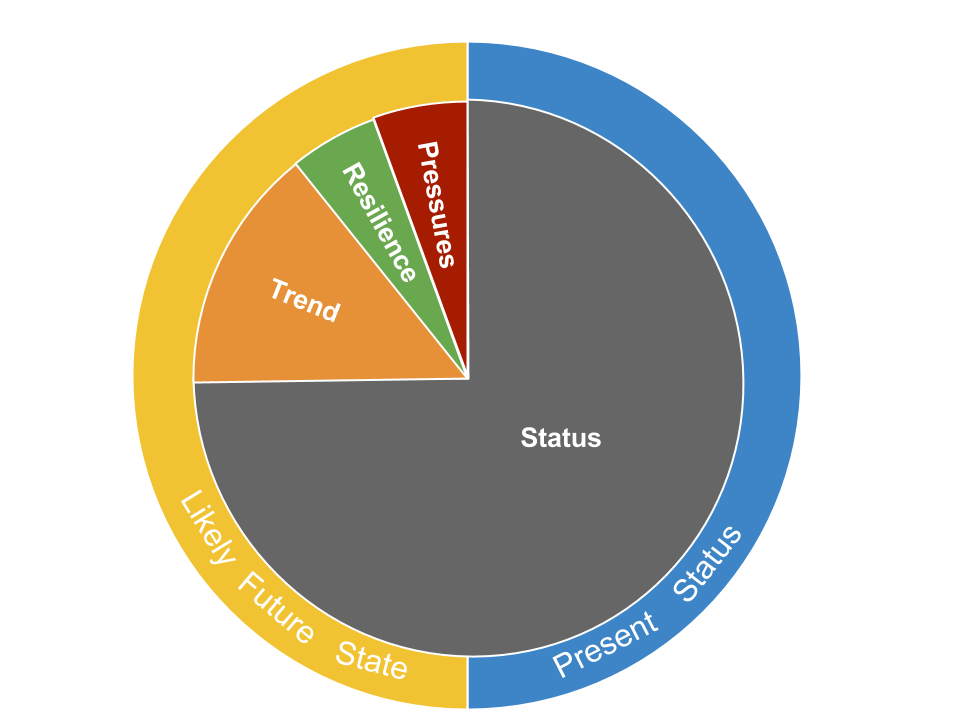

Each goal score is the average of its current status and likely future status (Figure 4.1).  The Index assesses the current status of each goal relative to a reference point.  Likely future status is estimated using: recent trends in current status; pressures that can stress the system and threaten future delivery of benefits; and resilience to such pressures, due to governance, institutional and ecological factors. 

**Figure 4.1. Pie chart describing the contribution of each dimension to the goal score**

Each goal score, $G$, is the average of its present status, $x$, and its likely near-term future status, $\hat x_{F}$:

$$
G \quad =\quad \frac {x \quad +\quad \hat x_{F} }{ 2 }, (Eq. 4.3)
$$

The present status of goal, $x$, is its present state, $X$, relative to a reference point, $X_{R}$, uniquely chosen for each goal:

$$
{ x }_{ i }\quad =\quad \frac { X }{  X_{R} }, (Eq. 4.4) 
$$

The reference point, $X_{R}$, can be determined mechanistically using a production function (e.g., maximum sustainable yield, MSY, for fisheries), spatially by means of comparison with another region (e.g., country X represents the best possible known case), temporally using a past benchmark (e.g., historical habitat extent), or in some cases via known (e.g., zero pollution) or established (e.g., 30% of waters set aside in MPAs) targets. Past benchmarks can either be a fixed point in time or a moving target (e.g., five years prior to most current data). The type of reference point can have important implications for interpretations of how a goal is doing in any given country.

For each region, the estimate of a goal’s likely near-term future status is a function of its present status, $x$ modified by: recent trends, $T$, in status; current cumulative pressures, $p$, acting on the goal; and social and ecological resilience, $r$, to pressures given the governance and social institutions in place to protect or regulate the system and the ecological condition of the system:

$$
\hat {x} _{F} \quad = \quad \left[ 1 \quad + \quad \beta T \quad + \quad \left( 1\quad -\quad \beta  \right) \left( r \quad - \quad  p \right)  \right] x, (Eq. 4.5)
$$

where, $\beta$ represents the relative importance of the trend versus the resilience and pressure terms in determining the likely trajectory of the goal status into the future. We assume $\beta = 0.67$, which makes trend twice as important as the pressure/resilience component.  We chose this value because we believe the direct measure of trend is a better indicator of future (i.e., in five years) condition than indirect measures of pressure and resilience.

The role of the resilience and pressure dimensions is to improve our understanding of the likely near-term future condition by incorporating additional information beyond that provided by the recent trend. Pressure or resilience measures that were in existence in the past may have a cumulative effect that has not yet manifested itself in trend (e.g., fishing pressure may have increasingly negative impacts as successive year classes of fish become increasingly less abundant; resilience due to establishment of a marine protected area (MPA) may require a number of years before its benefits become apparent). In addition, the recent trend does not capture the effect of current levels of resilience and pressures. The expectation of a likely future condition suggested by the trend will become more or less optimistic depending on the resilience and pressure dimensions. If the effects are equal they cancel each other out.

Both resilience and pressure dimensions are scaled from 0 to 1, and trend is constrained to -1.0 ≤ $T$ ≤ 1.0 (i.e., values outside this range are clamped to range end values). 

The likely future status cannot exceed the maximum possible value of the status for each goal, which is 1.0. In reality data are rarely perfect, creating potential situations where likely future condition exceeds 1.0. To address these cases, we implemented two rules. First, if current status = 1.0, then trend is set = 0.0, since any trend > 0.0 in those cases must be due to incomplete or imperfect data. Second, status and likely future status scores were constrained to maximum value of 1.
